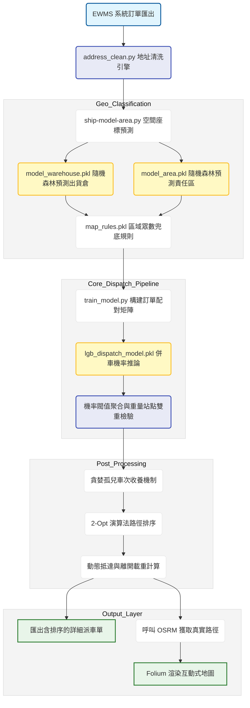

# AI 智慧派車與路徑最佳化系統 開發紀錄與踩坑筆記

### 項目背景

物流單位的派車作業極度依賴調度員的個人經驗。面對每日從 EWMS 系統匯出的海量 B2B 與 B2C 訂單，人工劃分配送區域與決定裝車順序耗時過長。專案目標是將歷史派車邏輯與老司機的經驗模型化，開發一套全自動的 AI 派車管線。系統涵蓋了底層的地址正規化，利用隨機森林預測所屬營業所，再透過 LightGBM 判斷併車機率，最後結合貪婪演算法與 2-Opt 進行路徑最佳化，產出視覺化的派車地圖與排序清單供現場人員直接使用。

### 數據流轉邏輯

### 地址清洗與正規化實作

台灣的地址資料庫極度混亂，業務端填寫的備註與 SAP 系統的原始地址往往帶有大量雜訊。為了解決經緯度轉換失敗的問題，專案獨立開發了 address_clean 模組。

這個模組首先透過 SQL 抓取 SYS_OUT_CONTACT 與 SYS_SALES_ORDER 兩張大表。清洗的第一步是針對 Google 地圖 API 偶爾回傳的英文倒裝格式進行修復。利用正則表達式的貪婪匹配機制，從字串尾部精確往回提取縣市與鄉鎮市區，解決了門牌號碼與路名沾黏的問題。

接著是暴力的雜訊過濾。腳本中寫死了幾十種業務常見的贅字（例如透天，洪文東，待確認，借鑰匙等），並利用正則表達式強制拔除 GPS 座標字串。為了確保後續比對的一致性，將所有的段落統一轉為阿拉伯數字（一段轉為 1段），強制截斷樓層與室號，最後透過 OpenCC 套件將簡體字全部轉為繁體。清洗完畢後，系統會計算 SAP 原始地址與業務修改地址的 SequenceMatcher 相似度，搭配行政區的硬核比對，將低於閥值的紀錄輸出給人工覆核。

### 模型訓練與封裝解析

專案中的四個核心 pkl 檔案分別由兩支不同的訓練腳本產出。

第一支是負責空間分類的 ship-model-area 腳本。這支程式單純利用訂單的收貨經緯度作為特徵，訓練了兩個 RandomForestClassifier 隨機森林模型。第一個是 model_warehouse 負責預測最適合的出貨營業所。第二個是 model_area 負責預測更細的區域代碼。為了防止模型在邊界地帶誤判，程式同時透過 pandas 分組計算了每個區域代碼歷史上最常對應的出貨倉，將這個眾數對應表儲存為 map_rules。在實際推論時，如果 model_warehouse 的預測信心度低於百分之七十五，系統就會呼叫 map_rules 進行覆蓋兜底，確保跨區派車的合理性。

第二支是負責判斷併車邏輯的 train_model 腳本。派車本質上是一個分群問題，這裡將其轉化為二元分類。程式將每日訂單透過 itertools 兩兩配對生成樣本矩陣。如果歷史紀錄中這兩筆訂單擁有相同的排單號，標籤就設為一，否則為零。特徵工程包含了兩點之間的 Haversine 距離，雙方重量加總，是否同區域，以及最晚派送時間的差距。考量到非同車的負樣本過多，程式設定了三倍的負樣本抽樣比例來平衡資料。最終訓練出 lgb_dispatch_model 這個 LightGBM 梯度提升樹模型，作為後續判斷兩張訂單是否能併入同一台車的核心依據。

### 實作挑戰與工程取捨

訂單備註的重量解析地獄。系統中存在大量聯絡單並沒有在資料庫中維護標準重量，業務通常直接把重量與建材規格打在備註欄裡。實作上開發了 extract_weight_with_log 函數，利用代幣化的概念，先用正則表達式把厚板或薄板等關鍵字替換成 TOKEN_A 與 TOKEN_B，再回頭去抓取前後相鄰的數字進行重量乘算。這種土炮的自然語言處理雖然不優雅，但成功挽救了大量因重量缺失導致模型崩潰的廢單。

AI 產出的孤兒車次問題。LightGBM 預測出的機率矩陣在經過閥值切分後，經常會產生一堆只裝了兩三張單且重量極輕的短車次。為了解決車輛資源浪費，在後處理階段加入了 optimize_orphans_greedy 貪婪收養機制。系統會主動掃描總重低於八百公斤或站點少於三站的孤兒車次，強制尋找距離最近且尚未違反一千四百公斤載重與三十個站點上限的母車次進行整併。

圖表展示了導入貪婪收養機制與雙重限制後，各營業所車隊的平均滿載率變化，以及單車低於三站的無效派遣比例顯著下降的趨勢，證明了硬規則後處理在物流領域的必要性。
