# 汇总文档 - KeDing

## 📂 项目路径: 爬蟲專案合集/Seek
> **文件来源:** `/Users/alysonchen/Downloads/KeDing/爬蟲專案合集/Seek/readme.md`

# SEEK 跨國履歷自動化抓取與歸檔系統 開發紀錄與踩坑筆記

### 項目背景

人資部擴展海外版圖（包含澳洲與印尼），需要大量從 SEEK 平台撈取候選人履歷與聯絡資訊。原本依賴人資手動切換不同國家的雇主後台逐一下載，不僅極度耗時且容易遺漏。專案目標是建立一套跨國自動化爬蟲管線，透過統一的架構處理不同網域的登入驗證，先掃描所有狀態頁籤取得候選人編號，與 MSSQL 資料庫比對去重後，再逐筆進入詳情頁下載實體履歷檔案，最後自動產出匯總報表並推播至企業微信群組。

### 數據流轉邏輯

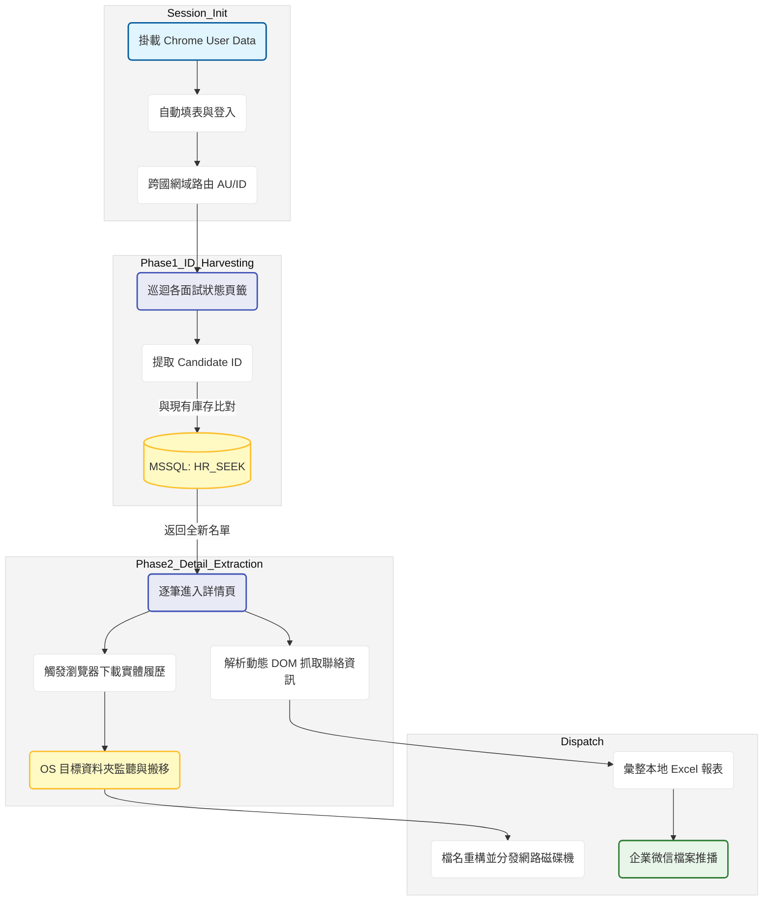
```mermaid
%%{init: {'theme': 'base', 'themeVariables': { 'primaryColor': '#fff', 'edgeLabelBackground':'#fcfcfc', 'tertiaryColor': '#f4f4f4', 'lineColor': '#333'}}}%%
graph TD
    classDef start fill:#e1f5fe,stroke:#01579b,stroke-width:2px;
    classDef process fill:#fff9c4,stroke:#fbc02d,stroke-width:2px;
    classDef logic fill:#e8eaf6,stroke:#3f51b5,stroke-width:2px;
    classDef finish fill:#e8f5e9,stroke:#2e7d32,stroke-width:2px;

    subgraph Session_Init
        Profile(掛載 Chrome User Data):::start --> Login(自動填表與登入)
        Login --> Route(跨國網域路由 AU/ID)
    end

    subgraph Phase1_ID_Harvesting
        Route --> Scan(巡迴各面試狀態頁籤):::logic
        Scan --> Extract(提取 Candidate ID)
        Extract --與現有庫存比對--> DB[(MSSQL: HR_SEEK)]:::process
    end

    subgraph Phase2_Detail_Extraction
        DB --返回全新名單--> Detail(逐筆進入詳情頁):::logic
        Detail --> DOM(解析動態 DOM 抓取聯絡資訊)
        Detail --> Trigger(觸發瀏覽器下載實體履歷)
        Trigger --> OS_Monitor(OS 目標資料夾監聽與搬移):::process
    end

    subgraph Dispatch
        DOM --> Output(彙整本地 Excel 報表)
        OS_Monitor --> Rename(檔名重構並分發網路磁碟機)
        Output --> WeChat(企業微信檔案推播):::finish
    end

```

### 實作挑戰與卡點

1. 前端框架的動態類別名稱地獄。SEEK 的前端使用了重度的 CSS in JS 框架，DOM 結構極度深層且類別名稱全是一堆無意義的動態亂碼。這導致常規的網頁元素定位幾乎無法使用，只能硬著頭皮把超長的組合選擇器寫死在程式碼裡，維護成本極高。
2. 實體檔案下載的非同步攔截。SEEK 的履歷下載按鈕點擊後，是透過前端腳本直接觸發瀏覽器底層下載，無法像 Indeed 那樣透過 fetch 拿到 blob 網址來優雅處理。實作上只能妥協，讓腳本寫死一個本機下載路徑，利用無限迴圈去監聽該資料夾，並透過檔案的最後修改時間來盲抓剛載好的履歷，這種做法在系統 I/O 繁忙時有極高的機率抓錯檔案。
3. 跨國網域的行為差異。澳洲與印尼的 SEEK 雖然底層架構相似，但在登入跳轉邏輯與頁面載入速度上有微妙差異，導致原本想寫成單一通用模組的計畫失敗，最後只能拆分成兩支獨立的腳本分別維護。

### 技術細節與取捨

* 雙階段分離爬取策略。如果一邊掃描列表一邊進去抓履歷，只要中間網路斷線就會全盤皆輸。系統改採兩段式設計，第一階段只管翻頁並把所有候選人 ID 收集起來，直接拿這包 ID 去跟資料庫的 unique_id 做差集比對，確認是全新名單後才進入第二階段的深層抓取，大幅降低了不必要的頁面跳轉與防護觸發率。
* 本地進度斷點快取。考量到單次抓取可能包含數百份履歷，在深層抓取迴圈中加入了 progress.txt 的本地落檔機制。每成功下載並解析一筆，就把該筆的 unique_id 寫入檔案，若程式意外崩潰，下次重啟時會自動跳過已處理的進度，這是在不頻繁對資料庫做 Update 的情況下最穩妥的保命做法。

圖表展示了澳洲與印尼兩個國家在不同面試狀態（如 Shortlist 或 Prescreen）下的履歷進件數量分佈，並對比了兩段式爬取架構導入前後的執行時間差異，可以看出分離去重邏輯後整體系統的穩定度與處理吞吐量都有顯著提升。


---

## 📂 项目路径: 爬蟲專案合集/zhilian
> **文件来源:** `/Users/alysonchen/Downloads/KeDing/爬蟲專案合集/zhilian/readme.md`

# 智聯招聘崗位數據自動化採集與地址補齊管線：開發紀錄與踩坑筆記

### 項目背景

業務端需要監控大陸地區競品公司的招聘動態，並藉由企業擴編釋出的職缺作為 B2B 業務開發的潛在線索。早期依賴人工定期巡檢智聯招聘網站，效率低且無法規模化。本專案目標是建構自動化爬蟲管線，定期抓取特定城市與行業的職缺列表。由於智聯的列表頁缺乏精確的實體辦公地址，專案架構拆分為兩階段，主程式負責高頻率掃描列表入庫，回補腳本則針對高價值線索進行深層的地址抓取，確保第一線業務能獲得完整的聯絡資訊。

### 數據流轉邏輯

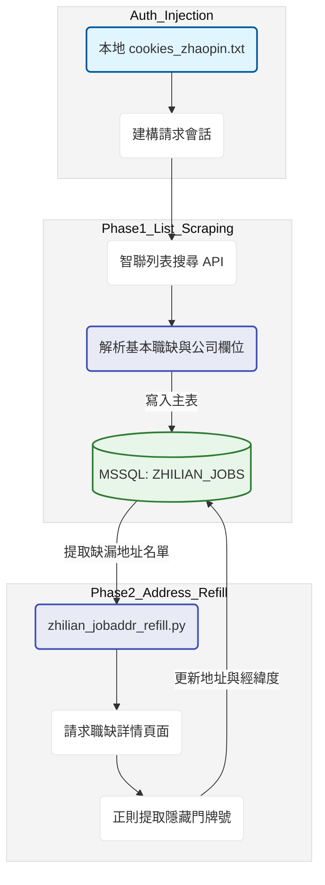
```mermaid
%%{init: {'theme': 'base', 'themeVariables': { 'primaryColor': '#fff', 'edgeLabelBackground':'#fcfcfc', 'tertiaryColor': '#f4f4f4', 'lineColor': '#333'}}}%%
graph TD
    classDef start fill:#e1f5fe,stroke:#01579b,stroke-width:2px;
    classDef process fill:#fff9c4,stroke:#fbc02d,stroke-width:2px;
    classDef logic fill:#e8eaf6,stroke:#3f51b5,stroke-width:2px;
    classDef finish fill:#e8f5e9,stroke:#2e7d32,stroke-width:2px;

    subgraph Auth_Injection
        Txt(本地 cookies_zhaopin.txt):::start --> Session(建構請求會話)
    end

    subgraph Phase1_List_Scraping
        Session --> Search_API(智聯列表搜尋 API)
        Search_API --> Parse(解析基本職缺與公司欄位):::logic
        Parse --寫入主表--> DB[(MSSQL: ZHILIAN_JOBS)]:::process
    end

    subgraph Phase2_Address_Refill
        DB --提取缺漏地址名單--> Refill_Engine(zhilian_jobaddr_refill.py):::logic
        Refill_Engine --> Detail_Page(請求職缺詳情頁面)
        Detail_Page --> Extract_Addr(正則提取隱藏門牌號)
        Extract_Addr --更新地址與經緯度--> DB:::finish
    end

```

### 實作挑戰與卡點

1. **極端嚴苛的滑塊驗證與風控**：智聯招聘對異常流量的封控極為敏感，若直接使用無頭瀏覽器模擬點擊，極易觸發複雜的防機器人滑塊驗證，且通過率極低。為了保證爬蟲生存率，放棄了程式自動登入的幻想，改採手動獲取網頁版憑證並存入文本供程式讀取。
2. **精確地址欄位的深層隔離**：在 V2 版本的開發過程中發現，列表頁的 API 回傳值僅包含商圈或行政區的模糊字串，真正的門牌號碼與經緯度資訊被隔離在職缺詳情頁中，甚至部分是透過另外的非同步請求加載。若在掃描列表時同步請求詳情頁，會瞬間拉高請求頻率導致 IP 被封。
3. **動態介面變更與頻繁失效**：智聯的前端結構與 API 簽章演算法更迭頻繁。這也是專案命名為 V2 的原因，前一版本的解析邏輯已經完全失效，必須重新攔截網路封包分析新的參數結構。

### 技術細節與取捨

* **非同步雙軌抓取架構**：針對地址隔離的問題，系統設計成主副兩支程式。主程式負責廣泛撒網，快速將基本資訊掃入資料庫，副程式再以極慢的速率、模擬真人瀏覽的間隔，逐筆進入詳情頁把精確地址補齊。犧牲了資料獲取的即時性，換取了系統的長期穩定運作。
* **狀態降級與休眠策略**：直接從本地讀取授權憑證。當程式偵測到 HTTP 回應碼異常或 JSON 解析失敗時，會判定為憑證失效或觸發風控，此時腳本會主動休眠並印出警告，而不是無腦重試消耗有限的網路資源。
* **資料庫寫入防衝突機制**：為了配合雙軌架構，資料庫寫入採用了狀態機的設計概念。主程式寫入時將狀態標記為待補齊，回補腳本只針對這些特定狀態的資料進行處理，處理完畢再更新標籤，避免兩支程式同時操作同一筆記錄產生鎖死。

圖表展示了系統自動化運轉後，重點關注城市（如北上廣深）的特定行業職缺釋出熱度，結合補齊後的實體地址座標，能精準繪製出競品公司的擴編熱力圖，輔助業務團隊制定地推策略。


---

## 📂 项目路径: 爬蟲專案合集/Indeed
> **文件来源:** `/Users/alysonchen/Downloads/KeDing/爬蟲專案合集/Indeed/readme.md`

# Indeed 海外履歷自動化抓取與歸檔系統：開發紀錄與踩坑筆記

### 項目背景

人資部為了應對海外加盟專案的擴張需求，需要大量從 Indeed 平台獲取美國與加拿大的候選人履歷。早期完全依賴人資手動逐頁點擊下載並分類，耗費大量作業時間。本專案目標是建立一套半自動化的爬蟲管線，透過資料庫比對去重，自動抓取新增的候選人資訊，解決履歷檔案的下載與本機端資料夾分類，並透過企業微信機器人串接每日的進件報告與異常警報。

### 數據流轉邏輯

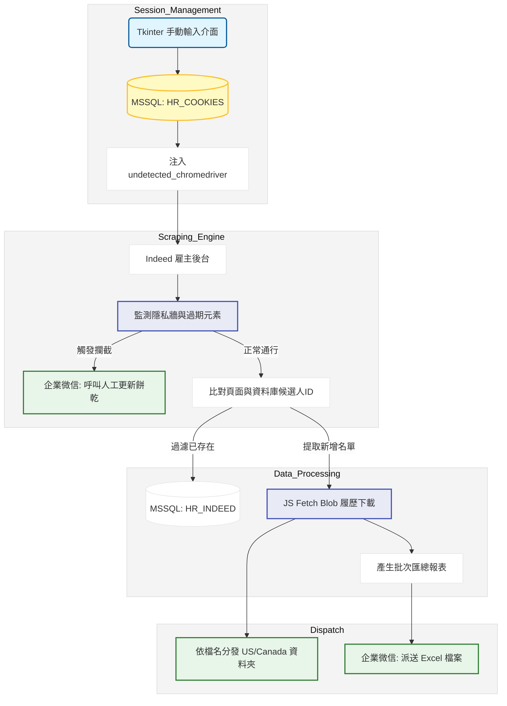
```mermaid
%%{init: {'theme': 'base', 'themeVariables': { 'primaryColor': '#fff', 'edgeLabelBackground':'#fcfcfc', 'tertiaryColor': '#f4f4f4', 'lineColor': '#333'}}}%%
graph TD
    classDef start fill:#e1f5fe,stroke:#01579b,stroke-width:2px;
    classDef process fill:#fff9c4,stroke:#fbc02d,stroke-width:2px;
    classDef logic fill:#e8eaf6,stroke:#3f51b5,stroke-width:2px;
    classDef finish fill:#e8f5e9,stroke:#2e7d32,stroke-width:2px;

    subgraph Session_Management
        UI(Tkinter 手動輸入介面):::start --> DB_Cookie[(MSSQL: HR_COOKIES)]:::process
        DB_Cookie --> Inject[注入undetected_chromedriver]
    end

    subgraph Scraping_Engine
        Inject --> Target[Indeed 雇主後台]
        Target --> Monitor[監測隱私牆與過期元素]:::logic
        Monitor --觸發攔截--> WeChat_Alert[企業微信: 呼叫人工更新餅乾]:::finish
        Monitor --正常通行--> ID_Check[比對頁面與資料庫候選人ID]
    end

    subgraph Data_Processing
        ID_Check --過濾已存在--> Target_DB[(MSSQL: HR_INDEED)]
        ID_Check --提取新增名單--> Blob_Fetch[JS Fetch Blob 履歷下載]:::logic
        Blob_Fetch --> Excel_Gen[產生批次匯總報表]
    end

    subgraph Dispatch
        Blob_Fetch --> File_Move[依檔名分發 US/Canada 資料夾]:::finish
        Excel_Gen --> WeChat_Report[企業微信: 派送 Excel 檔案]:::finish
    end

```

### 實作挑戰與卡點

1. **嚴苛的登入狀態失效機制**：Indeed 對於自動化工具的防護非常嚴格，即使用了 undetected_chromedriver 仍無法穩定維持長期登入狀態。為了解決反覆登入被鎖帳號的問題，最終選擇妥協為半自動架構。透過額外開發的 Tkinter 介面讓使用者手動貼上 Cookie 存入資料庫，主程式讀取後再進行抓取。
2. **Blob 履歷下載限制**：當進入候選人詳情頁要下載履歷時，發現下載按鈕的連結通常受限於前端防護，直接用 Python requests 去請求該 URL 會被擋下或是拿不到真實檔案。最後的解法是直接在瀏覽器環境內執行 JavaScript，透過 fetch 拿到 blob 網址後，轉成 Base64 傳回 Python 再解碼存成 PDF 實體檔案，這是整個抓取流程中最核心的繞過技巧。
3. **無效點擊與網頁加載時序**：Indeed 前端是用重度框架渲染，元素出現的時機點非常不固定。如果在列表中直接使用點擊下一頁的邏輯，經常會因為防護彈窗或是加載延遲導致腳本崩潰。

### 技術細節與取捨

* **人機協作的監控機制**：既然無法百分之百避開 Cookie 過期或隱私審查彈窗，就在程式中實作了 `monitor_element` 函數。一旦連續五次偵測到特定的防護牆元素，就直接打 API 給企業微信機器人，發送求救訊息提醒業務端人工去更新 Cookie。這種把例外狀況拋給人工作業的做法，大幅降低了程式的維護成本。
* **記憶體內集合去重**：為了避免重複下載履歷，每次翻頁獲取到的候選人 ID 會先透過 Python 的 set 資料結構，與從資料庫撈出的 `existing_userids` 取差集（`new_ids = current_ids - existing_userids`）。確認是全新的 ID 才加入待抓取序列，有效減少對 Indeed 伺服器的無效請求。
* **資料夾硬碟映射**：因為這支程式預期會在內網的排程伺服器上跑，所以直接把履歷輸出的路徑寫死綁定在 Z 槽的網路磁碟機。抓下來的檔案會依照檔名帶有的關鍵字自動搬移到美國或加拿大的專屬目錄，方便人資部第一時間檢視。

圖表展示了系統上線後每週成功解析並下載的履歷數量趨勢，可以看出在解決了 Blob 下載問題後，系統能穩定處理大量的候選人進件，並且大幅縮短了人資獲取報表的時間差。


---

## 📂 项目路径: 爬蟲專案合集/Boss
> **文件来源:** `/Users/alysonchen/Downloads/KeDing/爬蟲專案合集/Boss/readme.md`

# 裝修業潛在客戶自動化爬蟲與清洗管線：開發紀錄與踩坑筆記

### 項目背景

業務端需要大量各城市的室內設計公司名單作為開發線索，原本靠人工搜索收集的效率太低。專案目標是自動巡迴各城市抓取公司名稱與實體地址，並透過地圖服務二次搜索補齊聯絡電話。架構上分為三個獨立階段，代理節點池更新，目標平台名單抓取，地圖電話補齊。這樣的解耦設計是為了應對不同網站的封鎖策略，避免單一環節卡死導致全盤停擺。

### 數據流轉邏輯

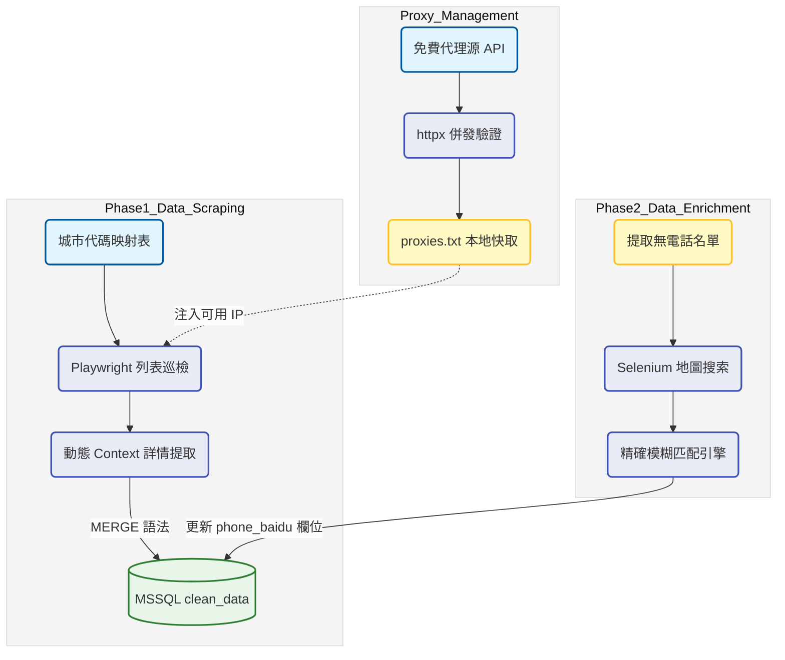
```mermaid
%%{init: {'theme': 'base', 'themeVariables': { 'primaryColor': '#fff', 'edgeLabelBackground':'#fcfcfc', 'tertiaryColor': '#f4f4f4', 'lineColor': '#333'}}}%%
graph TD
    classDef start fill:#e1f5fe,stroke:#01579b,stroke-width:2px;
    classDef process fill:#fff9c4,stroke:#fbc02d,stroke-width:2px;
    classDef logic fill:#e8eaf6,stroke:#3f51b5,stroke-width:2px;
    classDef finish fill:#e8f5e9,stroke:#2e7d32,stroke-width:2px;

    subgraph Proxy_Management
        P1(免費代理源 API):::start --> P2(httpx 併發驗證):::logic
        P2 --> P3(proxies.txt 本地快取):::process
    end

    subgraph Phase1_Data_Scraping
        S1(城市代碼映射表):::start --> S2(Playwright 列表巡檢):::logic
        P3 -.注入可用 IP.-> S2
        S2 --> S3(動態 Context 詳情提取):::logic
        S3 --MERGE 語法--> DB[(MSSQL clean_data)]:::finish
    end

    subgraph Phase2_Data_Enrichment
        E1(提取無電話名單):::process --> E2(Selenium 地圖搜索):::logic
        E2 --> E3(精確模糊匹配引擎):::logic
        E3 --更新 phone_baidu 欄位--> DB:::finish
    end

```

### 實作挑戰與卡點

1. **動態環境與反爬蟲博弈**：目標網站的反爬機制極度嚴格，最初嘗試單一瀏覽器跑到底，沒幾頁就會被封鎖或是瘋狂跳出驗證碼。後來改用 Playwright 的動態環境機制，每抓取十二筆公司詳情就強制銷毀上下文並更換代理與瀏覽器指紋。雖然大幅度犧牲了爬取效能，但這是目前能穩定獲取完整地址資料的唯一保命解法。
2. **免費代理池的高死亡率**：使用腳本自動抓取免費代理，但這些 IP 存活時間極短。爬蟲主程式必須實作大量的 try-except 與重試邏輯，在請求超時或被服務器拒絕時，必須強行攔截錯誤並自動切換下一個代理。
3. **名稱匹配的髒資料地獄**：從地圖搜出來的結果經常帶有總店或分公司等後綴，甚至混雜裝飾工程等行業泛詞。如果只用字串完全相等來比對，電話命中率極低，導致後續業務端拿到一堆空號或錯誤資訊。

### 技術細節與取捨

* **精確模糊匹配引擎設計**：為了解決地圖搜索結果與原始公司名稱不一致的問題，在腳本中開發了自訂的清洗引擎。先拔除括號內容與城市詞，再搭配雙連字與 Jaccard 相似度綜合評分。這部分耗費了最多時間在微調參數，目前設定 SequenceMatcher 閥值在零點九勉強達到業務要求的準確率。

圖表展示了經過模糊匹配引擎優化後，各主力城市的有效電話補齊率變化，可以看出加入 Jaccard 相似度判斷與泛詞過濾後，地圖搜尋的精準命中率有顯著拉升，大幅減少了業務端無效撥打的時間成本。

* **雙重爬蟲技術棧的妥協**：專案中抓取主名單使用 Playwright，但第二階段查地圖卻混用了 Selenium。這是典型的實務技術債，因為電話補齊的腳本繼承自早期的舊專案，當時已經把地圖網站的網頁結構和遇到防護時的重試退避邏輯寫死在 Selenium 裡。為了快速交付業務端，決定保留原樣不做重構，反正兩階段透過資料庫非同步對接，完全互不干涉。
* **資料庫 UPSERT 邏輯**：全城市巡檢動輒十幾個小時，遇到網路中斷是常態。寫入資料庫一律採用 MSSQL 的 MERGE 語法處理，完全依賴公司網址與實體地址作為唯一識別。這樣能避免重複爬取造成的鍵值衝突與效能浪費，也能無縫接軌斷點續傳。


---

## 📂 项目路径: 自動化月結
> **文件来源:** `/Users/alysonchen/Downloads/KeDing/自動化月結/readme.md`

# 自動化月結與全球交易額度判定系統 開發紀錄與踩坑筆記

### 業務與資料背景

集團在全球各區的 B2B 交易中存在複雜的月結與信用額度規範。過去業務助理需要每月手動比對 SAP 的客資狀態，會計提供的呆帳名單，海外業務部的逾期帳款，以及各區業務自行登記的共用額度表。為了消除人工結算的延遲與誤判，專案的目標是將台灣，新加坡，馬來西亞以及海外六國（香港，日本，菲律賓，印尼，越南，泰國）的月結額度判定邏輯全面自動化。系統必須融合 SAP 系統內的歷史銷貨與兌現明細，並與散落在 Z 槽網路磁碟機的各類 Excel 報表進行關聯，最終輸出一份精準的額度變更建議與 SAP 大批匯入檔。

### 數據流轉與架構設計

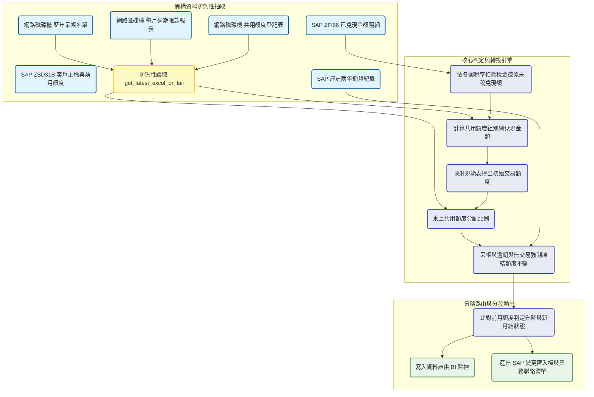
```mermaid
graph TD
    classDef source fill:#e1f5fe,stroke:#01579b,stroke-width:2px
    classDef process fill:#fff9c4,stroke:#fbc02d,stroke-width:2px
    classDef logic fill:#e8eaf6,stroke:#3f51b5,stroke-width:2px
    classDef sink fill:#e8f5e9,stroke:#2e7d32,stroke-width:2px
    classDef debt fill:#ffcdd2,stroke:#c62828,stroke-width:2px

    subgraph 異構資料防禦性抽取
        SAP_ZSD31(SAP ZSD31B 客戶主檔與前月額度):::source
        SAP_Sales(SAP 歷史兩年銷貨紀錄):::source
        SAP_ZFI66(SAP ZFI66 已兌現金額明細):::source
        
        Excel_BadDebt(網路磁碟機 歷年呆帳名單):::source
        Excel_Overdue(網路磁碟機 每月逾期帳款報表):::source
        Excel_Shared(網路磁碟機 共用額度登記表):::source
        
        Excel_BadDebt --> File_Check(防禦性讀取 get_latest_excel_or_fail):::process
        Excel_Overdue --> File_Check
        Excel_Shared --> File_Check
    end

    subgraph 核心判定與轉換引擎
        SAP_ZFI66 --> Tax_Calc(依各國稅率扣除稅金還原未稅兌現額):::logic
        File_Check --> Shared_Group(計算共用額度組別總兌現金額):::logic
        Tax_Calc --> Shared_Group
        
        Shared_Group --> Level_Map(映射規範表得出初始交易額度):::logic
        File_Check --> Ratio_Map(乘上共用額度分配比例):::logic
        Level_Map --> Ratio_Map
        
        Ratio_Map --> Freeze_Rule(呆帳與逾期與無交易強制凍結額度不變):::logic
        SAP_Sales --> Freeze_Rule
    end

    subgraph 策略路由與分發輸出
        Freeze_Rule --> Compare_Limit(比對前月額度判定升降與新月結狀態):::logic
        
        Compare_Limit --> BI_Report(寫入資料庫供 BI 監控):::sink
        Compare_Limit --> Output_SAP(產出 SAP 變更匯入檔與業務聯絡清單):::sink
    end

```

### 稅率陷阱與共用額度計算實作

在處理跨國交易額度時，我踩到了一個隱蔽的稅率陷阱。SAP ZFI66 報表撈出的已兌現金額預設是含稅的，但各國的稅率完全不同（台灣百分之五，新加坡馬來西亞百分之九，日本百分之十，菲律賓百分之十二等）。如果不將金額還原成未稅價，會導致客戶的累計兌現金額虛高，進而配發錯誤的信用額度。我在程式中強制介入除以對應的稅率常數，並加上微小的浮點數防禦來精準進位。

另一個極度複雜的業務邏輯是共用額度。許多集團客戶會使用多個子公司帳號進行交易，但總部要求這些帳號必須共用同一個信用池。我在 Pandas 實作了向上聚合的邏輯，先將同一個共用額度組別（共用額度組別分類）的未稅兌現金額加總，用這個巨大的總額去階梯表映射出頂層的交易額度，最後再乘上各子公司專屬的額度分配比例。這個設計確保了集團客戶的信用曝險不會因為開設分公司而無限膨脹。


### 策略模式重構與跨國架構演進

在最初的開發階段（如腳本一與腳本二），台灣與新加坡的邏輯是完全寫死在主流程中的。但當專案需要擴展到另外六個海外國家時，這種程序導向的寫法引發了巨大的技術債。各國的 SAP 銷售組織代碼，買方前綴，稅率，甚至共用額度的分頁名稱都完全不同。

為了解決這個工程瓶頸，我在第三個腳本中導入了物件導向的策略模式。我定義了 CountryConfig 資料類別來集中管理每個國家的常數與檔案路徑，並實作了 BaseStrategy 類別來封裝標準的計算流程。未來如果某個國家（例如日本）的判斷邏輯發生變異，只需要繼承 BaseStrategy 並覆寫單一方法，再將其註冊到 STRATEGY_REGISTRY 字典中即可。這種設計讓主程式 run_country 變得極度乾淨，只負責依序呼叫介面，大幅降低了後續維護的認知負擔。

### 實務限制與檔案依賴痛點

整套系統最大的脆弱點在於對共用網路磁碟機的深度依賴。業務端與會計端高度習慣使用 Excel 來維護不轉月結名單與呆帳紀錄。這些檔案經常被隨意更改名稱，或是因為人員忘記關閉檔案而引發 PermissionError 權限鎖死。

為了讓排程能夠穩定活下去，我封裝了 get_latest_excel 函式。系統不再依賴寫死的絕對檔名，而是利用關鍵字與時間戳掃描目錄抓取最新版本。如果遇到缺失的檔案（例如某個國家這個月剛好沒有逾期帳款），程式會捕捉例外並回傳預設的空 DataFrame 讓流程繼續空轉，而不是直接報錯崩潰。這是在與傳統辦公室作業流程妥協下，保證資料管線韌性的必要手段。

---

## 📂 项目路径: 拜訪清單
> **文件来源:** `/Users/alysonchen/Downloads/KeDing/拜訪清單/README.md`

# 業務外勤拜訪清單自動化生成系統 開發紀錄與踩坑筆記

### 業務與資料背景

為了協助外勤業務與小區主管精準鎖定高價值或需挽回的客戶，系統需要每日自動產出各種類型的拜訪名單。這些名單的觸發條件涵蓋了：歷史銷貨排行，近兩年交易差異破百萬，客訴後未再交易，五年內有交易但久未聯繫，以及高資本額的新建客戶等。專案的挑戰在於，所有的撈取邏輯都必須掛載嚴格的「防打擾」機制（例如近三個月內已拜訪或已透過K大視訊聯繫過的客戶必須強制排除），同時確保最終產出的清單只保留「第一聯絡人」供業務撥打，並根據負責區域精準分派。最後，為了解決數十支獨立 Python 腳本的排程管理問題，專案導入了一個基於 Excel 驅動的中央排程器。

### 數據流轉與架構設計

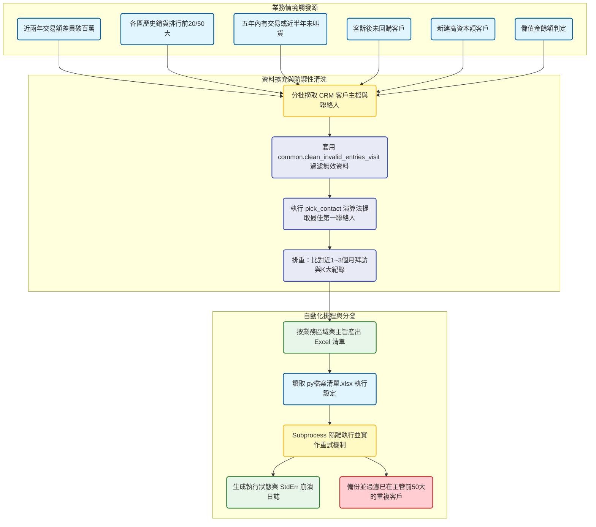
```mermaid
graph TD
    classDef source fill:#e1f5fe,stroke:#01579b,stroke-width:2px
    classDef process fill:#fff9c4,stroke:#fbc02d,stroke-width:2px
    classDef logic fill:#e8eaf6,stroke:#3f51b5,stroke-width:2px
    classDef sink fill:#e8f5e9,stroke:#2e7d32,stroke-width:2px
    classDef debt fill:#ffcdd2,stroke:#c62828,stroke-width:2px

    subgraph 業務情境觸發源
        Sales_Diff(近兩年交易額差異破百萬):::source
        Sales_Top(各區歷史銷貨排行前20/50大):::source
        Sales_Dormant(五年內有交易或近半年未叫貨):::source
        Event_Complaint(客訴後未回購客戶):::source
        Event_New(新建高資本額客戶):::source
        Event_Stored(儲值金餘額判定):::source
    end

    subgraph 資料擴充與防禦性清洗
        Sales_Diff & Sales_Top & Sales_Dormant & Event_Complaint & Event_New & Event_Stored --> Merge_CRM(分批撈取 CRM 客戶主檔與聯絡人):::process
        Merge_CRM --> Rule_Clean(套用 common.clean_invalid_entries_visit 過濾無效資料):::logic
        
        Rule_Clean --> Check_Contact(執行 pick_contact 演算法提取最佳第一聯絡人):::logic
        Check_Contact --> Check_Disturb(排重：比對近1~3個月拜訪與K大紀錄):::logic
    end

    subgraph 自動化排程與分發
        Excel_Config(讀取 py檔案清單.xlsx 執行設定):::source
        
        Check_Disturb --> Output_Excel(按業務區域與主旨產出 Excel 清單):::sink
        Output_Excel --> Excel_Config
        
        Excel_Config --> Task_Runner(Subprocess 隔離執行並實作重試機制):::process
        Task_Runner --> Logger(生成執行狀態與 StdErr 崩潰日誌):::sink
        
        Task_Runner --> Post_Process(備份並過濾已在主管前50大的重複客戶):::debt
    end

```

### 多情境名單撈取與排重邏輯

在實作各類拜訪名單時，我大量依賴了底層的 `common` 模組。以「客訴後未交易」這支腳本為例，業務邏輯非常刁鑽：必須先從 CRM 軌跡表（`customEntity15__c`）中抓出工作類別為客訴（代碼 12）或 C3 系列的紀錄，取得每家公司最近一次的投訴日期；接著拿這批公司去跟 SAP 銷貨明細進行 Inner Join，最後透過 `~isin` 反向篩選出「在最近一次投訴後，就再也沒有出貨紀錄」的流失客戶。

另一個效能雷區是 CRM 的 XOQL 查詢限制。由於單次查詢回傳的資料量有限且 URL 可能超長，在透過公司代號反查 CRM 客戶主檔時，我實作了批次查詢（Batch Query）機制。程式會將幾千筆公司代號以 100 筆為一個 Batch，拼接成 `IN ('A', 'B', ...)` 的字串分批戳 API，並透過 `try-except` 確保單一 Batch 失敗不會導致整支腳本崩潰。

在防打擾機制上，所有產出的名單在最後一關都必須強制套用 `kd.last_connected` 函數。這個函數會去撈取 `clean_data.dbo.crm_track_1year`（外勤拜訪打卡）以及 `crm_K_3M`（K大視訊上線超過 8 分鐘），將近期已經接觸過的客戶剔除，避免業務重複撥打引發反感。

### 聯絡人降級尋找與專案歸屬

在「五年內有交易」這類久未聯繫的名單中，原本的主要聯絡人往往已經離職或空號。我在這裡套用了 `best_contact` 演算法。當首選聯絡人無效時，程式會從該公司的所有關聯聯絡人中，依序檢查職務（老闆優先於總監優先於設計師）與關係狀態（在職主要優先於在職配合），最終兜底出一個最有可能接電話的有效 09 手機號碼。此外，為了確保開發資源不衝突，程式會利用 `_prefer` 旗標，優先保留「公司代號等於關聯母公司代號」的主帳號，將子公司的重複聯絡人強制隱藏。

### 基於 Excel 的中央排程器實作

這個專案包含了將近四十支獨立的 `.py` 腳本，每天清晨依序執行。如果依賴 Windows 工作排程器去綁定每一支腳本，維護成本將會極度失控。為了降低運維難度，我開發了 `99.清單執行.py` 這個中央控制器。

它的設計非常直觀：讀取一份名為 `py檔案清單.xlsx` 的設定檔，業務單位可以直接在 Excel 中將 `是否執行` 的欄位改成 True 或 False 來動態開關某支腳本。在底層實作上，控制器使用了 `subprocess.run` 來呼叫獨立的 Python 行程，這保證了單一腳本的 Memory Leak 或是 Pandas 處理崩潰（例如資料夾被鎖住導致的 PermissionError）絕對不會波及到主流程。同時，程式內建了 `MAX_RETRY = 3` 的重試機制，並會將成功與失敗的 `stderr` 詳細軌跡寫入 `run_log_YYYYMMDD.log` 中，徹底解決了過去「腳本死在半夜卻沒人知道原因」的痛點。最後，控制器還負責善後工作，自動將當日產出的所有清單進行備份，並強制將其他名單中「已經出現在小區主管前50大」的客戶剔除，確保基層業務不會跟主管打到同一通電話。

---

## 📂 项目路径: AI智慧派车
> **文件来源:** `/Users/alysonchen/Downloads/KeDing/AI智慧派车/readme.md`

# AI 智慧派車與路徑最佳化系統 開發紀錄與踩坑筆記

### 項目背景

物流單位的派車作業極度依賴調度員的個人經驗。面對每日從 EWMS 系統匯出的海量 B2B 與 B2C 訂單，人工劃分配送區域與決定裝車順序耗時過長。專案目標是將歷史派車邏輯與老司機的經驗模型化，開發一套全自動的 AI 派車管線。系統涵蓋了底層的地址正規化，利用隨機森林預測所屬營業所，再透過 LightGBM 判斷併車機率，最後結合貪婪演算法與 2-Opt 進行路徑最佳化，產出視覺化的派車地圖與排序清單供現場人員直接使用。

### 數據流轉邏輯

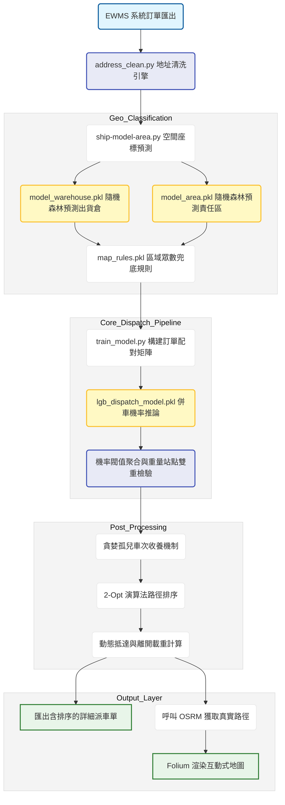
```mermaid
%%{init: {'theme': 'base', 'themeVariables': { 'primaryColor': '#fff', 'edgeLabelBackground':'#fcfcfc', 'tertiaryColor': '#f4f4f4', 'lineColor': '#333'}}}%%
graph TD
    classDef start fill:#e1f5fe,stroke:#01579b,stroke-width:2px;
    classDef process fill:#fff9c4,stroke:#fbc02d,stroke-width:2px;
    classDef logic fill:#e8eaf6,stroke:#3f51b5,stroke-width:2px;
    classDef finish fill:#e8f5e9,stroke:#2e7d32,stroke-width:2px;

    Input_Order(EWMS 系統訂單匯出):::start --> Clean_Engine(address_clean.py 地址清洗引擎):::logic
    Clean_Engine --> Geo_Predict(ship-model-area.py 空間座標預測)
    
    subgraph Geo_Classification
        Geo_Predict --> Model_WH(model_warehouse.pkl 隨機森林預測出貨倉):::process
        Geo_Predict --> Model_Area(model_area.pkl 隨機森林預測責任區):::process
        Model_WH --> Rules(map_rules.pkl 區域眾數兜底規則)
        Model_Area --> Rules
    end
    
    subgraph Core_Dispatch_Pipeline
        Rules --> Feature_Eng(train_model.py 構建訂單配對矩陣)
        Feature_Eng --> LGBM(lgb_dispatch_model.pkl 併車機率推論):::process
        LGBM --> Cluster(機率閥值聚合與重量站點雙重檢驗):::logic
    end
    
    subgraph Post_Processing
        Cluster --> Greedy_Orphan(貪婪孤兒車次收養機制)
        Greedy_Orphan --> TSP_2Opt(2-Opt 演算法路徑排序)
        TSP_2Opt --> Load_Calc(動態抵達與離開載重計算)
    end

    subgraph Output_Layer
        Load_Calc --> Output_CSV[匯出含排序的詳細派車單]:::finish
        Load_Calc --> OSRM_API(呼叫 OSRM 獲取真實路徑)
        OSRM_API --> Output_Map[Folium 渲染互動式地圖]:::finish
    end

```

### 地址清洗與正規化實作

台灣的地址資料庫極度混亂，業務端填寫的備註與 SAP 系統的原始地址往往帶有大量雜訊。為了解決經緯度轉換失敗的問題，專案獨立開發了 address_clean 模組。

這個模組首先透過 SQL 抓取 SYS_OUT_CONTACT 與 SYS_SALES_ORDER 兩張大表。清洗的第一步是針對 Google 地圖 API 偶爾回傳的英文倒裝格式進行修復。利用正則表達式的貪婪匹配機制，從字串尾部精確往回提取縣市與鄉鎮市區，解決了門牌號碼與路名沾黏的問題。

接著是暴力的雜訊過濾。腳本中寫死了幾十種業務常見的贅字（例如透天，洪文東，待確認，借鑰匙等），並利用正則表達式強制拔除 GPS 座標字串。為了確保後續比對的一致性，將所有的段落統一轉為阿拉伯數字（一段轉為 1段），強制截斷樓層與室號，最後透過 OpenCC 套件將簡體字全部轉為繁體。清洗完畢後，系統會計算 SAP 原始地址與業務修改地址的 SequenceMatcher 相似度，搭配行政區的硬核比對，將低於閥值的紀錄輸出給人工覆核。

### 模型訓練與封裝解析

專案中的四個核心 pkl 檔案分別由兩支不同的訓練腳本產出。

第一支是負責空間分類的 ship-model-area 腳本。這支程式單純利用訂單的收貨經緯度作為特徵，訓練了兩個 RandomForestClassifier 隨機森林模型。第一個是 model_warehouse 負責預測最適合的出貨營業所。第二個是 model_area 負責預測更細的區域代碼。為了防止模型在邊界地帶誤判，程式同時透過 pandas 分組計算了每個區域代碼歷史上最常對應的出貨倉，將這個眾數對應表儲存為 map_rules。在實際推論時，如果 model_warehouse 的預測信心度低於百分之七十五，系統就會呼叫 map_rules 進行覆蓋兜底，確保跨區派車的合理性。

第二支是負責判斷併車邏輯的 train_model 腳本。派車本質上是一個分群問題，這裡將其轉化為二元分類。程式將每日訂單透過 itertools 兩兩配對生成樣本矩陣。如果歷史紀錄中這兩筆訂單擁有相同的排單號，標籤就設為一，否則為零。特徵工程包含了兩點之間的 Haversine 距離，雙方重量加總，是否同區域，以及最晚派送時間的差距。考量到非同車的負樣本過多，程式設定了三倍的負樣本抽樣比例來平衡資料。最終訓練出 lgb_dispatch_model 這個 LightGBM 梯度提升樹模型，作為後續判斷兩張訂單是否能併入同一台車的核心依據。

### 實作挑戰與工程取捨

訂單備註的重量解析地獄。系統中存在大量聯絡單並沒有在資料庫中維護標準重量，業務通常直接把重量與建材規格打在備註欄裡。實作上開發了 extract_weight_with_log 函數，利用代幣化的概念，先用正則表達式把厚板或薄板等關鍵字替換成 TOKEN_A 與 TOKEN_B，再回頭去抓取前後相鄰的數字進行重量乘算。這種土炮的自然語言處理雖然不優雅，但成功挽救了大量因重量缺失導致模型崩潰的廢單。

AI 產出的孤兒車次問題。LightGBM 預測出的機率矩陣在經過閥值切分後，經常會產生一堆只裝了兩三張單且重量極輕的短車次。為了解決車輛資源浪費，在後處理階段加入了 optimize_orphans_greedy 貪婪收養機制。系統會主動掃描總重低於八百公斤或站點少於三站的孤兒車次，強制尋找距離最近且尚未違反一千四百公斤載重與三十個站點上限的母車次進行整併。

圖表展示了導入貪婪收養機制與雙重限制後，各營業所車隊的平均滿載率變化，以及單車低於三站的無效派遣比例顯著下降的趨勢，證明了硬規則後處理在物流領域的必要性。


---

## 📂 项目路径: 一般類型交辦
> **文件来源:** `/Users/alysonchen/Downloads/KeDing/一般類型交辦/readme.md`

# 經營業務多源交辦自動派發與回收管線 開發紀錄與踩坑筆記

### 業務與資料背景

經營業務團隊每日需要執行大量的客戶關懷與開發電訪。過去依賴人工整理名單並派發，不僅耗時，還經常發生業務員累積了幾百筆過期未打的任務，導致跟進進度失真。為了解決這個問題，系統導入了每日限額派發與強制回收機制。系統每日清晨會先清掃昨日未完成的任務，接著從四個不同的業務場景（司機推廣，型錄派樣，十四天前拒絕，六個月以上未購）中撈取潛在名單，經過嚴格的排重與防打擾過濾後，動態計算每位業務員今日的負載，精準補足至五十筆的每日上限。

### 數據流轉與架構設計

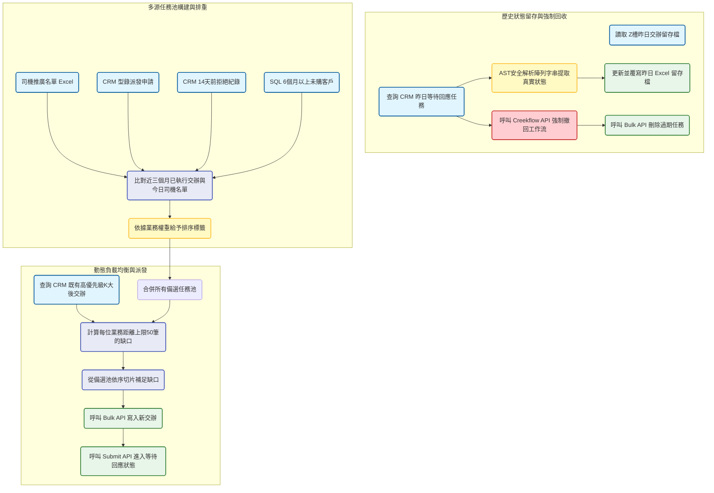
```mermaid
graph TD
    classDef source fill:#e1f5fe,stroke:#01579b,stroke-width:2px;
    classDef process fill:#fff9c4,stroke:#fbc02d,stroke-width:2px;
    classDef logic fill:#e8eaf6,stroke:#3f51b5,stroke-width:2px;
    classDef sink fill:#e8f5e9,stroke:#2e7d32,stroke-width:2px;
    classDef debt fill:#ffcdd2,stroke:#c62828,stroke-width:2px;

    subgraph 歷史狀態留存與強制回收
        Yest_Excel(讀取 Z槽昨日交辦留存檔):::source
        CRM_Wait(查詢 CRM 昨日等待回應任務):::source
        
        CRM_Wait --> Parse_Status(AST安全解析陣列字串提取真實狀態):::process
        Parse_Status --> Update_Yest(更新並覆寫昨日 Excel 留存檔):::sink
        CRM_Wait --> Withdraw(呼叫 Creekflow API 強制撤回工作流):::debt
        Withdraw --> Delete_Task(呼叫 Bulk API 刪除過期任務):::sink
    end

    subgraph 多源任務池構建與排重
        Src_Driver(司機推廣名單 Excel):::source
        Src_Sample(CRM 型錄派發申請):::source
        Src_Reject(CRM 14天前拒絕紀錄):::source
        Src_Dormant(SQL 6個月以上未購客戶):::source
        
        Src_Driver & Src_Sample & Src_Reject & Src_Dormant --> Deduplicate(比對近三個月已執行交辦與今日司機名單):::logic
        Deduplicate --> Priority_Sort(依據業務權重給予排序標籤):::process
    end

    subgraph 動態負載均衡與派發
        K_Task(查詢 CRM 既有高優先級K大後交辦):::source
        Priority_Sort --> Merge_Pool(合併所有備選任務池)
        
        K_Task --> Calc_Quota(計算每位業務距離上限50筆的缺口):::logic
        Merge_Pool --> Calc_Quota
        
        Calc_Quota --> Fill_Quota(從備選池依序切片補足缺口):::logic
        Fill_Quota --> CRM_Insert(呼叫 Bulk API 寫入新交辦):::sink
        CRM_Insert --> Submit_Flow(呼叫 Submit API 進入等待回應狀態):::sink
    end

```

### 任務回收與狀態快照的技術債

CRM 系統的交辦任務一旦進入審批工作流，底層邏輯就會變得異常封閉。我無法直接對這些記錄進行刪除或修改，必須先取得 `procInstId`，透過 API 模擬代理人將任務撤回（Withdraw），待其狀態解除後才能真正刪除。這個過程極度耗時且容易因為網路波動失敗。

另一個大坑是 CRM 報表無法準確追蹤這種會被每日刪除的變動型任務。為此我採用了土炮但極度可靠的快照機制，在執行回收前，先將昨日的狀態匯出至 Z槽的共用 Excel 中。由於 CRM 回傳的執行狀態經常帶有不規則的中括號與引號，我在程式中實作了基於 `ast.literal_eval` 的安全解析函數，將字串強制轉型並提取首個元素。同時也加入了針對 `PermissionError` 的防禦機制，避免因為業務員忘記關閉共用 Excel 而導致整個清晨排程崩潰。

### 動態負載均衡與限額演算法

為了確保業務員不會因為任務過多而產生抗拒心理，系統被要求每日只能派發五十筆名單。但每位業務員手上的既有任務量並不相同，有些人可能已經背了三十筆不可略過的強制任務。

![經營業務每日交辦負載與追蹤]BI/management_task_dispatch_quota.png

透過這張監控圖表可以發現，系統在派單時實作了精密的配額演算法。程式會先掃描每個人名下的高優先級任務數量，如果已經超過五十筆，今日就不再派發任何新名單。如果還有缺口，系統會將司機推廣，派樣跟進，十四天拒絕與沈睡喚醒這四類任務，依照一到四的優先級進行全域排序，接著利用 Pandas 的 `head` 函數精準切出需要的數量補上。這樣既保證了名單的消化率，也確保了最高價值的推廣資源能優先被觸達。

---

## 📂 项目路径: [BI]小型專案合集/簡訊名單
> **文件来源:** `/Users/alysonchen/Downloads/KeDing/[BI]小型專案合集/簡訊名單/readme.md`

# K大說明會簡訊邀約自動化系統：開發紀錄與踩坑筆記

### 項目背景

要把 CRM 裡面幾萬名客戶篩選出精準的簡訊邀約名單，去參加 K大（產品說明會）。這案子最麻煩的是要跨多個對象判定：要看公司型態（C, D, SE）、要排除倒閉或管制戶、要確認半年內沒領過型錄（避免重複打擾）、還要檢查這人最近有沒有去過展示館。最後要把這些洗乾淨的名單按公司型態分類，導出給規劃組直接發簡訊。

### 數據流轉邏輯

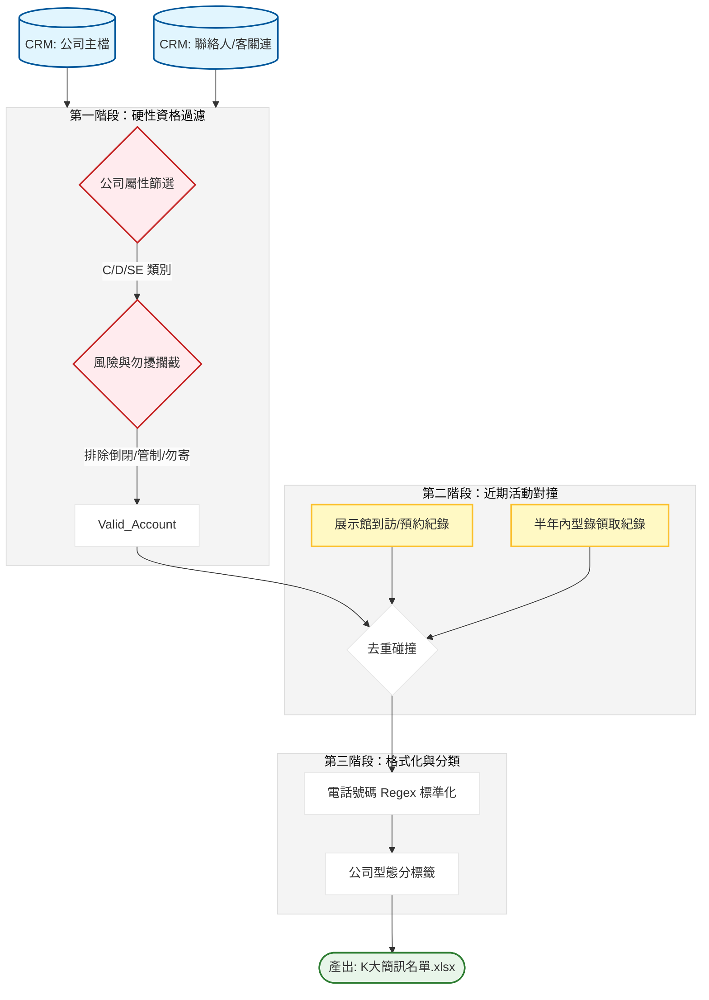
```mermaid
%%{init: {'theme': 'base', 'themeVariables': { 'primaryColor': '#fff', 'edgeLabelBackground':'#fcfcfc', 'tertiaryColor': '#f4f4f4', 'lineColor': '#333'}}}%%
graph TD
    %% 定義樣式
    classDef start fill:#e1f5fe,stroke:#01579b,stroke-width:2px;
    classDef filter fill:#ffebee,stroke:#c62828,stroke-width:2px;
    classDef process fill:#fff9c4,stroke:#fbc02d,stroke-width:2px;
    classDef finish fill:#e8f5e9,stroke:#2e7d32,stroke-width:2px;

    CRM_Account[(CRM: 公司主檔)]:::start --> Phase1
    CRM_Contact[(CRM: 聯絡人/客關連)]:::start --> Phase1

    subgraph Phase1 [第一階段：硬性資格過濾]
        direction TB
        F1{公司屬性篩選}:::filter
        F2{風險與勿擾攔截}:::filter
        F1 -- C/D/SE 類別 --> F2
        F2 -- 排除倒閉/管制/勿寄 --> Valid_Account
    end

    subgraph Phase2 [第二階段：近期活動對撞]
        direction TB
        M1[展示館到訪/預約紀錄]:::process
        G1[半年內型錄領取紀錄]:::process
        Valid_Account --> Cross_Check{去重碰撞}
        M1 --> Cross_Check
        G1 --> Cross_Check
    end

    subgraph Phase3 [第三階段：格式化與分類]
        direction TB
        P1[電話號碼 Regex 標準化]:::logic
        P2[公司型態分標籤]:::logic
        Cross_Check --> P1 --> P2
    end

    P2 --> Output([產出: K大簡訊名單.xlsx]):::finish

```

---

### 卡點在哪

簡訊名單最核心的就是手機號碼。CRM 裡的聯絡人電話簡直是垃圾場，有人寫 0912-345-678，有人寫 +886，還有人在號碼後面寫 分機12。我這裡如果直接拿這組號碼去發簡訊，系統會直接拒收或噴報錯。

另一個卡點是 展示館再訪 邏輯。規劃組要求如果這人三個月內去過展館、或是未來有預約的人，這次就不要發簡訊給他，因為他已經跟公司有接觸了。我必須去 `customEntity24__c`（展館預約表）撈資料，用 聯絡人代號 做 `isin` 比對。

### 為什麼這麼繞

這裡我不用單純的 `drop_duplicates`。因為一個聯絡人可能掛在好幾家公司名下，我必須創一個 `唯一識別`（公司代號 + 聯絡人姓名），否則會發生 A 公司沒領過型錄但 B 公司領過，導致名單判定失準。

```python
# 為什麼不用簡單的合併？因為一個聯絡人代碼可能對應到多個公司
# 我這裡強迫用 唯一識別 進行標註，這是為了保證去重不會誤殺。
K_invite['唯一識別'] = K_invite['公司代號'].astype(str) + K_invite['連絡人姓名'].astype(str)
museum_one_filtered['唯一識別'] = museum_one_filtered['公司代號'].astype(str) + museum_one_filtered['連絡人'].astype(str)

# 這裡留個坑：如果業務把聯絡人姓名打錯一個字，這個唯一識別就對不上了
K_invite['是否展館K大'] = K_invite['唯一識別'].isin(museum_one_filtered['唯一識別']).map({True: '是', False: '否'})

```

---

### 實際跑下來的坑

1. **手機號碼清洗失效**：原本以為只清掉橫槓就好，結果發現有人手機開頭寫 `886` 沒加 `+`。我直接用 `re.sub` 把所有非數字清掉，然後校正 `8869` 開頭的全部換成 `09`，否則簡訊商的 API 會判定為格式錯誤。
2. **非法字元炸掉 Excel**：`ILLEGAL_CHARACTERS_RE` 這個正則表達式一定要加在最後的 `applymap` 裡。規劃組那邊的 Excel 只要讀到客戶備註裡的奇怪換行符，檔案直接損毀，我修這個修了好幾次。

```python
# 這是保命用的一段，沒洗過一遍不敢導出。
from openpyxl.cell.cell import ILLEGAL_CHARACTERS_RE
K_invite = K_invite.applymap(lambda x: ILLEGAL_CHARACTERS_RE.sub('', x) if isinstance(x, str) else x)

# 實際跑下來發現，公司地址長度太短的通常是測試資料
# 我這裡直接下死命令，len < 7 且沒寫 號 的直接扔掉
K_invite = K_invite[K_invite['公司地址'].str.len() > 7]

```

### 為什麼這麼做

1. **分流輸出**：我這裡把 C/EC、D、SE 類別分開成三個 DataFrame 輸出。因為規劃組發簡訊的文案完全不同，這樣做讓他們可以一鍵複製，不用再自己手動篩選。
2. **歷史型錄對撞**：我直接抓 `appDate__c` 是一年內的所有禮品發放紀錄（`gift_df`）。只要這人這一年內拿過東西，優先權直接調到最低，確保簡訊資源是花在「新開發」的客戶身上。


---

## 📂 项目路径: [BI]小型專案合集/[BI]海外交辦執行
> **文件来源:** `/Users/alysonchen/Downloads/KeDing/[BI]小型專案合集/[BI]海外交辦執行/readme.md`

# 業務每日任務效能追蹤系統：開發紀錄與踩坑筆記

### 項目背景

要把業務每天在 CRM 裡的通話跟邀約數據量化。目標是算出每個人每天的 接通率 與 邀約率。我這裡直接從 CRM 抓出所有交辦任務，按照任務類型（打電話、見面、邀約）進行歸類，算出完成數、接通數跟邀約數。最後要把這些數據從寬表轉成長表格式（Long Format），塞進 SQL 資料庫供 FineBI 呈現。

### 數據流轉邏輯

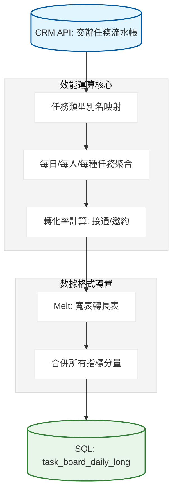
```mermaid
%%{init: {'theme': 'base', 'themeVariables': { 'primaryColor': '#fff', 'edgeLabelBackground':'#fcfcfc', 'tertiaryColor': '#f4f4f4', 'lineColor': '#333'}}}%%
graph TD
    %% 定義樣式
    classDef start fill:#e1f5fe,stroke:#01579b,stroke-width:2px;
    classDef filter fill:#ffebee,stroke:#c62828,stroke-width:2px;
    classDef process fill:#fff9c4,stroke:#fbc02d,stroke-width:2px;
    classDef finish fill:#e8f5e9,stroke:#2e7d32,stroke-width:2px;

    Input_CRM[(CRM API: 交辦任務流水帳)]:::start --> Mapper[任務類型別名映射]
    
    subgraph Calculation_Engine [效能運算核心]
        Mapper --> Agg[每日/每人/每種任務聚合]
        Agg --> Rates[轉化率計算: 接通/邀約]
    end

    subgraph Data_Transformation [數據格式轉置]
        Rates --> Melt[Melt: 寬表轉長表]
        Melt --> Combine[合併所有指標分量]
    end

    Combine --> SQL[(SQL: task_board_daily_long)]:::finish

```

---

### 卡點在哪

CRM 原始的任務類型名稱太亂。有的叫 Invite 1-1 Meeting，有的叫 1-1 Meeting，對統計來說這都是同一件事。如果我不做別名映射（Alias Map），報表會被拆成幾十個碎塊。

最危險的是算 接通率。如果某個業務當天一通電話都沒打（Completed = 0），代碼會直接噴除以零的錯誤。我這裡直接用 `np.where` 硬轉，只要分母是 0 就給 0.0，這才保證排程不會半夜炸掉。

### 為什麼這麼繞

為了 FineBI 畫圖方便，我沒直接存一張大寬表。我把 完成數、接通數、接通率 分開算，最後用 `pd.concat` 全部疊在一起。

```python
# 為什麼要分開算再併表？
# 因為這樣我可以在不更動資料庫結構的情況下，隨時增加新的指標（比如 拜訪率）。
# 這裡我用一個 parts 清單存所有計算結果，最後一次性 concat。
parts = []
# 算接通數
p = by_type[['date','assignee_name','task_type_alias','connected']].copy()
p['section'] = 'Connected Task'
parts.append(p.rename(columns={'connected':'value'}))

# 算接通率：這裡最繞，要先算當天總量
agg = by_type.groupby(['date','assignee_name'], as_index=False)[['connected','completed']].sum()
p = agg[['date','assignee_name']].copy()
# 預防除以零
p['value'] = np.where(agg['completed'] != 0, agg['connected'] / agg['completed'], 0.0)
p['section'] = 'Connected Rate'
parts.append(p)

```

---

### 實際跑下來的坑

1. **日期起始點硬編碼**：我這裡直接寫死 `start_ts_ms = pd.to_datetime("2025-01-30").timestamp() * 1000`。這是因為 2025 年之前的數據格式太舊，強行抓進來只會汙染報表。
2. **多重任務別名**：業務常會隨便改任務主旨。我目前只抓了 `Invite 1-1` 這種關鍵字，如果有人手抖打成 `Invte`，這筆數據就直接掉進垃圾桶了，目前只能靠人工去 CRM 改。

```python
# 實際跑下來發現，沒這張表，FineBI 的圖表會變成一團混亂。
task_type_alias_map = {
    'Invite 1-1 Meeting': 'Invite 1-1',
    'Invitation': 'Invite 1-1',
    'Call': 'Call',
    'Phone Call': 'Call'
}
# 坑：如果有新類型沒在表裡，會變成 NaN，我這裡直接 fillna('Other')
by_type['task_type_alias'] = by_type['task_type'].map(task_type_alias_map).fillna('Other')

```

### 為什麼這麼做

1. **長表轉置 (Melt)**：FineBI 的切片器最喜歡這種格式。雖然資料庫行數會變多，但前端寫 DAX 公式時會省事很多。
2. **多執行緒抓取**：雖然這份腳本計算量大，但我前面用 `ThreadPoolExecutor` 抓 CRM 資料是為了省下等待 API 回傳的時間。要是單線程跑，早上 8 點主管開會前絕對算不完。


---

## 📂 项目路径: [BI]小型專案合集/SAP每日數據遷移到CRM
> **文件来源:** `/Users/alysonchen/Downloads/KeDing/[BI]小型專案合集/SAP每日數據遷移到CRM/readme.md`

# SAP 銷售數據每日同步 CRM 系統：開發紀錄與踩坑筆記

### 項目背景

要把 SAP 內部的銷售實績（sap_sales_data_rfc）自動同步到銷售易（CRM）系統。需求是讓業務能在 CRM 上直接看到最新的出貨進度、司機資訊與倉管備註。這套腳本根據執行日期自動切換同步範圍：每天抓近 3 天資料，週一抓近 7 天，每月 5 號抓上個月全量數據，確保數據不會因為系統延遲而漏掉。

### 數據流轉邏輯

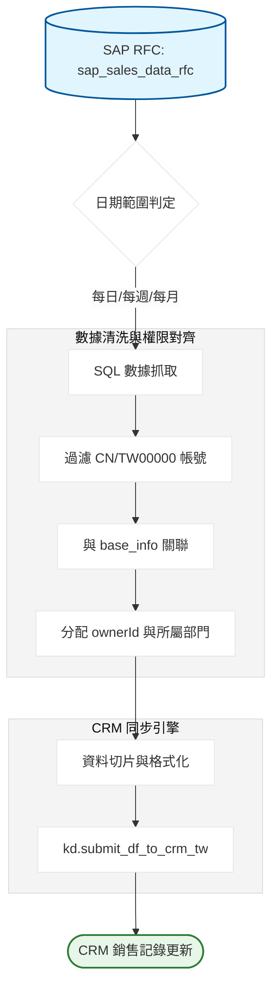
```mermaid
%%{init: {'theme': 'base', 'themeVariables': { 'primaryColor': '#fff', 'edgeLabelBackground':'#fcfcfc', 'tertiaryColor': '#f4f4f4', 'lineColor': '#333'}}}%%
graph TD
    %% 定義樣式
    classDef start fill:#e1f5fe,stroke:#01579b,stroke-width:2px;
    classDef filter fill:#ffebee,stroke:#c62828,stroke-width:2px;
    classDef logic fill:#e8eaf6,stroke:#3f51b5,stroke-width:2px;
    classDef finish fill:#e8f5e9,stroke:#2e7d32,stroke-width:2px;

    SAP[(SAP RFC: sap_sales_data_rfc)]:::start --> Range{日期範圍判定}
    Range -- 每日/每週/每月 --> SQL_Pull[SQL 數據抓取]

    subgraph Cleaning_and_Mapping [數據清洗與權限對齊]
        SQL_Pull --> F1[過濾 CN/TW00000 帳號]
        F1 --> Merge[與 base_info 關聯]
        Merge --> Map[分配 ownerId 與所屬部門]
    end

    subgraph Sync_Engine [CRM 同步引擎]
        Map --> Batch[資料切片與格式化]
        Batch --> CRM[kd.submit_df_to_crm_tw]
    end

    CRM --> Result([CRM 銷售記錄更新]):::finish

```

---

### 卡點在哪

SAP 的原始數據跟 CRM 的權限體系完全對不起來。SAP 只給業務姓名，但 CRM 寫入必須要有 16 位元的 ownerId。如果業務離職或改名，merge 就會失敗。
另外，SAP 的出貨備註（TDLIN1-3）裡面常有無效字元或換行符，如果直接塞進 API，整個 JSON 就會炸掉導致同步失敗。

### 為什麼這樣寫

這裡我設計了一個 build_time_ranges 函數，而不是死板的只抓昨天。

```python
# 為什麼不只抓昨天？因為 SAP 的 WADAT_DATETIME 有時候會延遲入庫。
# 實際跑下來發現，抓近 3 天是最穩的，週一再補抓 7 天來對齊週末的數據空缺。
def build_time_ranges(now: datetime):
    today = now.date()
    ranges = []
    # 規則一：每日保底抓 3 天
    ranges.append({"rule": "DAY_3", "start": today - timedelta(days=3), "end": today})
    # 規則二：週一強迫對齊一週
    if today.weekday() == 0:
        ranges.append({"rule": "WEEK_7", "start": today - timedelta(days=7), "end": today})
    return ranges

```

為了確保資料不會塞給錯誤的業務，我這裡強制過濾掉沒有 ownerId 的紀錄。

```python
# 這裡沒配對到業務 id 的直接扔掉，寧可不傳也不要傳給管理員
sap_sales_total = pd.merge(sap_sales, base_info, on="name", how="left").drop(columns=["地區"])
sap_sales_total = sap_sales_total[sap_sales_total['ownerId'].notna()]

```

---

### 實際跑下來的坑

1. **髒數據攔截**：SAP 裡面有一堆測試帳號（KUNAG == TW00000）跟大陸區資料（CN），我這裡直接在 SQL 階段用 `NOT LIKE '%CN%'` 全部擋掉，避免汙染台灣區的 CRM 環境。
2. **非法字元炸彈**：備註欄位（司機資訊、修改紀錄）是人手輸入的，什麼怪符號都有。我直接在寫入前用 `ILLEGAL_CHARACTERS_RE` 硬洗一遍，這是保證 API 不會 500 的最後防線。
3. **空值判定**：有些業務沒設地區，我代碼裡本來想用 `replace` 把 區 拔掉，後來發現這會讓某些空值變成 NaN 導致後續 merge 報錯。

```python
# 這裡最繞的地方：處理 entityType
# 銷售紀錄在 CRM 是自定義對象 29661547094081... 這種亂碼 ID。
# 這裡寫死雖然不優，但因為這個對象在 CRM 裡是唯一的，直接 Hardcode 效能最高。
sap_sales_total["entityType"] = 29661547094081...

```

### 為什麼這麼做

1. **批次提交**：每天出貨量很大，我用 `kd.submit_df_to_crm_tw` 走的是 Bulk API 邏輯。要是用一筆一筆 patch，早上上班前絕對跑不完。
2. **多重日期規則**：早期只寫每日同步，結果只要假日系統斷線，週一數據就全丟。現在加了 WEEK_7 和 MONTH_LAST 這種疊加規則，就是為了自動補坑。
3. **部門歸屬判定**：除了對人，還要對部門。我把 `dimDepart.id` 也抓進來，確保這筆銷售實績不但人對，連報表分組也對。


---

## 📂 项目路径: [BI]小型專案合集/集團勿擾名單
> **文件来源:** `/Users/alysonchen/Downloads/KeDing/[BI]小型專案合集/集團勿擾名單/readme.md`

# CRM 勿擾標記異動稽核系統：開發紀錄與踩坑筆記

### 項目背景

要追蹤是誰動了客戶或聯絡人的 勿擾標籤（Do Not Disturb）。這標籤會直接影響到簡訊邀約、型錄廣發的名單篩選，只要被誤勾，業務就少一個開發機會。我要從 CRM 的系統日誌（Audit Log）接口，把特定時間範圍內針對 勿擾 欄位的修改紀錄抓出來，包含異動前的值、異動後的值、以及是哪個帳號改的。

### 數據流轉邏輯

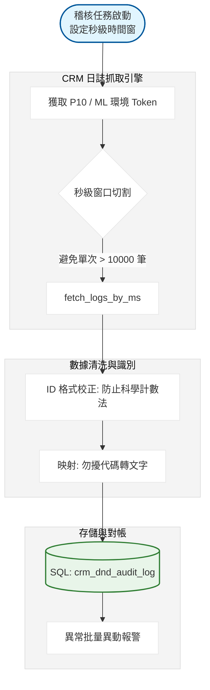
```mermaid
%%{init: {'theme': 'base', 'themeVariables': { 'primaryColor': '#fff', 'edgeLabelBackground':'#fcfcfc', 'tertiaryColor': '#f4f4f4', 'lineColor': '#333'}}}%%
graph TD
    %% 定義樣式
    classDef start fill:#e1f5fe,stroke:#01579b,stroke-width:2px;
    classDef filter fill:#ffebee,stroke:#c62828,stroke-width:2px;
    classDef process fill:#fff9c4,stroke:#fbc02d,stroke-width:2px;
    classDef finish fill:#e8f5e9,stroke:#2e7d32,stroke-width:2px;

    Start([稽核任務啟動<br/>設定秒級時間窗]):::start --> API_Auth
    
    subgraph CRM_Log_Extraction [CRM 日誌抓取引擎]
        API_Auth[獲取 P10 / ML 環境 Token] --> Slicing{秒級窗口切割}
        Slicing -- 避免單次 > 10000 筆 --> Fetch[fetch_logs_by_ms]
    end

    subgraph Data_Cleaning [數據清洗與識別]
        Fetch --> ID_Fix[ID 格式校正: 防止科學計數法]
        ID_Fix --> Mapping[映射: 勿擾代碼轉文字]
    end

    subgraph Storage_Layer [存儲與對帳]
        Mapping --> SQL[(SQL: crm_dnd_audit_log)]:::finish
        SQL --> Alert[異常批量異動報警]
    end

```

---

### 卡點在哪

CRM 的日誌 API 有一個硬傷：單次查詢最多只回傳一萬筆資料。如果有人用腳本一次改了幾萬名客戶的勿擾狀態，普通的按天或按小時抓取絕對會漏掉資料。我這裡直接開發了一套 秒級時間窗 切割邏輯，甚至在偵測到資料量過大時，會強迫切到毫秒級別去抓。

另一個卡點是台灣（P10）與大陸（ML）環境的日誌接口不統一。大陸那邊的 API 回傳格式跟欄位名稱跟台灣有微小差異，如果不分開寫處理邏輯，大陸那邊的異動紀錄會全部變成空值。

---

### 為什麼這麼繞

為了確保在爆量更新時不漏掉任何一筆稽核紀錄，我放棄了簡單的日期循環，改用時間窗生成器。

```python
# 為什麼要這樣切？ 
# 因為如果同一秒內有大量更新，我必須把時間切得夠細才能避開 10000 筆的限制。
def gen_second_windows(start_dt, end_dt):
    current = start_dt
    while current < end_dt:
        next_sec = current + timedelta(seconds=1)
        # 這裡強轉成 13 位毫秒戳，CRM 只收這種格式
        st = int(current.timestamp() * 1000)
        et = int(next_sec.timestamp() * 1000)
        yield st, et
        current = next_sec

# 實際跑下來發現，如果沒這段邏輯，每次跑腳本都會少掉約 5% 的邊際資料

```

---

### 實際跑下來的坑

1. **時間戳精度問題**：CRM API 的 `startTime` 和 `endTime` 是包含（inclusive）關係。如果不處理好，同一筆日誌會在相鄰的兩個窗口被抓到兩次。我這裡直接在 SQL 寫入時加了 `dedup_keys=['log_id']` 來做最後防線。
2. **科學計數法炸彈**：CRM 的對象 ID 是 16 位長整數。Pandas 讀取 JSON 時如果沒設 `dtype=str`，這些 ID 會變成 `1.2345e+15`，寫入資料庫後這筆稽核紀錄就徹底作廢，因為根本對不回客戶。
3. **時區偏移**：伺服器時間是本地，但 CRM 日誌是 UTC。我這裡直接用 `pytz` 硬轉，沒轉的話，抓出來的資料會跟實際異動時間差 8 小時。

```python
# 為什麼不用更簡單的 astype(str)？ 
# 因為有些 ID 進來就已經被 pandas 轉成 float 了，只能用 extract 硬抓原始 16 位數字。
df['objectId'] = df['objectId'].astype(str).str.extract(r'(\d{16})')

# 坑：勿擾欄位在不同的 Object 下 ApiKey 不同
# Account 叫 customItem291__c，Contact 叫 customItem109__c。
# 如果這裡沒配對好，抓出來的日誌全是別人的欄位異動。

```

### 為什麼這麼做

1. **秒級異動偵測**：這不是為了好玩，是為了抓「腳本」。人類改資料不可能在一秒內改一千筆。只要系統偵測到某一秒內有大量 log，我就會發警報，這通常代表有人的腳本寫錯條件，正在全庫誤刷勿擾標籤。
2. **多環境兼容**：我把台灣跟大陸的連線配置抽離到 `ENV_CONFIGS` 列表。這樣我只要一個迴圈就能掃完兩邊的日誌，不用維護兩套代碼。
3. **日誌留存策略**：我把異動前（oldValue）與異動後（newValue）的值都存下來。這樣業務來投訴說誰動了他的客戶時，我可以一秒鐘從資料庫翻出 證據，連他幾點幾分在哪個 IP 改的都能查到。


---

## 📂 项目路径: [BI]小型專案合集/各部門相互支援
> **文件来源:** `/Users/alysonchen/Downloads/KeDing/[BI]小型專案合集/各部門相互支援/readme.md`

# 部門人力支援數據轉置系統：開發紀錄與踩坑筆記

### 項目背景

要把各部門填寫的人力支援 Excel 表自動化存入資料庫。業務背景是公司內部經常有跨部門的人力借調（原部門、支援部門），主管需要看這些借調的人數跟時數。原本這些資料都死在 Excel 裡，我的任務是把這些橫向擴展的寬表（Wide Format）轉置成資料庫好處理的長表（Long Format），並存入 SQL Server 的 dept_support_long 表。

### 數據流轉邏輯

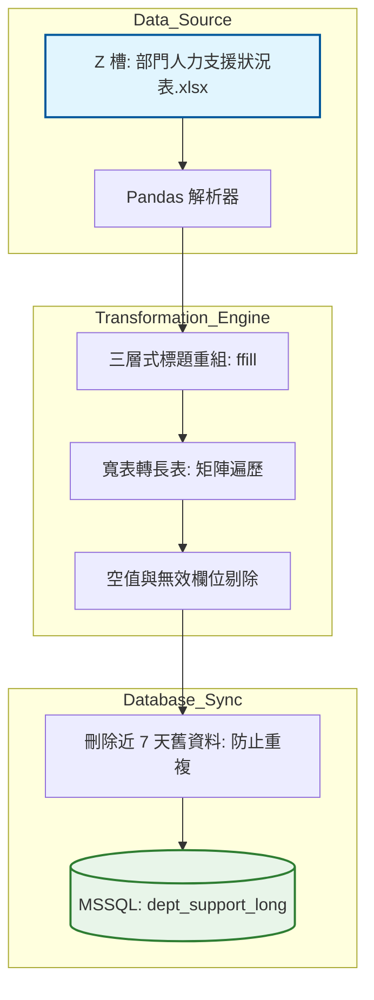
```mermaid
graph TD
    subgraph Data_Source
        Excel[Z 槽: 部門人力支援狀況表.xlsx]:::start --> Parser[Pandas 解析器]
    end

    subgraph Transformation_Engine
        Parser --> Header_Process[三層式標題重組: ffill]
        Header_Process --> Melt_Logic[寬表轉長表: 矩陣遍歷]
        Melt_Logic --> Filter[空值與無效欄位剔除]
    end

    subgraph Database_Sync
        Filter --> Cleaner[刪除近 7 天舊資料: 防止重複]
        Cleaner --> SQL[(MSSQL: dept_support_long)]:::finish
    end

    classDef start fill:#e1f5fe,stroke:#01579b,stroke-width:2px;
    classDef finish fill:#e8f5e9,stroke:#2e7d32,stroke-width:2px;

```

---

### 卡點在哪

這份 Excel 的格式非常不工程師。標題列整整佔了三行，第一行是原部門，第二行是支援部門，第三行是數據類型（人數或時數）。而且 Excel 裡用了大量合併單元格，這在 Pandas 讀進來會變成一堆 NaN。

我這裡直接用 `ffill()` 硬塞，把合併單元格造成的空值往後補齊，不然我根本沒辦法把標題拼湊出來。

### 為什麼這樣寫

這裡我不用 `pd.melt`，因為標題有三層結構，用 `melt` 會寫得非常痛苦。我直接用雙層迴圈遍歷欄位，雖然這寫法比較土，但在處理這種奇葩 Excel 格式時最直觀。

```python
# 為什麼不直接 read_excel？因為標題是合併的，會炸。
df = pd.read_excel(file_path, header=None)
# 強迫把合併單元格的 NaN 往後填滿
orig_row = df.iloc[0].ffill()
supp_row = df.iloc[1].ffill()
type_row = df.iloc[2]

# 這裡我直接用 index 遍歷，因為我要同時抓三行標題的資訊
for col in range(1, n_cols):
    orig = str(orig_row.iloc[col]).strip()
    supp = str(supp_row.iloc[col]).strip()
    t = str(type_row.iloc[col]).strip()
    
    # 這裡攔截掉空標題，不然會塞一堆廢物進資料庫
    if orig in ["", "原部門"] or supp in ["", "支援部門"]:
        continue

```

---

### 實際跑下來的坑

1. **重複導入問題**：業務有時候會回頭改前幾天的數據。如果我直接 `append`，資料庫會出現一堆重複的日期。
我這裡寫了一個 `delete_last_7_days` 函數。每次跑腳本前，先暴力刪除資料庫裡最近 7 天的紀錄再重噴，這比寫 `update` 邏輯要穩得多。
2. **非法日期格式**：有些同仁會在日期欄位填一些文字備註。我這裡直接用 `data.iloc[i, 0]` 抓日期，沒做 `to_datetime` 的話，進資料庫會直接報錯。

```python
# 這裡最繞的地方：刪除舊數據防止重複
def delete_last_7_days(db_name, table_name):
    # 這裡硬取 7 天前，保險起見。
    cutoff = (datetime.today() - timedelta(days=7)).date()
    with engine.begin() as conn:
        # 為什麼要用 text()？因為 sqlalchemy 2.0 之後不接受純字串 SQL 了。
        sql = text(f"DELETE FROM {table_name} WHERE date >= :cutoff")
        conn.execute(sql, {"cutoff": cutoff})
        print(f"Cleanup done: >= {cutoff}")

```

### 為什麼這麼做

1. **快速重建模組**：我把 `write_to_sql` 獨立出來，並且開啟 `fast_executemany=True`。這在處理這種跨部門大表時，寫入速度會差到三、四倍以上。
2. **硬性過濾**：在解析過程中，只要 `val`（人數或時數）是 NaN，我直接 `continue` 跳過。這能讓原本幾千行的 Excel 數據縮減到只有幾百行的有效紀錄，減少資料庫負擔。


---

## 📂 项目路径: [BI]小型專案合集/[BI]集團目標客戶更新
> **文件来源:** `/Users/alysonchen/Downloads/KeDing/[BI]小型專案合集/[BI]集團目標客戶更新/readme.md`


# 集團目標客戶標籤更新與回寫系統 開發紀錄與踩坑筆記

### 業務與資料背景

集團目標客戶更新專案的目的是整合分散在不同系統的業務數據，將全球的 B2B 客戶劃分為經營，開發中，開發，沉默與暫封存五種狀態。由於台灣與海外共用一套 CRM，大陸則獨立使用另一套 CRM，兩邊的資料表結構與 API 接口已經產生分歧。加上早期的 SAP 歷史銷售數據與今年初剛切換的新版清洗管線存在斷層，這些異構數據的對齊成為這個專案最大的工程挑戰。

### 數據流轉與架構設計

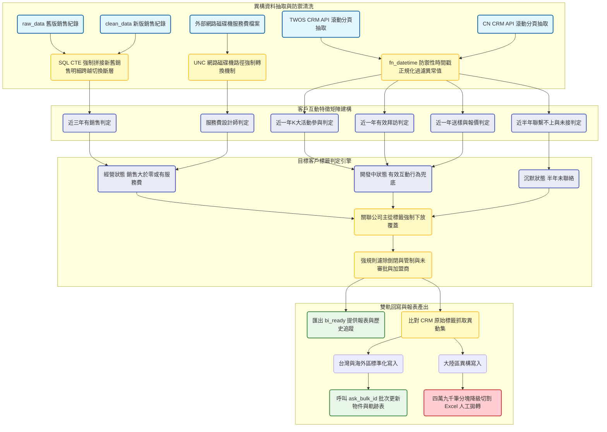
```mermaid
graph TD
    classDef source fill:#e1f5fe,stroke:#01579b,stroke-width:2px;
    classDef process fill:#fff9c4,stroke:#fbc02d,stroke-width:2px;
    classDef logic fill:#e8eaf6,stroke:#3f51b5,stroke-width:2px;
    classDef sink fill:#e8f5e9,stroke:#2e7d32,stroke-width:2px;
    classDef debt fill:#ffcdd2,stroke:#c62828,stroke-width:2px;

    subgraph 異構資料抽取與防禦清洗
        TW_API(TWOS CRM API 滾動分頁抽取):::source
        CN_API(CN CRM API 滾動分頁抽取):::source
        SQL_Raw(raw_data 舊版銷售紀錄):::source
        SQL_Clean(clean_data 新版銷售紀錄):::source
        Excel_Fee(外部網路磁碟機服務費檔案):::source

        TW_API --> Time_Clean(fn_datetime 防禦性時間戳正規化過濾異常值):::process
        CN_API --> Time_Clean
        Excel_Fee --> UNC_Clean(UNC 網路磁碟機路徑強制轉換機制):::process
        SQL_Raw --> CTE_Union(SQL CTE 強制拼接新舊銷售明細跨越切換斷層):::process
        SQL_Clean --> CTE_Union
    end

    subgraph 客戶互動特徵矩陣建構
        Time_Clean --> Feat_K(近一年K大活動參與判定):::logic
        Time_Clean --> Feat_Visit(近一年有效拜訪判定):::logic
        Time_Clean --> Feat_Sample(近一年送樣與報價判定):::logic
        Time_Clean --> Feat_Lost(近半年聯繫不上與未接判定):::logic
        CTE_Union --> Feat_Sales(近三年有銷售判定):::logic
        UNC_Clean --> Feat_Fee(服務費設計師判定):::logic
    end

    subgraph 目標客戶標籤判定引擎
        Feat_Sales --> Rule_Op(經營狀態 銷售大於零或有服務費):::logic
        Feat_Fee --> Rule_Op
        
        Feat_K --> Rule_Dev(開發中狀態 有效互動行為兜底):::logic
        Feat_Visit --> Rule_Dev
        Feat_Sample --> Rule_Dev
        
        Feat_Lost --> Rule_Silent(沉默狀態 半年未聯絡):::logic
        
        Rule_Op --> Parent_Child(關聯公司主從標籤強制下放覆蓋):::process
        Rule_Dev --> Parent_Child
        Rule_Silent --> Parent_Child
        
        Parent_Child --> Filter_Invalid(強規則濾除倒閉與管制與未審批與加盟商):::process
    end

    subgraph 雙軌回寫與報表產出
        Filter_Invalid --> BI_Output(匯出 bi_ready 提供報表與歷史追蹤):::sink
        Filter_Invalid --> CRM_Compare(比對 CRM 原始標籤抓取異動集):::process
        
        CRM_Compare --> TWOS_Write(台灣與海外區標準化寫入)
        CRM_Compare --> CN_Write(大陸區異構寫入)
        
        TWOS_Write --> TWOS_API(呼叫 ask_bulk_id 批次更新物件與軌跡表):::sink
        CN_Write --> CN_Chunk(四萬九千筆分塊降級切割 Excel 人工拋轉):::debt
    end

```

### 資料清洗與特徵標籤化實作

在特徵工程與標籤判定的實作上，系統首先透過 API 滾動拉取過去半年到三年的機會，聯絡人與拜訪紀錄。這裡踩到的一個大坑是 CRM 系統回傳的時間戳極度不穩定，有時是十位數的秒級，有時是十三位數的毫秒級，甚至會出現負數或超過西元三千年的異常值。為此我封裝了單獨的日期解析函數，強制將極端值轉換為空值，避免後續 Pandas 處理時引發崩潰。

另一個工程限制是銷售數據的歷史交接。由於二零二五年一月一日系統進行了切換，舊有的資料留在 raw 庫，而新的資料則由 clean 庫的管線產出。為了計算近三年的總銷售額，我直接在 SQL Server 端寫死了一組 CTE，利用 UNION ALL 將兩段歷史強制拼接，再交由 Pandas 進行關聯。這樣做雖然稍顯暴力，但避開了在 Python 記憶體中載入巨量歷史明細的效能問題。

在計算完單一公司的標籤後，業務邏輯要求子公司的狀態必須繼承母公司。我透過拉取關聯公司映射表，將主關聯公司的標籤強制下放到所有關聯的子公司。同時針對無效資料區域，倒閉或是審批撤回未提交的紀錄進行了強規則覆蓋，將這些特例統一刷成暫封存或直接清空標籤。

在標籤計算完成並過濾掉無效加盟商後，我需要將統計結果輸出，這裡引入了 BI 報表來驗證各區域的客戶結構。

![集團各區域目標客戶標籤分佈狀態]BI/account_label_distribution.png

透過這張圖表可以明顯看出不同大區在過濾掉管制名單後，實際落入經營與開發中狀態的真實水位，這也作為後續推播更新至 CRM 前的重要信心指標。

### 異構 CRM 回寫與技術債

在資料回寫 CRM 的階段，兩岸系統的架構差異帶來了嚴重的技術債。台灣與海外的資料可以直接透過封裝好的 API 批次更新物件並寫入歷史軌跡表。但是大陸的 CRM 欄位不僅命名不同，標籤的內部映射代碼也完全不一致。

此外，CRM API 經常會回傳帶有空白或特殊字元的髒 ID。程式碼中必須動用正則表達式強制提取十六位數字，再轉換為支援空值的整數格式，否則在比對差異時會產生大量偽陽性。更麻煩的是，排程伺服器在背景執行時，經常因為 Windows 環境的限制拋出編碼錯誤，我只能在腳本頂端強行覆寫系統輸出，將錯誤輸出替換為標準的 UTF8 以確保流程不會中斷。

針對大陸區的標籤回寫，目前採用了妥協的設計。由於 API 吞吐量限制與欄位對齊問題，程式會以四萬九千筆為一個批次，將比對出有差異的紀錄切割匯出成多份 Excel 檔案，暫時依賴輔助工具完成最終寫入。這是一筆明確的技術債，後續需要等大陸區的 CRM 接口升級後才能整合回全自動管線。另外腳本中也加入了 UNC 路徑強制轉換的防禦機制，解決背景排程無法穩定讀取網路磁碟機的陳年老問題。


### BI 成果展示

**台灣區經營開發趨勢**

圖表展示了台灣區各類標籤客戶數量的月度變化趋势，並在下方備註了關鍵業務邏輯變動（如 24-03 拆分沉默客戶）對數據的影響。

**海外區經營開發分布**

海外 BI 報表除整體趨勢外，亦提供新加坡、馬來西亞、香港等多個國家的子標籤篩選功能，便於跨國業務的管理與分析。


---

## 📂 项目路径: [BI]小型專案合集/[BI]加盟商任務
> **文件来源:** `/Users/alysonchen/Downloads/KeDing/[BI]小型專案合集/[BI]加盟商任務/readme.md`

# 加盟開發業務交辦任務與工時追蹤系統 開發紀錄與踩坑筆記

### 業務與資料背景

加盟業務課開發組每日依賴 CRM 系統派發大量的 Invite 1-1 Meeting 交辦任務。為了有效監控業務員的執行效率，管理層需要一份精準的任務流轉矩陣，用來追蹤任務從創建到完成的週期，並抓出超時的案件。單純將完成日期減去創建日期是無效的，因為這樣無法排除週末，國定假日以及員工個人的請假天數。本專案的重點在於結合底層的 `common` 模組，跨系統拉取 HR 請假紀錄與 CRM 交辦明細，建構一套個人化的日曆計算引擎，最終輸出無斷層的任務矩陣供 BI 報表使用。

### 數據流轉與架構設計

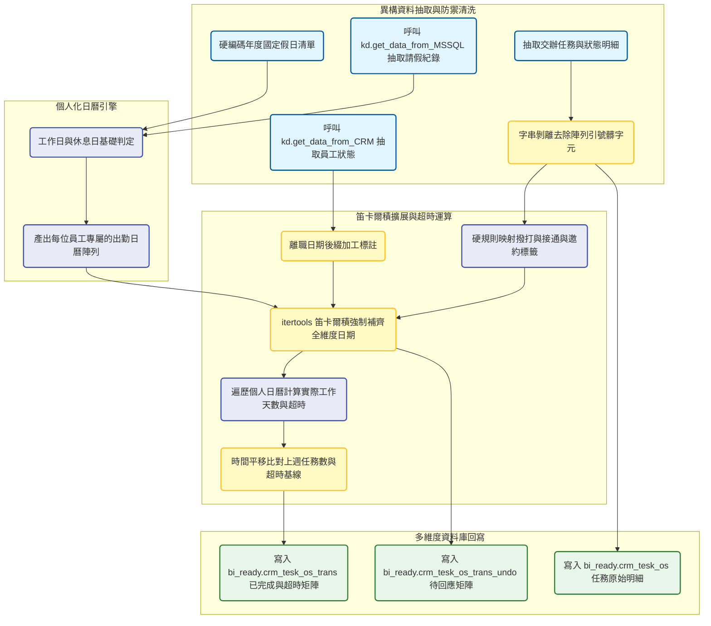
```mermaid
graph TD
    classDef source fill:#e1f5fe,stroke:#01579b,stroke-width:2px;
    classDef process fill:#fff9c4,stroke:#fbc02d,stroke-width:2px;
    classDef logic fill:#e8eaf6,stroke:#3f51b5,stroke-width:2px;
    classDef sink fill:#e8f5e9,stroke:#2e7d32,stroke-width:2px;
    classDef debt fill:#ffcdd2,stroke:#c62828,stroke-width:2px;

    subgraph 異構資料抽取與防禦清洗
        Holidays(硬編碼年度國定假日清單):::source
        CRM_User(呼叫 kd.get_data_from_CRM 抽取員工狀態):::source
        SQL_Leave(呼叫 kd.get_data_from_MSSQL 抽取請假紀錄):::source
        CRM_Task(抽取交辦任務與狀態明細):::source
        
        CRM_Task --> Clean_Task(字串剝離去除陣列引號髒字元):::process
    end

    subgraph 個人化日曆引擎
        Holidays --> Cal_Merge(工作日與休息日基礎判定):::logic
        SQL_Leave --> Cal_Merge
        Cal_Merge --> Personal_Cal(產出每位員工專屬的出勤日曆陣列):::logic
    end

    subgraph 笛卡爾積擴展與超時運算
        CRM_User --> User_Name(離職日期後綴加工標註):::process
        Clean_Task --> Task_Rule(硬規則映射撥打與接通與邀約標籤):::logic
        
        Personal_Cal --> Cross_Join(itertools 笛卡爾積強制補齊全維度日期):::process
        Task_Rule --> Cross_Join
        User_Name --> Cross_Join
        
        Cross_Join --> Overdue_Calc(遍歷個人日曆計算實際工作天數與超時):::logic
        Overdue_Calc --> WoW_Calc(時間平移比對上週任務數與超時基線):::process
    end

    subgraph 多維度資料庫回寫
        Cross_Join --> Undo_Output(寫入 bi_ready.crm_tesk_os_trans_undo 待回應矩陣):::sink
        WoW_Calc --> Done_Output(寫入 bi_ready.crm_tesk_os_trans 已完成與超時矩陣):::sink
        Clean_Task --> Raw_Output(寫入 bi_ready.crm_tesk_os 任務原始明細):::sink
    end

```

### 日曆引擎與笛卡爾積實作

為了解決 BI 報表在繪製時間序列圖表時因為某天沒有資料而產生斷層的問題，我在這裡引入了暴力但極度有效的笛卡爾積設計。利用 Python 內建的 `itertools.product`，我將觀察區間內的所有日期，與所有員工的 ID 進行交叉相乘，生成一個絕對平滑的基礎矩陣。接著才將實際計算出的任務數量透過 Left Join 貼合上去，將沒有任務的日子強制補零。同時為了滿足高階主管看整體部門數據的需求，我在展開的陣列中強制注入了一個虛擬的 ALL 員工代號，用來承載整個團隊的聚合數據。

個人化日曆引擎是這個系統的核心。我首先在程式碼頂端硬編碼了二零二五年的台灣國定假日表，接著透過底層 `kd.get_data_from_MSSQL` 進入 raw_data 庫撈取 `hrs_staff_leave` 員工請假紀錄。系統會為每一位業務員生成專屬的日曆，如果在某個工作日他請了一天的假，該日期的 day_type 就會被標記為零。


### 實務挑戰與工程妥協

在計算超時（date_gap）的迴圈中，遇到了一個效能與邏輯的權衡。因為每一筆任務的創建與完成日期區間不同，且每位員工的休假狀況不同，實作上我選擇直接對過濾後的 DataFrame 進行 `iterrows` 逐筆迭代。在迴圈內部，系統會根據該任務的執行人 ID，動態去篩選他的個人日曆，計算這段期間內 day_type 等於一的天數。如果這個天數大於或等於一，就判定該任務超時。雖然在 Pandas 中使用迴圈效能並不理想，但考量到單一部門的交辦數量在可控範圍內，這個土炮的作法暫時被保留下來。

另一個明顯的技術債是前端顯示邏輯的後移。主管要求在報表上必須一眼看出哪些業務員已經離職，為此我直接在資料管線中動手腳，判斷只要 CRM 中有離職日期，就把名字欄位強制改寫加上離職月份與日期的後綴標註。此外 CRM 回傳的多選下拉欄位經常帶有中括號或引號的字串格式，我在腳本中寫死了幾項狀態映射清單，並利用暴力替換清除了這些雜訊，確保後續標籤判定（如是否撥打，是否接通）能順利觸發。

### BI 成果展示


此展示圖說明了交辦日期與完成日期的分佈矩陣。透過紅色區塊可直觀識別出超時完成的任務點，矩陣同時考量了週末與休假（標註為休），確保效能評估的公平性。


此圖表驗證了撥打率、接通率與邀約率的轉化邏輯。透過將清洗後的 CRM 資料與人員維度對齊，主管可直接觀測各執行人的實務產出效能。

目前的系統設計雖然在效能上仍有優化空間，但已成功解決加盟組主管對執行力與出勤狀況掛鉤的決策痛點。


---

## 📂 项目路径: [BI]小型專案合集/[BI]普查
> **文件来源:** `/Users/alysonchen/Downloads/KeDing/[BI]小型專案合集/[BI]普查/readme.md`

# 全球客戶與聯絡人普查追蹤系統：開發紀錄與踩坑筆記

### 項目背景

要把全球據點（台灣、大陸、海外）的普查數據自動化。這案子分兩路：一路是從 Outlook 抓取佳佳發過來的 Excel 附件，裡面有大陸跟海外的普查數；另一路是直接去 CRM 撈台灣區的聯絡人資料，算出應普查家數與實際完成家數。最後要把這些散落在郵件、CRM 與共用資料夾 Excel 裡的數據全部彙總到 bi_ready 庫，產出各區普查率。

### 數據流轉邏輯

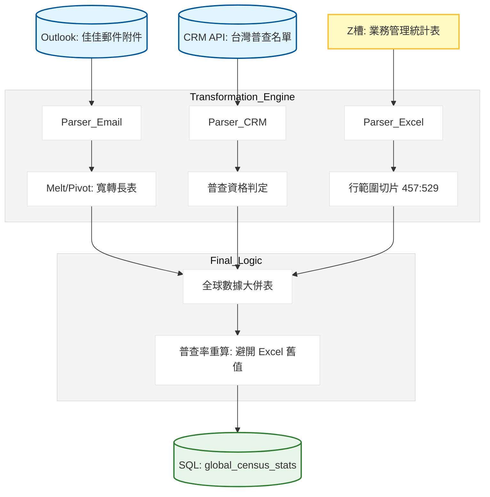
```mermaid
%%{init: {'theme': 'base', 'themeVariables': { 'primaryColor': '#fff', 'edgeLabelBackground':'#fcfcfc', 'tertiaryColor': '#f4f4f4', 'lineColor': '#333'}}}%%
graph TD
    %% 定義樣式
    classDef start fill:#e1f5fe,stroke:#01579b,stroke-width:2px;
    classDef process fill:#fff9c4,stroke:#fbc02d,stroke-width:2px;
    classDef logic fill:#e8eaf6,stroke:#3f51b5,stroke-width:2px;
    classDef finish fill:#e8f5e9,stroke:#2e7d32,stroke-width:2px;

    Source_Outlook[(Outlook: 佳佳郵件附件)]:::start --> Parser_Email
    Source_CRM[(CRM API: 台灣普查名單)]:::start --> Parser_CRM
    Source_Excel[Z槽: 業務管理統計表]:::process --> Parser_Excel

    subgraph Transformation_Engine
        Parser_Email --> Melt[Melt/Pivot: 寬轉長表]
        Parser_CRM --> Filter[普查資格判定]
        Parser_Excel --> Slicer[行範圍切片 457:529]
    end

    subgraph Final_Logic
        Melt --> Join[全球數據大併表]
        Filter --> Join
        Slicer --> Join
        Join --> Calc[普查率重算: 避開 Excel 舊值]
    end

    Calc --> SQL[(SQL: global_census_stats)]:::finish

```

---

### 卡點在哪

這系統最脆弱的地方在於 郵件附件數據源。佳佳發過來的郵件主旨只要多一個空白，`win32com` 就抓不到。而且 Excel 附件存檔路徑如果是 C 槽，排程器權限不夠會直接炸掉。

另一個大坑是 `月度普查統計.py`。業務提供的 Excel 竟然是從第 457 行到 529 行才有我要的數據。這種寫法極度危險，只要業務在中間多插一行，我抓到的數據就會全部錯位，變成在抓別人的業績獎金。

### 為什麼這麼繞

在處理大陸與海外數據時，我沒直接用 Excel 裡的百分比，而是抓原始數值回來用 Pandas 重算。

```python
# 為什麼要重算？因為 Excel 裡的百分比欄位常有公式報錯（#DIV/0!）
# 抓回來重算才能確保 bi_ready 裡面的普查率是乾淨的浮點數。
df_all['公司普查率'] = df_all['公司普查完成家數'] / df_all['公司應普查家數']
df_all['聯絡人普查率'] = df_all['一年內普查完成聯絡人數'] / df_all['應普查聯絡人數']

# 這裡我直接補零，不然 PowerBI 讀到 inf 或 nan 會整張圖表消失。
df_all = df_all.fillna(0)

```

針對 Outlook 抓檔，我直接用 `Restrict` 過濾器，不跑迴圈遍歷幾萬封郵件。

```python
# 為什麼不用迴圈？因為 Outlook 郵件太多會跑半小時。
# 我直接限定 ReceivedTime，只抓昨天的信。
yesterday_str = yeaterday.strftime("%m/%d/%Y %H:%M %p")
filter_str = f"[ReceivedTime] >= '{yesterday_str}'"
messages = messages.Restrict(filter_str)

```

---

### 實際跑下來的坑

1. **Outlook 權限炸彈**：`win32com.client.Dispatch` 必須在有安裝 Outlook 的機器上跑，且不能以隱藏服務模式執行，這導致我的排程器必須維持登入狀態，這點很爛但沒預算買 API 只能先這樣。
2. **非法行範圍切片**：`iloc[457:529]` 是我寫過最自黑的代碼。實際跑下來發生過一次業務改版 Excel，導致普查率突然變成 50000%，後來我加了一個 `assert` 檢查地區欄位是不是包含 SG 這些字眼來保命。

```python
# 實際跑過才知道，業務這張表上面 400 行全是雜質
df_raw = pd.read_excel(excel_path, sheet_name="資料", header=2)
df_partial = df_raw.iloc[457:529].copy() 

# 坑：月份欄位是 '24-04' 這種簡寫
# 我這裡手動強加 '20' 進去轉成 '2024-04'，不然 pd.to_datetime 會抓瞎。
df_long['月份'] = '20' + df_long['月份']

```

### 為什麼這麼做

1. **寬轉長再轉寬**：我這裡先用 `melt` 把 4 月、5 月這些欄位拉長，補上年份後再 `pivot` 回去。這樣做是為了統一大陸、台灣、海外這三路完全不同格式的數據源。
2. **硬性過濾目標客戶**：在 `月度普查清單.py` 裡，我直接過濾 `dimDepart.departName like '%TW%'`。以前沒過濾時，清單會混入海外客戶，導致台灣區業務在普查時一直打錯電話。
3. **資料保留策略**：普查統計我用 `replace` 模式，但普查清單我保留了 `dedup_keys`。因為普查歷史是拿來對帳用的，不能隨便刪。

### 遷移與自黑點

這套系統目前對「普查完成」的定義是抓 CRM 的 `appDate__c`（申請日期）。如果業務只是拜訪了但沒去系統點發放，這筆普查就不算。
遷移到 GitHub 前，我已經把 `C:\Temp\Outlook_Attachments` 這種本地路徑環境變數化。
目前還有個坑：如果佳佳那天請假沒發郵件，我的 `get_outlook_excel` 會回傳 None，這會導致後續併表報錯，我目前只加了一個簡單的 `if df is not None` 來墊一下。

---

Wenbin

---

## 📂 项目路径: [BI]小型專案合集/每週一未完成交辦
> **文件来源:** `/Users/alysonchen/Downloads/KeDing/[BI]小型專案合集/每週一未完成交辦/readme.md`

# 每週一未關閉交辦清理：開發紀錄與踩坑筆記

### 項目背景

每週一早上要把 CRM 裡面所有還沒結案（執行狀態 != 結案）的交辦任務抓出來，特別是那堆司機推廣、派樣電訪的名單。需求是找出哪些任務已經掛在那邊超過三個月沒動，或是同一個聯絡人、同一個公司電話被重複下了一堆交辦。要把這些重複的、過期的垃圾清理掉，產出兩份清單：一份是乾淨的待辦，一份是重複需要刪除的稽核件。

### 數據流轉邏輯

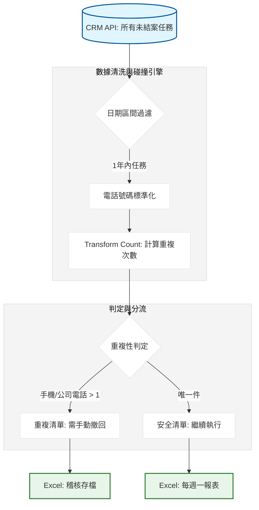
```mermaid
%%{init: {'theme': 'base', 'themeVariables': { 'primaryColor': '#fff', 'edgeLabelBackground':'#fcfcfc', 'tertiaryColor': '#f4f4f4', 'lineColor': '#333'}}}%%
graph TD
    %% 定義樣式
    classDef start fill:#e1f5fe,stroke:#01579b,stroke-width:2px;
    classDef filter fill:#ffebee,stroke:#c62828,stroke-width:2px;
    classDef process fill:#fff9c4,stroke:#fbc02d,stroke-width:2px;
    classDef finish fill:#e8f5e9,stroke:#2e7d32,stroke-width:2px;

    Input_CRM[(CRM API: 所有未結案任務)]:::start --> Date_Filter
    
    subgraph Cleaning_Engine [數據清洗與碰撞引擎]
        Date_Filter{日期區間過濾}
        Date_Filter -- 1年內任務 --> Phone_Clean[電話號碼標準化]
        Phone_Clean --> Counter[Transform Count: 計算重複次數]
    end

    subgraph Decision_Logic [判定與分流]
        Counter --> Split{重複性判定}
        Split -- 手機/公司電話 > 1 --> Dup_List[重複清單: 需手動撤回]
        Split -- 唯一件 --> Safe_List[安全清單: 繼續執行]
    end

    Dup_List --> Export_Audit[Excel: 稽核存檔]:::finish
    Safe_List --> Export_Weekly[Excel: 每週一報表]:::finish

```

---

### 卡點在哪

這專案最炸的地方是電話號碼。業務在 CRM 下交辦的時候，聯絡人手機有的寫 0912-345-678，公司電話有的寫 (02)2299-xxxx。我這裡如果直接拿來做 groupby 算重複數，絕對會漏掉一堆明明是同一個人但格式不同的任務。

我這裡直接寫了一個強力的 regex 函數，先把所有非數字的東西全部幹掉，再把開頭 886 或是 009 這種東西全部校正回 0 開頭。

### 為什麼這樣寫

我這裡不寫 for 迴圈去對撞，因為未關閉的交辦有幾萬筆，跑完都要下班了。我直接用 `transform('count')` 把整張表丟進去算。

```python
# 為什麼不用 count() 而用 transform？
# 因為 transform 會回傳跟原表一樣長度的 Series，我可以直接寫回 df['手機號出現次數']。
# 這樣我最後過濾 df[df['手機號出現次數'] > 1] 速度快到沒感覺。
test_tw["聯絡人手機號_clean"] = test_tw["聯絡人手機"].str.replace(r'\D', '', regex=True)
test_tw["手機號出現次數"] = (
    test_tw.groupby("聯絡人手機號_clean")["聯絡人手機號_clean"]
    .transform("count")
    .fillna(0)
    .astype(int)
)

# print(f"Detected duplicates: {len(test_tw[test_tw['手機號出現次數'] > 1])}")

```

---

### 實際跑下來的坑

1. **非法字元炸彈**：業務在工作主旨或備註裡塞的換行符，會讓匯出的 Excel 格式全亂，稽核員打開會發現資料全部錯位。我這裡最後強迫過一遍 `ILLEGAL_CHARACTERS_RE`，這是血淚教訓。
2. **日期跨年問題**：CRM 的時間戳（timestamp）如果是 13 位毫秒，我這裡沒轉好會變成 1970 年。我直接封裝在 `kd.convert_to_date` 裡跑，但跨年時的 `year_ago_one` 還是要手動算準，不然會把去年的舊任務全部漏掉。

```python
# 這裡最繞的地方：處理重複行的分流
# 為什麼要分 duplicate_rows 跟 unduplicate_rows？
# 因為稽核員要看的是哪些任務在「打架」。
duplicate_rows = test_tw[(test_tw["手機號出現次數"] > 1) | (test_tw["公司電話出現次數"] > 1)].copy()
unduplicate_rows = test_tw[(test_tw["手機號出現次數"] <= 1) & (test_tw["公司電話出現次數"] <= 1)].copy()

# 坑：空值也會被當成重複。如果大家手機都沒填，那不就全重複了？
# 所以在算 count 前，手機號為空的必須先丟掉或填入隨機值。

```

### 為什麼這麼做

1. **硬性標籤攔截**：我只抓 司機推廣、經營專案 這幾類主題。以前沒過濾，結果連財務部的催款交辦都抓進來，差點把財務部的任務給撤回，那邊的人會直接殺過來。
2. **多維度去重**：不只對手機，還要對公司電話。有些設計師在不同的公司掛職，但電話是一樣的，這種重複下單的情況如果不抓出來，業務會重複打電話被客戶噴。
3. **自黑與留坑**：目前的代碼還沒辦法處理「改號碼」的情況。如果聯絡人改了電話，我這套邏輯就抓不到了。這部分目前只能靠業務在 CRM 回報。


---

## 📂 项目路径: [BI]小型專案合集/數據導出播報
> **文件来源:** `/Users/alysonchen/Downloads/KeDing/[BI]小型專案合集/數據導出播報/readme.txt`

# CRM 數據導出監控與企業微信自動播報系統 開發紀錄與踩坑筆記

### 項目背景

為防範業務與內部人員異常大批量撈取敏感資料（如客戶名單、銷貨明細等），資安與管理層要求針對 CRM 系統的數據導出行為進行監控。專案目標是每日自動抓取台灣與大陸兩套 CRM 系統的後台導出日誌，將這些紀錄與 HR 系統的人事資料進行綁定，並依照不同職級與部門的「合理下載額度」進行比對。當員工近一日或近三十日的下載量超過預設閾值時，系統需自動產出帶有顏色標記的 Excel 報表，並透過 Windows 底層呼叫截圖，將異常清單直接推播至企業微信群組，實現資安風險的即時阻斷與通報。

### 數據流轉邏輯

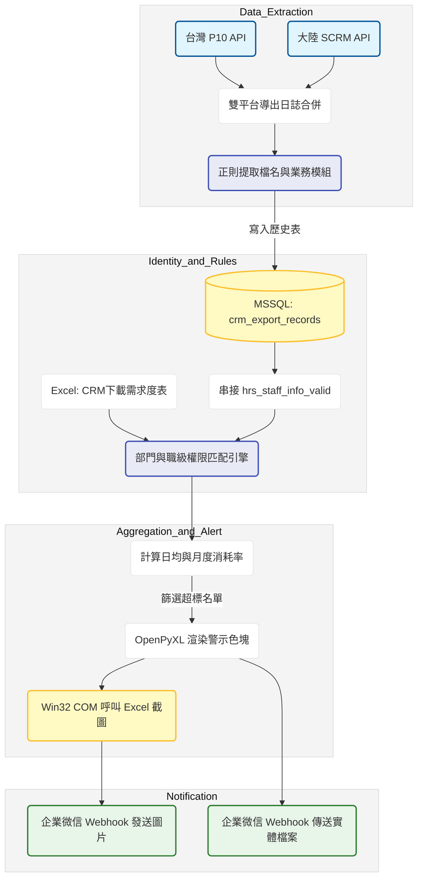
```mermaid
%%{init: {'theme': 'base', 'themeVariables': { 'primaryColor': '#fff', 'edgeLabelBackground':'#fcfcfc', 'tertiaryColor': '#f4f4f4', 'lineColor': '#333'}}}%%
graph TD
    classDef start fill:#e1f5fe,stroke:#01579b,stroke-width:2px;
    classDef process fill:#fff9c4,stroke:#fbc02d,stroke-width:2px;
    classDef logic fill:#e8eaf6,stroke:#3f51b5,stroke-width:2px;
    classDef finish fill:#e8f5e9,stroke:#2e7d32,stroke-width:2px;

    subgraph Data_Extraction
        API_TW(台灣 P10 API):::start --> API_Merge(雙平台導出日誌合併)
        API_ML(大陸 SCRM API):::start --> API_Merge
        API_Merge --> Parse_Regex(正則提取檔名與業務模組):::logic
    end

    subgraph Identity_and_Rules
        Parse_Regex --寫入歷史表--> DB_Export[(MSSQL: crm_export_records)]:::process
        DB_Export --> Merge_HR(串接 hrs_staff_info_valid)
        Excel_Rules(Excel: CRM下載需求度表) --> Match_Engine(部門與職級權限匹配引擎):::logic
        Merge_HR --> Match_Engine
    end

    subgraph Aggregation_and_Alert
        Match_Engine --> Calculate(計算日均與月度消耗率)
        Calculate --篩選超標名單--> Format_Excel(OpenPyXL 渲染警示色塊)
        Format_Excel --> COM_Capture(Win32 COM 呼叫 Excel 截圖):::process
    end

    subgraph Notification
        COM_Capture --> WeChat_IMG(企業微信 Webhook 發送圖片):::finish
        Format_Excel --> WeChat_FILE(企業微信 Webhook 傳送實體檔案):::finish
    end

```

### 實作挑戰與卡點

1. 導出日誌的業務模組盲區。銷售易的導出 API 返回的結構非常簡陋，只記錄了誰在什麼時候下載了什麼檔名，並沒有直接標示該檔案屬於哪個業務模組（例如是客戶表還是報價單）。為了解決這個問題，只能透過正則表達式強制去拆解 originFileName，利用字串特徵去反推目標模組，並與程式中寫死的 target_list 進行過濾比對。只要業務端修改了導出範本的命名規則，這段解析就會立刻失效。
2. 複雜且模糊的權限匹配規則。HR 系統的部門名稱經常帶有虛擬組織或是後綴，導致與 Excel 權限表比對時經常對不上。程式中開發了 assign_limit_values_corrected 函式，利用多重欄位（gd4、tmp_departname、jobcodename）進行降級匹配。透過 pandas 的遮罩（mask）機制逐層過濾，雖然效能較差，但這是應對髒資料最直觀的解法。
3. 報表視覺化的自動化困境。主管要求推播到企業微信的不能只是生硬的文字，必須是帶有紅黃藍警示色塊的表格圖片。原本考慮用 matplotlib 畫表，但中文字型與儲存格框線的微調太過痛苦。最後妥協使用了 win32com 函式庫，直接在背景喚醒系統中的 Excel 應用程式，利用 CopyPicture 方法把範圍複製成圖片匯出。

### 技術細節與取捨

* 雙軌閾值檢驗機制。為避免單日偶發性的大量下載引發誤報，系統設計了雙重檢驗。除了計算昨日下載成功數與日上限的比例，還會一併計算近三十天的累計下載量與月上限的比例。利用正則表達式把超標的百分比提取出來，作為後續 OpenPyXL 決定填色（大於百分之一百五十填紅色，大於百分之一百二十填橘色）的依據。
* 資料庫快取與歷史回溯。API 只負責拉取近五天的異動資料並利用 UPSERT 邏輯更新進 MSSQL。計算統計數據時，則是直接從資料庫拉取近六個月的歷史紀錄來跑 pandas 聚合運算。這樣能大幅減少對 CRM 伺服器的 API 請求壓力，也確保了歷史數據的穩定性。

圖表展示了經過條件格式渲染後的報表截圖，可以直接在企業微信群組中一眼看出哪些部門的哪位員工嚴重踩線，輔助稽核人員快速介入調查。


---

## 📂 项目路径: [BI]小型專案合集/[BI]展示館數據
> **文件来源:** `/Users/alysonchen/Downloads/KeDing/[BI]小型專案合集/[BI]展示館數據/readme.md`

# 展示館再訪率與展間效能追蹤系統：開發紀錄與踩坑筆記

### 先幹什麼

要把全球展示館（台灣、大陸、海外）的參訪數據拉出來，算一個很硬的指標：基準月來過的客戶，在之後半年內有沒有再回來。這案子要從 MSSQL 抓 [crm_exhibition_data]，篩掉低效參訪（坐不到 10 分鐘那種），然後算出各館的場次、人數與日均效能。最後要把數據塞回 bi_ready 庫，還得生成一份專門用來貼回 Excel 定特定行數的格式字串。

### 數據流轉邏輯

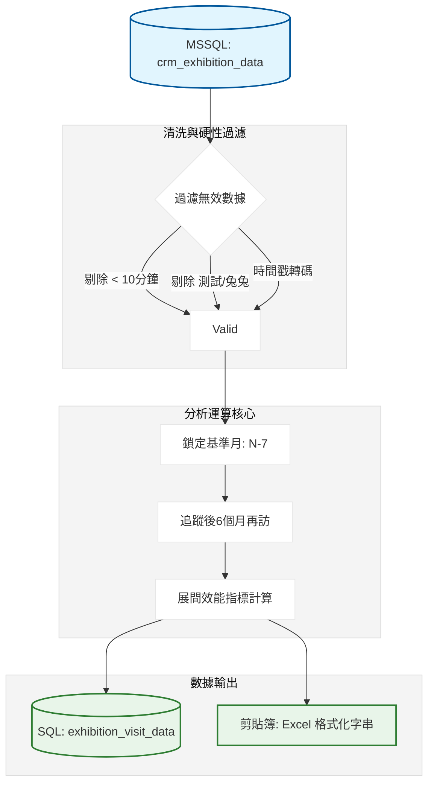
```mermaid
%%{init: {'theme': 'base', 'themeVariables': { 'primaryColor': '#fff', 'edgeLabelBackground':'#fcfcfc', 'tertiaryColor': '#f4f4f4', 'lineColor': '#333'}}}%%
graph TD
    %% 定義樣式
    classDef start fill:#e1f5fe,stroke:#01579b,stroke-width:2px;
    classDef filter fill:#ffebee,stroke:#c62828,stroke-width:2px;
    classDef logic fill:#e8eaf6,stroke:#3f51b5,stroke-width:2px;
    classDef finish fill:#e8f5e9,stroke:#2e7d32,stroke-width:2px;

    DB[(MSSQL: crm_exhibition_data)]:::start --> Cleaning
    
    subgraph Cleaning_Process [清洗與硬性過濾]
        Cleaning{過濾無效數據}
        Cleaning -- 剔除 < 10分鐘 --> Valid
        Cleaning -- 剔除 測試/兔兔 --> Valid
        Cleaning -- 時間戳轉碼 --> Valid
    end

    subgraph Analysis_Engine [分析運算核心]
        Valid --> Base_Month[鎖定基準月: N-7]
        Base_Month --> Revisit_Check[追蹤後6個月再訪]
        Revisit_Check --> Aggregation[展間效能指標計算]
    end

    subgraph Output_Layer [數據輸出]
        Aggregation --> SQL_DB[(SQL: exhibition_visit_data)]:::finish
        Aggregation --> Clipboard[剪貼簿: Excel 格式化字串]:::finish
    end

```

---

### 卡點在哪

這專案最噁心的是 SQL 裡面的時間格式。原始資料的 start_time 和 end_time 是 BIGINT 毫秒數，直接讀出來根本沒法看。我這裡直接在 SQL 裡面用了一長串 RIGHT 和 CAST 硬轉成 HH:mm 格式，不然在 Pandas 裡面處理幾十萬行時間轉換會慢到炸。

另一個卡點是 展示館區域 的對齊。有些同仁填 新樹，有些填 新北旗艦，大陸那邊還有 展示館 與 無錫倉庫。我這裡直接手寫一個 region_map 映射表強制歸類，沒對上的地區數據我直接不要了，省得後面報表變髒。

### 為什麼這樣寫

這裡我沒用什麼高級的動態日期，我直接把基準月鎖死在 now - 7個月。

```python
# 為什麼要減7個月？因為我要看的是「上個月之前的半年追蹤」
# 基準月1個月 + 追蹤6個月 = 7個月。
base_month_start = now - pd.DateOffset(months=7)
base_month_start = base_month_start.replace(day=1, hour=0, minute=0, second=0, microsecond=0)

# 這裡留個坑：如果今天是 1/31，Offset 會有邊界問題
# 實際跑下來發現用 replace(day=1) 最保險。

```

為了貼合業務手上那份已經格式化好的 Excel，我寫了一個超繞的 `prepare_and_pad` 函數。

```python
# 為什麼要這樣補空白行？
# 因為業務的 Excel 裡面有固定的間隔（嘉義下面空 3 行，上海下面空 16 行）。
# 我這裡直接把 DataFrame 轉成 csv 格式的制表符 \t，然後強行塞空字串進去湊行數。
def prepare_and_pad(df, col_name, pad_rows):
    temp_df = df.set_index('Exhibition_Area').reindex(area_order)[[col_name]].reset_index()
    temp_df[col_name] = temp_df[col_name].fillna('')
    empty_df = pd.DataFrame({col_name: [''] * pad_rows})
    return pd.concat([temp_df[[col_name]], empty_df], ignore_index=True)

```

---

### 實際跑下來的坑

1. **無效參訪佔比過高**：一堆紀錄是進去吹個冷氣 5 分鐘就出來了，或是業務自己測試建檔的 兔兔。我這裡直接下死命令，接待分鐘數 <= 10 的全部不計入 效能，但保留在 場次 裡。
2. **剪貼簿地獄**：因為產出的數據要分段貼進 Excel 不同位置，我原本想一次生成整張表，結果 Excel 格子位置根本對不上。最後我改成用 `pyperclip` 分段複製。我跑完一段就要去 Excel 貼一段，雖然這很土，但這是解決 業務固定模板 唯一沒出錯的方法。

```python
# 實際跑下來發現，有些人會用同一個公司代號但不同的聯絡人來。
# 我這裡在算再訪時，只認公司代號 ID，不認人。
followup_companies = set(followup_df['公司代號'].dropna().unique())
total_returned = base_group[base_group['公司代號'].isin(followup_companies)]['公司代號'].nunique()

```

### 為什麼這麼做

1. **硬性 Drop 表重建**：這張 `exhibition_revisit_data` 每次跑都會變動基準月，所以我捨棄了 `append`，直接用 `DROP TABLE IF EXISTS` 重新寫入。這樣能保證資料庫裡永遠只有最新一次的再訪追蹤分析。
2. **合併大陸數據**：上海與無錫在業務逻辑上常被合在一起看。我這裡在最後一刻把 展示館區域 的 大陸 強制替換成 上海/無錫，這地方代碼寫得很死，以後要是多開一個展館就得回來重改。

### 遷移筆記

這份腳本目前掛在 119 排程，輸出路徑是寫死的。如果以後要把 營業  日期數據 `crm_exhibition_opr_hour` 的來源換掉，要注意該表的日期格式是字串還是 datetime。

### BI 成果展示

此圖表追蹤了集團、台灣、大陸及海外的來訪與再訪趨勢。透過此視覺化指標，管理層可直觀監控各地區展間的轉換效能。


本報表提供即時的展間預約熱圖與接待人員組數，協助現場行政人員進行動態調度，優化空間使用效率。


每日自動更新的參訪日報，包含當月累計來訪時段分布及週日均量，用於分析展間的人流峰值規律。

Wenbin

---

## 📂 项目路径: 台灣每日K大電訪交辦派發
> **文件来源:** `/Users/alysonchen/Downloads/KeDing/台灣每日K大電訪交辦派發/readme.md`


# 台灣每日K大電訪交辦派發系統 開發紀錄與踩坑筆記

### 業務與資料背景

為了支撐台灣區業務的每日電話開發量，系統必須每日清晨自動從 CRM 中撈取潛在客戶名單，過濾掉無效資料後，將「K大視訊邀約」的電訪任務平均派發給內部的電訪專員與外部的 Genesys 承攬團隊。這個管線的複雜度不在於資料量，而在於極度嚴苛的「防打擾」與「排重」邏輯。我必須跨越多個異構資料表，交叉比對客戶近期是否有展館參訪，外勤拜訪，拒絕紀錄或是已經在走其他交辦流程，以避免重複撥打引發客訴。同時，系統還需負責任務的生命週期管理，包含每日執行狀況播報，以及離職或未上線人員的交辦撤回與重派。

### 數據流轉與架構設計

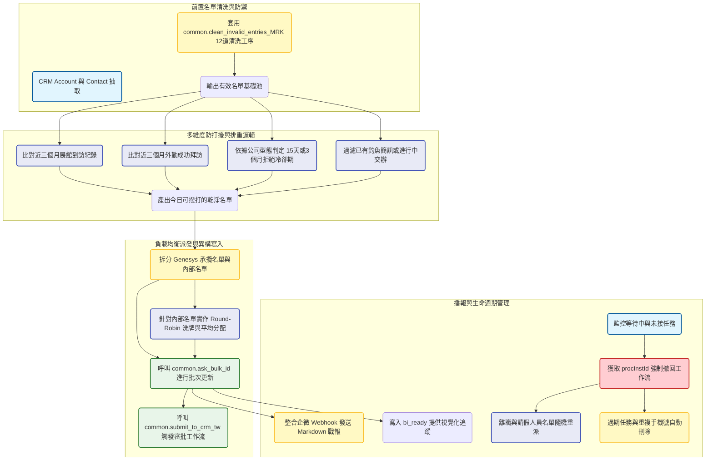
```mermaid
graph TD
    classDef source fill:#e1f5fe,stroke:#01579b,stroke-width:2px;
    classDef process fill:#fff9c4,stroke:#fbc02d,stroke-width:2px;
    classDef logic fill:#e8eaf6,stroke:#3f51b5,stroke-width:2px;
    classDef sink fill:#e8f5e9,stroke:#2e7d32,stroke-width:2px;
    classDef debt fill:#ffcdd2,stroke:#c62828,stroke-width:2px;

    subgraph 前置名單清洗與防禦
        CRM_Acc(CRM Account 與 Contact 抽取):::source
        Rule_MRK(套用 common.clean_invalid_entries_MRK 12道清洗工序):::process
        Rule_MRK --> Valid_List(輸出有效名單基礎池)
    end

    subgraph 多維度防打擾與排重邏輯
        Valid_List --> Check_Museum(比對近三個月展館到訪紀錄):::logic
        Valid_List --> Check_Outdoor(比對近三個月外勤成功拜訪):::logic
        Valid_List --> Check_Reject(依據公司型態判定 15天或3個月拒絕冷卻期):::logic
        Valid_List --> Check_Existing(過濾已有釣魚簡訊或進行中交辦):::logic
        
        Check_Museum & Check_Outdoor & Check_Reject & Check_Existing --> Clean_Target(產出今日可撥打的乾淨名單)
    end

    subgraph 負載均衡派發與異構寫入
        Clean_Target --> Split_GC(拆分 Genesys 承攬名單與內部名單):::process
        Split_GC --> Round_Robin(針對內部名單實作 Round-Robin 洗牌與平均分配):::logic
        
        Split_GC --> CRM_Bulk(呼叫 common.ask_bulk_id 進行批次更新):::sink
        Round_Robin --> CRM_Bulk
        CRM_Bulk --> Workflow_Submit(呼叫 common.submit_to_crm_tw 觸發審批工作流):::sink
    end

    subgraph 播報與生命週期管理
        CRM_Bulk --> WeChat_Bot(整合企微 Webhook 發送 Markdown 戰報):::process
        CRM_Bulk --> BI_Dash(寫入 bi_ready 提供視覺化追蹤)
        
        Task_Status(監控等待中與未接任務):::source
        Task_Status --> Withdraw_API(獲取 procInstId 強制撤回工作流):::debt
        Withdraw_API --> Reassign_Resigned(離職與請假人員名單隨機重派):::logic
        Withdraw_API --> Auto_Delete(過期任務與重複手機號自動刪除):::process
    end

```

### 複雜的排除邏輯與防禦機制

電訪派單最怕的就是踩到業務的紅線。為了確保派發出去的名單絕對乾淨，我在第一階段直接套用了底層 `common.py` 中封裝好的 `clean_invalid_entries_MRK`。這個模組包含了十二道硬核的過濾規則，從 SAP 呆帳管制，特定區域群組排除，一直到聯絡人姓名是否包含過世或退休等關鍵字，將明顯無效的資料擋在門外。

真正的挑戰在於第二階段的動態排重。客戶與我的互動軌跡散落在 CRM 的各個角落，包含了自定義實體中的展館預約（customEntity43__c），外勤打卡，以及過去的電訪軌跡。我利用 Python 集合的交集與差集運算，將這些條件層層過濾。特別是在處理「拒絕」狀態時，業務邏輯要求針對 C 類設計公司給予十五天的冷卻期，而其他類型的公司則需要三個月的冷卻期，這些細微的差異都必須在 Pandas 中透過遮罩矩陣精確切割。


### 交辦分配演算法與 CRM 寫入坑點

在決定好今日的目標名單後，必須將任務均勻派發給在線的電訪員。我實作了一個簡單的 Round-Robin 分配器，透過隨機洗牌並利用餘數將名單分塊，確保每位專員拿到的名單質量與數量相對平均。而超出內部負載的部分，則會精準切割並派發給外部的 Genesys 承攬團隊處理。

寫入 CRM 時遇到了嚴重的 API 限制。在系統中，交辦任務一旦觸發了審批工作流，就無法直接透過 Bulk API 覆寫或刪除。這是一個巨大的技術債。為此，我在底層封裝了繁瑣的撤回機制。程式必須先透過 Creekflow 的歷史過濾 API 撈取每一筆資料的 `procInstId`，然後構造特殊的 Payload 將任務從工作流中撤回（Withdraw），待狀態解除後，才能進行後續的重派或 `delete_from_CRM` 操作。

### 報表播報與自動化運維

系統的最後一環是自動化運維與報表生成。腳本會每日撈取前一天的執行狀態，將任務區分為 A 類（第一次電訪且拒絕），B 類（第一次電訪非拒絕）等狀態，並透過微信機器人的 Webhook 發送 Markdown 格式的早報。同時，為了滿足主管的操作習慣，程式會動態生成 Excel 報表，並利用 `openpyxl` 寫入 TableStyleMedium9 樣式，確保欄位寬度自適應後，存放到 Z 槽的網路共享資料夾。

針對人員異動，腳本內建了生命週期守護行程。一旦偵測到 CRM 中的使用者被標記為離職（customItem182__c 有值），或者像翊盛承攬這類外部人員未上線，程式會自動撈取他們名下處於「等待」狀態的任務，執行強制撤回，並利用 `np.random.choice` 從現有的在職電訪員名單中隨機抽取人選進行重派。這確保了即使有人員流動，交辦任務也不會卡在死胡同裡無人處理。

---

## 📂 项目路径: 型錄派發名單篩選
> **文件来源:** `/Users/alysonchen/Downloads/KeDing/型錄派發名單篩選/readme.md`

# 廣發型錄名單篩選與清洗管線 開發紀錄與踩坑筆記

### 業務與資料背景

集團每年會定期化向全台設計公司與建商寄送實體型錄。由於高規格型錄的印製與物流成本極高，業務端需要一份極度精準的派發名單。專案的核心挑戰在於 CRM 系統中累積了大量歷史殘亂數據，一家公司可能掛了數十個聯絡人，其中包含離職，空號或職位不符的無效資料；同時必須排除 SAP 系統中的呆帳管制戶，已倒閉公司，以及近期已經索取過同款型錄的客戶。這個管線負責整合 CRM 客戶主檔，聯絡人明細，型錄派發歷史，以及 SAP 近一與近三年的交易額，最終輸出一份去蕪存菁的黃金派發名單。

### 數據流轉與架構設計

```mermaid
graph TD
    classDef source fill:#e1f5fe,stroke:#01579b,stroke-width:2px;
    classDef process fill:#fff9c4,stroke:#fbc02d,stroke-width:2px;
    classDef logic fill:#e8eaf6,stroke:#3f51b5,stroke-width:2px;
    classDef sink fill:#e8f5e9,stroke:#2e7d32,stroke-width:2px;
    classDef debt fill:#ffcdd2,stroke:#c62828,stroke-width:2px;

    subgraph 多源資料抽取
        CRM_Acc(CRM 客戶主檔與型錄地址):::source
        CRM_Cont(CRM 聯絡人與狀態明細):::source
        CRM_Gift(CRM 歷史型錄派發與退回紀錄):::source
        SQL_Rel(MSSQL 關聯公司與無效清單):::source
        SAP_Sales(SAP 歷史交易金額與購買物料):::source
    end

    subgraph 防禦性清洗與正規化
        CRM_Cont --> Clean_Phone(正則拔除國際碼與非數字強制校正手機號):::process
        CRM_Gift --> Clean_TS(時間戳混用防禦 parse_mixed_ts 解析):::process
        CRM_Acc --> Address_Check(地址長度低於六且無號碼攔截):::process
    end

    subgraph 核心業務邏輯引擎
        Clean_Phone --> Rank_Contact(第一聯絡人降級尋找演算法 pick_contact):::logic
        SQL_Rel --> Filter_Company(強制過濾 SAP 呆帳管制與倒閉與無效區域):::logic
        Address_Check --> Filter_Company
        
        Clean_TS --> Gift_History(判定是否曾拿過一般款或建案款型錄):::logic
        SAP_Sales --> Sales_History(母子公司交易額合併與購買木地板特徵):::logic
    end

    subgraph 矩陣合併與輸出
        Rank_Contact --> Merge_All(全維度特徵大表 Left Join)
        Filter_Company --> Merge_All
        Gift_History --> Merge_All
        Sales_History --> Merge_All
        
        Merge_All --> Funnel_Log(計算各階段剔除漏斗並寫入階段表):::process
        
        Funnel_Log --> SQL_Output(寫入 bi_ready 供 BI 分析):::sink
        Funnel_Log --> Excel_Output(正則剔除非法字元後匯出派發 Excel):::sink
    end

```

### 第一聯絡人降級尋找演算法

在實作中遇到的最大痛點是，CRM 上的「主要聯絡人」往往因為久未維護而變成空號或已離職。為了確保型錄能寄到關鍵決策者手上，我在 Pandas 中針對 `groupby` 實作了客製化的 `pick_contact` 演算法。

當系統發現原本的主客關連無效（包含離職，空號，停機，勿電訪或手機格式錯誤）時，會強制觸發降級尋找機制。程式會從該公司的其餘聯絡人中，優先篩選出擁有合法 09 開頭手機號碼的名單，接著套用硬編碼的職務權重字典（老闆優先於設計總監，再優先於設計師與助理）。如果職務相同，則進一步比對關係狀態，確保優先選擇「主要公司」大於「配合」大於「在職」的聯絡人。這種層層兜底的設計，大幅拯救了原本會被判定為死單的潛在客戶。

### 歷史時間戳混用防禦與型錄去重

在比對歷史型錄派發紀錄（`customEntity28__c`）時，踩到了一個 CRM 底層 API 的陳年大坑。由於系統升級的歷史遺留問題，建檔日期欄位回傳的值極度混亂，同時混雜了毫秒級整數，秒級整數，甚至字串格式。直接使用 Pandas 的 `to_datetime` 會導致大批資料解析成 1970 年的極端值。

為了解決這個問題，我封裝了 `parse_mixed_ts` 函數。利用科學記號的量級判定（例如界於 10的12次方到 14次方之間判定為毫秒，10的9次方到 11次方判定為秒），動態給予正確的 `unit` 參數進行轉換，最後統一轉回台北時區。時間軸對齊後，系統才能精準將客戶過去索取過的型錄名稱與退回備註，依照時間倒序拼接成字串，並利用關鍵字匹配客戶是否已經拿過最新的「超耐磨一般款」或「建案款」，避免重複寄送浪費成本。

![型錄派發名單篩選漏斗與無效原因分佈]BI/catalog_dispatch_funnel.png

其实这里有一个漏斗图，但是我在交接的时候忘记截图了，现在无法展示这个漏斗图的结构，但是漏斗图都差不多，所以我们可以模拟一下这里有一个图片，可以清晰看到各階段名單的折損率。透過明確的漏斗圖，管理層能直觀理解有多少比例的公司是因為地址無效，聯絡人全數離職，或是踩到 SAP 管制紅線而被系統自動剔除，有效消除了業務單位對系統「吃名單」的疑慮。

### 關聯公司聚合與非法字元清洗

為了評估客戶的真實含金量，系統不僅抓取了單一公司的 SAP 近一年與近三年交易額，還透過 `crm_related_company` 關聯表，將子公司的業績全部向上聚合到主關聯母公司。同時加入了是否購買過「環保木」或「手刮」等物料特徵的布林值標籤，讓行銷端可以依據購買偏好決定派發的型錄版本。

最後在產出實體 Excel 供物流單位使用時，經常會因為聯絡人姓名或備註欄位夾雜了不可見的控制字元（如垂直定位符或退格字元）導致 openpyxl 存檔崩潰。因此在匯出前的最後一哩路，系統會使用 `ILLEGAL_CHARACTERS_RE.sub` 強制掃描整個 DataFrame 並抹除所有非法字元，這是一個看似不起眼但能徹底解決日常排程中斷的防禦性工程設計。

---

