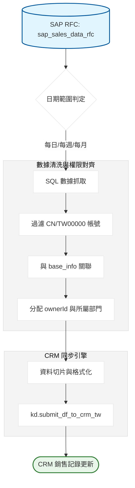

# SAP 銷售數據每日同步 CRM 系統：開發紀錄與踩坑筆記

### 項目背景

要把 SAP 內部的銷售實績（sap_sales_data_rfc）自動同步到銷售易（CRM）系統。需求是讓業務能在 CRM 上直接看到最新的出貨進度、司機資訊與倉管備註。這套腳本根據執行日期自動切換同步範圍：每天抓近 3 天資料，週一抓近 7 天，每月 5 號抓上個月全量數據，確保數據不會因為系統延遲而漏掉。

### 數據流轉邏輯



---

### 卡點在哪

SAP 的原始數據跟 CRM 的權限體系完全對不起來。SAP 只給業務姓名，但 CRM 寫入必須要有 16 位元的 ownerId。如果業務離職或改名，merge 就會失敗。
另外，SAP 的出貨備註（TDLIN1-3）裡面常有無效字元或換行符，如果直接塞進 API，整個 JSON 就會炸掉導致同步失敗。

### 為什麼這樣寫

這裡我設計了一個 build_time_ranges 函數，而不是死板的只抓昨天。

```python
# 為什麼不只抓昨天？因為 SAP 的 WADAT_DATETIME 有時候會延遲入庫。
# 實際跑下來發現，抓近 3 天是最穩的，週一再補抓 7 天來對齊週末的數據空缺。
def build_time_ranges(now: datetime):
    today = now.date()
    ranges = []
    # 規則一：每日保底抓 3 天
    ranges.append({"rule": "DAY_3", "start": today - timedelta(days=3), "end": today})
    # 規則二：週一強迫對齊一週
    if today.weekday() == 0:
        ranges.append({"rule": "WEEK_7", "start": today - timedelta(days=7), "end": today})
    return ranges

```

為了確保資料不會塞給錯誤的業務，我這裡強制過濾掉沒有 ownerId 的紀錄。

```python
# 這裡沒配對到業務 id 的直接扔掉，寧可不傳也不要傳給管理員
sap_sales_total = pd.merge(sap_sales, base_info, on="name", how="left").drop(columns=["地區"])
sap_sales_total = sap_sales_total[sap_sales_total['ownerId'].notna()]

```

---

### 實際跑下來的坑

1. **髒數據攔截**：SAP 裡面有一堆測試帳號（KUNAG == TW00000）跟大陸區資料（CN），我這裡直接在 SQL 階段用 `NOT LIKE '%CN%'` 全部擋掉，避免汙染台灣區的 CRM 環境。
2. **非法字元炸彈**：備註欄位（司機資訊、修改紀錄）是人手輸入的，什麼怪符號都有。我直接在寫入前用 `ILLEGAL_CHARACTERS_RE` 硬洗一遍，這是保證 API 不會 500 的最後防線。
3. **空值判定**：有些業務沒設地區，我代碼裡本來想用 `replace` 把 區 拔掉，後來發現這會讓某些空值變成 NaN 導致後續 merge 報錯。

```python
# 這裡最繞的地方：處理 entityType
# 銷售紀錄在 CRM 是自定義對象 29661547094081... 這種亂碼 ID。
# 這裡寫死雖然不優，但因為這個對象在 CRM 裡是唯一的，直接 Hardcode 效能最高。
sap_sales_total["entityType"] = 29661547094081...

```

### 為什麼這麼做

1. **批次提交**：每天出貨量很大，我用 `kd.submit_df_to_crm_tw` 走的是 Bulk API 邏輯。要是用一筆一筆 patch，早上上班前絕對跑不完。
2. **多重日期規則**：早期只寫每日同步，結果只要假日系統斷線，週一數據就全丟。現在加了 WEEK_7 和 MONTH_LAST 這種疊加規則，就是為了自動補坑。
3. **部門歸屬判定**：除了對人，還要對部門。我把 `dimDepart.id` 也抓進來，確保這筆銷售實績不但人對，連報表分組也對。

