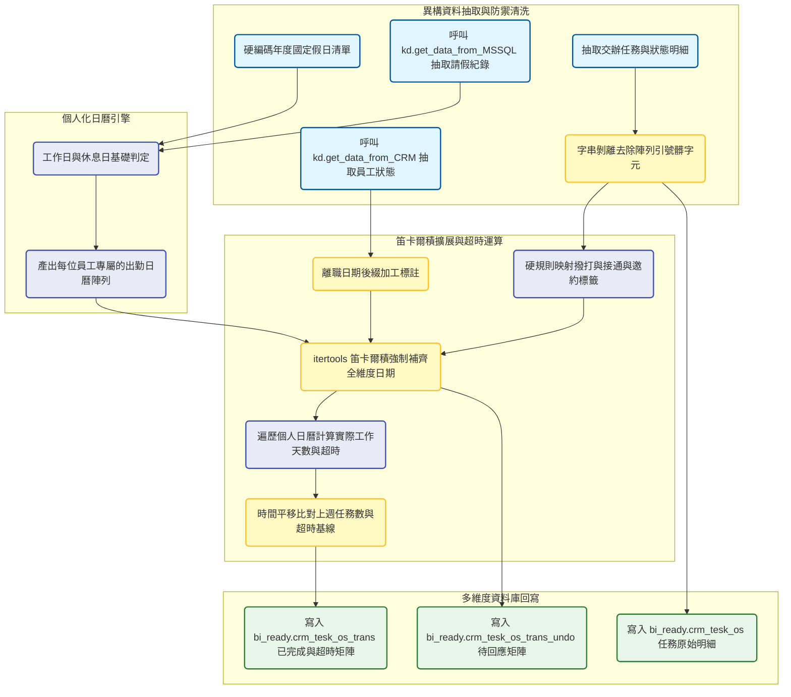
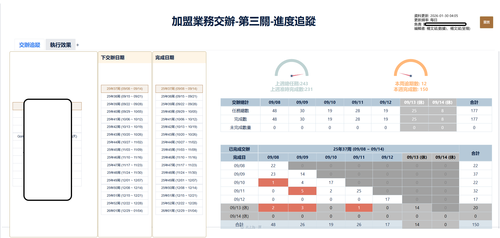
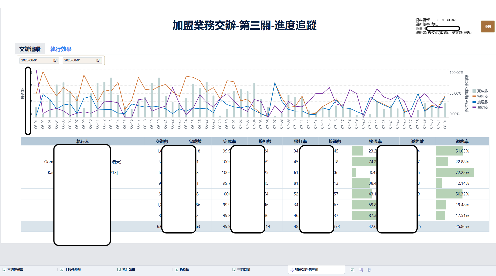

# 加盟開發業務交辦任務與工時追蹤系統 開發紀錄與踩坑筆記

### 業務與資料背景

加盟業務課開發組每日依賴 CRM 系統派發大量的 Invite 1-1 Meeting 交辦任務。為了有效監控業務員的執行效率，管理層需要一份精準的任務流轉矩陣，用來追蹤任務從創建到完成的週期，並抓出超時的案件。單純將完成日期減去創建日期是無效的，因為這樣無法排除週末，國定假日以及員工個人的請假天數。本專案的重點在於結合底層的 `common` 模組，跨系統拉取 HR 請假紀錄與 CRM 交辦明細，建構一套個人化的日曆計算引擎，最終輸出無斷層的任務矩陣供 BI 報表使用。

### 數據流轉與架構設計

### 日曆引擎與笛卡爾積實作

為了解決 BI 報表在繪製時間序列圖表時因為某天沒有資料而產生斷層的問題，我在這裡引入了暴力但極度有效的笛卡爾積設計。利用 Python 內建的 `itertools.product`，我將觀察區間內的所有日期，與所有員工的 ID 進行交叉相乘，生成一個絕對平滑的基礎矩陣。接著才將實際計算出的任務數量透過 Left Join 貼合上去，將沒有任務的日子強制補零。同時為了滿足高階主管看整體部門數據的需求，我在展開的陣列中強制注入了一個虛擬的 ALL 員工代號，用來承載整個團隊的聚合數據。

個人化日曆引擎是這個系統的核心。我首先在程式碼頂端硬編碼了二零二五年的台灣國定假日表，接著透過底層 `kd.get_data_from_MSSQL` 進入 raw_data 庫撈取 `hrs_staff_leave` 員工請假紀錄。系統會為每一位業務員生成專屬的日曆，如果在某個工作日他請了一天的假，該日期的 day_type 就會被標記為零。

### 實務挑戰與工程妥協

在計算超時（date_gap）的迴圈中，遇到了一個效能與邏輯的權衡。因為每一筆任務的創建與完成日期區間不同，且每位員工的休假狀況不同，實作上我選擇直接對過濾後的 DataFrame 進行 `iterrows` 逐筆迭代。在迴圈內部，系統會根據該任務的執行人 ID，動態去篩選他的個人日曆，計算這段期間內 day_type 等於一的天數。如果這個天數大於或等於一，就判定該任務超時。雖然在 Pandas 中使用迴圈效能並不理想，但考量到單一部門的交辦數量在可控範圍內，這個土炮的作法暫時被保留下來。

另一個明顯的技術債是前端顯示邏輯的後移。主管要求在報表上必須一眼看出哪些業務員已經離職，為此我直接在資料管線中動手腳，判斷只要 CRM 中有離職日期，就把名字欄位強制改寫加上離職月份與日期的後綴標註。此外 CRM 回傳的多選下拉欄位經常帶有中括號或引號的字串格式，我在腳本中寫死了幾項狀態映射清單，並利用暴力替換清除了這些雜訊，確保後續標籤判定（如是否撥打，是否接通）能順利觸發。

### BI 成果展示

此展示圖說明了交辦日期與完成日期的分佈矩陣。透過紅色區塊可直觀識別出超時完成的任務點，矩陣同時考量了週末與休假（標註為休），確保效能評估的公平性。

此圖表驗證了撥打率、接通率與邀約率的轉化邏輯。透過將清洗後的 CRM 資料與人員維度對齊，主管可直接觀測各執行人的實務產出效能。

目前的系統設計雖然在效能上仍有優化空間，但已成功解決加盟組主管對執行力與出勤狀況掛鉤的決策痛點。
