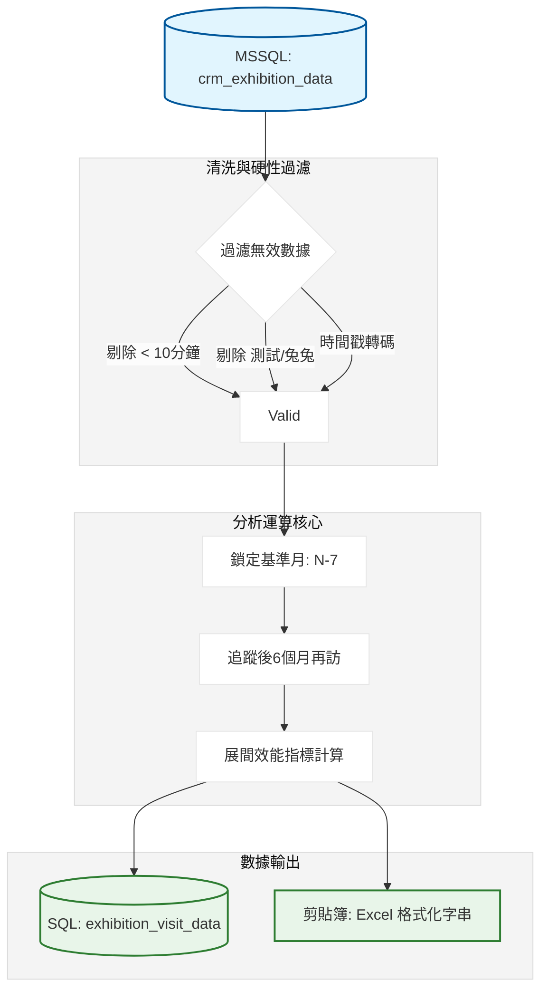
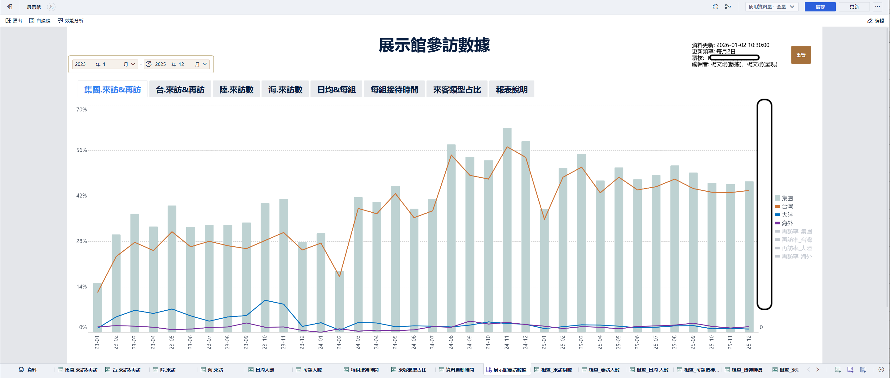
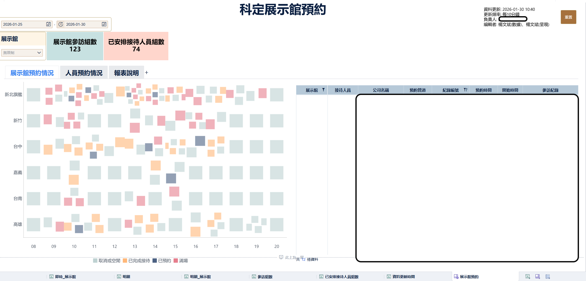
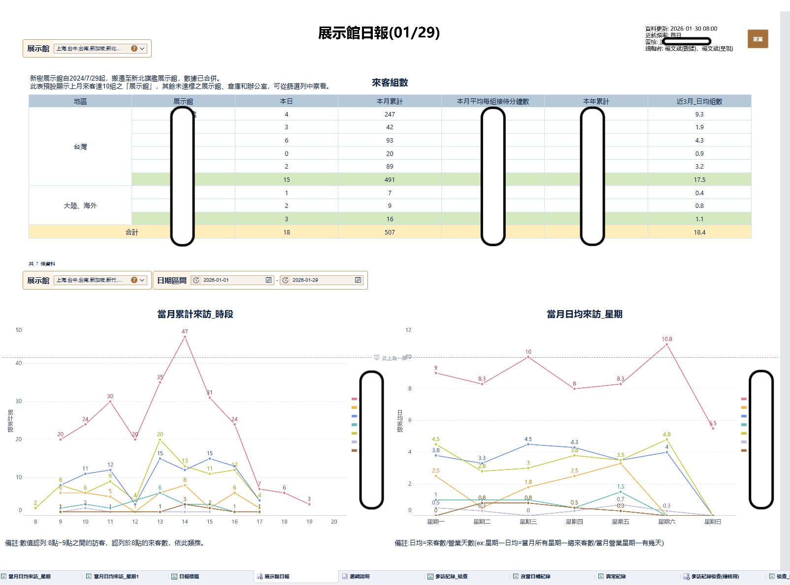

# 展示館再訪率與展間效能追蹤系統：開發紀錄與踩坑筆記

### 先幹什麼

要把全球展示館（台灣、大陸、海外）的參訪數據拉出來，算一個很硬的指標：基準月來過的客戶，在之後半年內有沒有再回來。這案子要從 MSSQL 抓 [crm_exhibition_data]，篩掉低效參訪（坐不到 10 分鐘那種），然後算出各館的場次、人數與日均效能。最後要把數據塞回 bi_ready 庫，還得生成一份專門用來貼回 Excel 定特定行數的格式字串。

### 數據流轉邏輯



---

### 卡點在哪

這專案最噁心的是 SQL 裡面的時間格式。原始資料的 start_time 和 end_time 是 BIGINT 毫秒數，直接讀出來根本沒法看。我這裡直接在 SQL 裡面用了一長串 RIGHT 和 CAST 硬轉成 HH:mm 格式，不然在 Pandas 裡面處理幾十萬行時間轉換會慢到炸。

另一個卡點是 展示館區域 的對齊。有些同仁填 新樹，有些填 新北旗艦，大陸那邊還有 展示館 與 無錫倉庫。我這裡直接手寫一個 region_map 映射表強制歸類，沒對上的地區數據我直接不要了，省得後面報表變髒。

### 為什麼這樣寫

這裡我沒用什麼高級的動態日期，我直接把基準月鎖死在 now - 7個月。

```python
# 為什麼要減7個月？因為我要看的是「上個月之前的半年追蹤」
# 基準月1個月 + 追蹤6個月 = 7個月。
base_month_start = now - pd.DateOffset(months=7)
base_month_start = base_month_start.replace(day=1, hour=0, minute=0, second=0, microsecond=0)

# 這裡留個坑：如果今天是 1/31，Offset 會有邊界問題
# 實際跑下來發現用 replace(day=1) 最保險。

```

為了貼合業務手上那份已經格式化好的 Excel，我寫了一個超繞的 `prepare_and_pad` 函數。

```python
# 為什麼要這樣補空白行？
# 因為業務的 Excel 裡面有固定的間隔（嘉義下面空 3 行，上海下面空 16 行）。
# 我這裡直接把 DataFrame 轉成 csv 格式的制表符 \t，然後強行塞空字串進去湊行數。
def prepare_and_pad(df, col_name, pad_rows):
    temp_df = df.set_index('Exhibition_Area').reindex(area_order)[[col_name]].reset_index()
    temp_df[col_name] = temp_df[col_name].fillna('')
    empty_df = pd.DataFrame({col_name: [''] * pad_rows})
    return pd.concat([temp_df[[col_name]], empty_df], ignore_index=True)

```

---

### 實際跑下來的坑

1. **無效參訪佔比過高**：一堆紀錄是進去吹個冷氣 5 分鐘就出來了，或是業務自己測試建檔的 兔兔。我這裡直接下死命令，接待分鐘數 <= 10 的全部不計入 效能，但保留在 場次 裡。
2. **剪貼簿地獄**：因為產出的數據要分段貼進 Excel 不同位置，我原本想一次生成整張表，結果 Excel 格子位置根本對不上。最後我改成用 `pyperclip` 分段複製。我跑完一段就要去 Excel 貼一段，雖然這很土，但這是解決 業務固定模板 唯一沒出錯的方法。

```python
# 實際跑下來發現，有些人會用同一個公司代號但不同的聯絡人來。
# 我這裡在算再訪時，只認公司代號 ID，不認人。
followup_companies = set(followup_df['公司代號'].dropna().unique())
total_returned = base_group[base_group['公司代號'].isin(followup_companies)]['公司代號'].nunique()

```

### 為什麼這麼做

1. **硬性 Drop 表重建**：這張 `exhibition_revisit_data` 每次跑都會變動基準月，所以我捨棄了 `append`，直接用 `DROP TABLE IF EXISTS` 重新寫入。這樣能保證資料庫裡永遠只有最新一次的再訪追蹤分析。
2. **合併大陸數據**：上海與無錫在業務逻辑上常被合在一起看。我這裡在最後一刻把 展示館區域 的 大陸 強制替換成 上海/無錫，這地方代碼寫得很死，以後要是多開一個展館就得回來重改。

### 遷移筆記

這份腳本目前掛在 119 排程，輸出路徑是寫死的。如果以後要把 營業  日期數據 `crm_exhibition_opr_hour` 的來源換掉，要注意該表的日期格式是字串還是 datetime。

### BI 成果展示

此圖表追蹤了集團、台灣、大陸及海外的來訪與再訪趨勢。透過此視覺化指標，管理層可直觀監控各地區展間的轉換效能。


本報表提供即時的展間預約熱圖與接待人員組數，協助現場行政人員進行動態調度，優化空間使用效率。


每日自動更新的參訪日報，包含當月累計來訪時段分布及週日均量，用於分析展間的人流峰值規律。

Wenbin