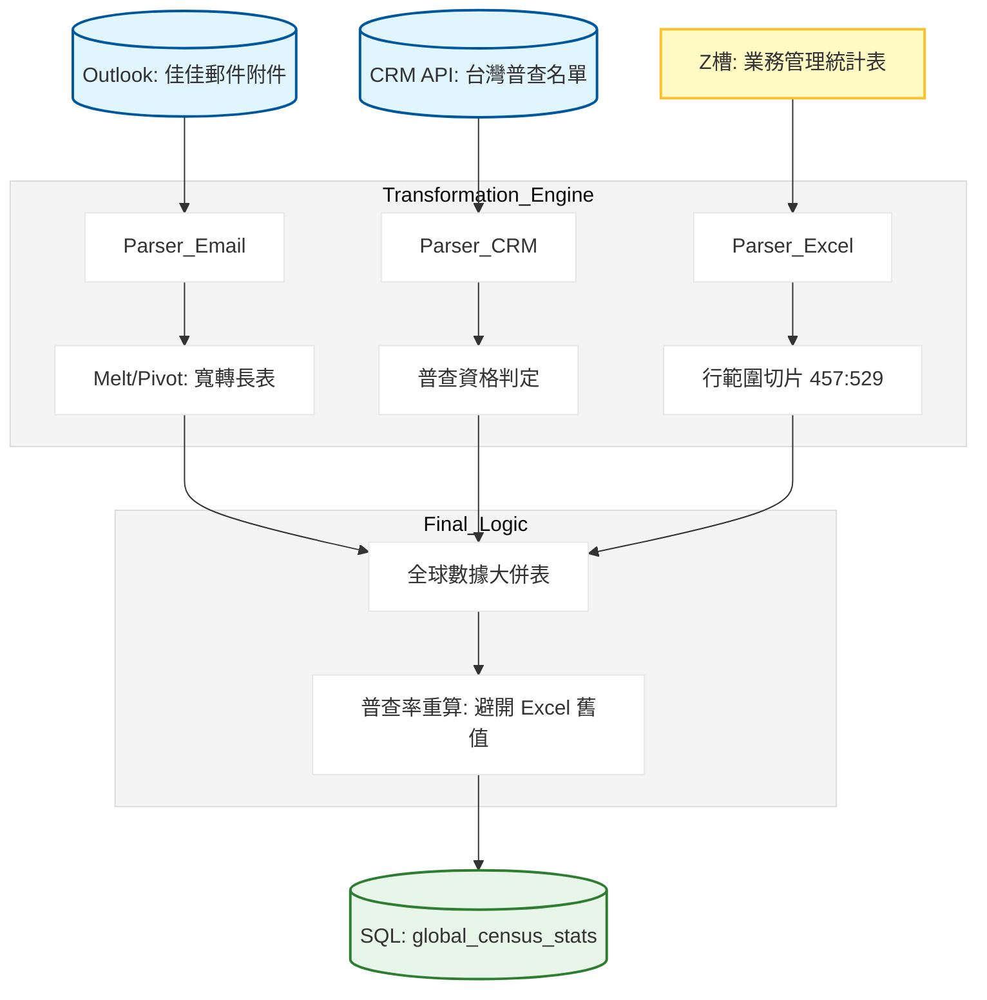

# 全球客戶與聯絡人普查追蹤系統：開發紀錄與踩坑筆記

### 項目背景

要把全球據點（台灣、大陸、海外）的普查數據自動化。這案子分兩路：一路是從 Outlook 抓取佳佳發過來的 Excel 附件，裡面有大陸跟海外的普查數；另一路是直接去 CRM 撈台灣區的聯絡人資料，算出應普查家數與實際完成家數。最後要把這些散落在郵件、CRM 與共用資料夾 Excel 裡的數據全部彙總到 bi_ready 庫，產出各區普查率。

### 數據流轉邏輯



---

### 卡點在哪

這系統最脆弱的地方在於 郵件附件數據源。佳佳發過來的郵件主旨只要多一個空白，`win32com` 就抓不到。而且 Excel 附件存檔路徑如果是 C 槽，排程器權限不夠會直接炸掉。

另一個大坑是 `月度普查統計.py`。業務提供的 Excel 竟然是從第 457 行到 529 行才有我要的數據。這種寫法極度危險，只要業務在中間多插一行，我抓到的數據就會全部錯位，變成在抓別人的業績獎金。

### 為什麼這麼繞

在處理大陸與海外數據時，我沒直接用 Excel 裡的百分比，而是抓原始數值回來用 Pandas 重算。

```python
# 為什麼要重算？因為 Excel 裡的百分比欄位常有公式報錯（#DIV/0!）
# 抓回來重算才能確保 bi_ready 裡面的普查率是乾淨的浮點數。
df_all['公司普查率'] = df_all['公司普查完成家數'] / df_all['公司應普查家數']
df_all['聯絡人普查率'] = df_all['一年內普查完成聯絡人數'] / df_all['應普查聯絡人數']

# 這裡我直接補零，不然 PowerBI 讀到 inf 或 nan 會整張圖表消失。
df_all = df_all.fillna(0)

```

針對 Outlook 抓檔，我直接用 `Restrict` 過濾器，不跑迴圈遍歷幾萬封郵件。

```python
# 為什麼不用迴圈？因為 Outlook 郵件太多會跑半小時。
# 我直接限定 ReceivedTime，只抓昨天的信。
yesterday_str = yeaterday.strftime("%m/%d/%Y %H:%M %p")
filter_str = f"[ReceivedTime] >= '{yesterday_str}'"
messages = messages.Restrict(filter_str)

```

---

### 實際跑下來的坑

1. **Outlook 權限炸彈**：`win32com.client.Dispatch` 必須在有安裝 Outlook 的機器上跑，且不能以隱藏服務模式執行，這導致我的排程器必須維持登入狀態，這點很爛但沒預算買 API 只能先這樣。
2. **非法行範圍切片**：`iloc[457:529]` 是我寫過最自黑的代碼。實際跑下來發生過一次業務改版 Excel，導致普查率突然變成 50000%，後來我加了一個 `assert` 檢查地區欄位是不是包含 SG 這些字眼來保命。

```python
# 實際跑過才知道，業務這張表上面 400 行全是雜質
df_raw = pd.read_excel(excel_path, sheet_name="資料", header=2)
df_partial = df_raw.iloc[457:529].copy() 

# 坑：月份欄位是 '24-04' 這種簡寫
# 我這裡手動強加 '20' 進去轉成 '2024-04'，不然 pd.to_datetime 會抓瞎。
df_long['月份'] = '20' + df_long['月份']

```

### 為什麼這麼做

1. **寬轉長再轉寬**：我這裡先用 `melt` 把 4 月、5 月這些欄位拉長，補上年份後再 `pivot` 回去。這樣做是為了統一大陸、台灣、海外這三路完全不同格式的數據源。
2. **硬性過濾目標客戶**：在 `月度普查清單.py` 裡，我直接過濾 `dimDepart.departName like '%TW%'`。以前沒過濾時，清單會混入海外客戶，導致台灣區業務在普查時一直打錯電話。
3. **資料保留策略**：普查統計我用 `replace` 模式，但普查清單我保留了 `dedup_keys`。因為普查歷史是拿來對帳用的，不能隨便刪。

### 遷移與自黑點

這套系統目前對「普查完成」的定義是抓 CRM 的 `appDate__c`（申請日期）。如果業務只是拜訪了但沒去系統點發放，這筆普查就不算。
遷移到 GitHub 前，我已經把 `C:\Temp\Outlook_Attachments` 這種本地路徑環境變數化。
目前還有個坑：如果佳佳那天請假沒發郵件，我的 `get_outlook_excel` 會回傳 None，這會導致後續併表報錯，我目前只加了一個簡單的 `if df is not None` 來墊一下。

---

Wenbin