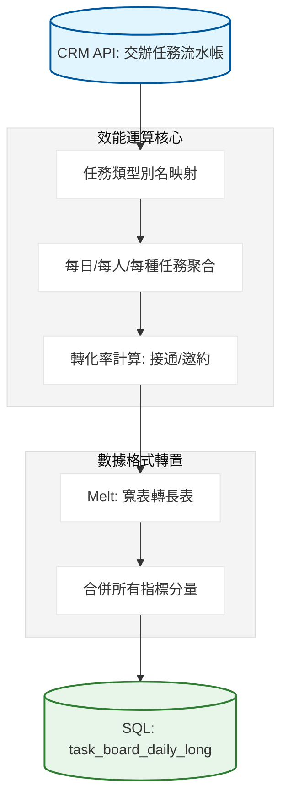

# 業務每日任務效能追蹤系統：開發紀錄與踩坑筆記

### 項目背景

要把業務每天在 CRM 裡的通話跟邀約數據量化。目標是算出每個人每天的 接通率 與 邀約率。我這裡直接從 CRM 抓出所有交辦任務，按照任務類型（打電話、見面、邀約）進行歸類，算出完成數、接通數跟邀約數。最後要把這些數據從寬表轉成長表格式（Long Format），塞進 SQL 資料庫供 FineBI 呈現。

### 數據流轉邏輯



---

### 卡點在哪

CRM 原始的任務類型名稱太亂。有的叫 Invite 1-1 Meeting，有的叫 1-1 Meeting，對統計來說這都是同一件事。如果我不做別名映射（Alias Map），報表會被拆成幾十個碎塊。

最危險的是算 接通率。如果某個業務當天一通電話都沒打（Completed = 0），代碼會直接噴除以零的錯誤。我這裡直接用 `np.where` 硬轉，只要分母是 0 就給 0.0，這才保證排程不會半夜炸掉。

### 為什麼這麼繞

為了 FineBI 畫圖方便，我沒直接存一張大寬表。我把 完成數、接通數、接通率 分開算，最後用 `pd.concat` 全部疊在一起。

```python
# 為什麼要分開算再併表？
# 因為這樣我可以在不更動資料庫結構的情況下，隨時增加新的指標（比如 拜訪率）。
# 這裡我用一個 parts 清單存所有計算結果，最後一次性 concat。
parts = []
# 算接通數
p = by_type[['date','assignee_name','task_type_alias','connected']].copy()
p['section'] = 'Connected Task'
parts.append(p.rename(columns={'connected':'value'}))

# 算接通率：這裡最繞，要先算當天總量
agg = by_type.groupby(['date','assignee_name'], as_index=False)[['connected','completed']].sum()
p = agg[['date','assignee_name']].copy()
# 預防除以零
p['value'] = np.where(agg['completed'] != 0, agg['connected'] / agg['completed'], 0.0)
p['section'] = 'Connected Rate'
parts.append(p)

```

---

### 實際跑下來的坑

1. **日期起始點硬編碼**：我這裡直接寫死 `start_ts_ms = pd.to_datetime("2025-01-30").timestamp() * 1000`。這是因為 2025 年之前的數據格式太舊，強行抓進來只會汙染報表。
2. **多重任務別名**：業務常會隨便改任務主旨。我目前只抓了 `Invite 1-1` 這種關鍵字，如果有人手抖打成 `Invte`，這筆數據就直接掉進垃圾桶了，目前只能靠人工去 CRM 改。

```python
# 實際跑下來發現，沒這張表，FineBI 的圖表會變成一團混亂。
task_type_alias_map = {
    'Invite 1-1 Meeting': 'Invite 1-1',
    'Invitation': 'Invite 1-1',
    'Call': 'Call',
    'Phone Call': 'Call'
}
# 坑：如果有新類型沒在表裡，會變成 NaN，我這裡直接 fillna('Other')
by_type['task_type_alias'] = by_type['task_type'].map(task_type_alias_map).fillna('Other')

```

### 為什麼這麼做

1. **長表轉置 (Melt)**：FineBI 的切片器最喜歡這種格式。雖然資料庫行數會變多，但前端寫 DAX 公式時會省事很多。
2. **多執行緒抓取**：雖然這份腳本計算量大，但我前面用 `ThreadPoolExecutor` 抓 CRM 資料是為了省下等待 API 回傳的時間。要是單線程跑，早上 8 點主管開會前絕對算不完。

