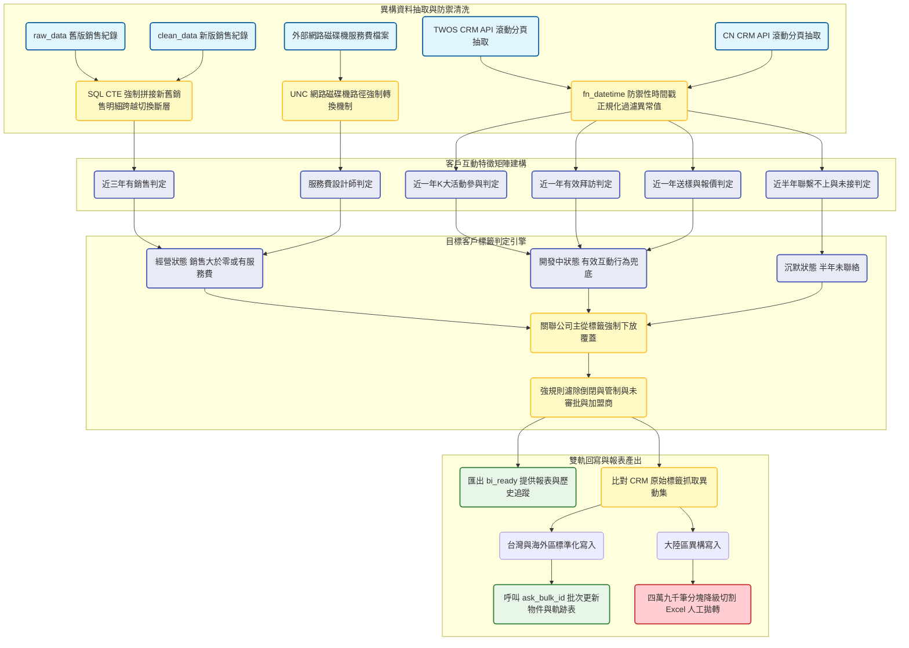
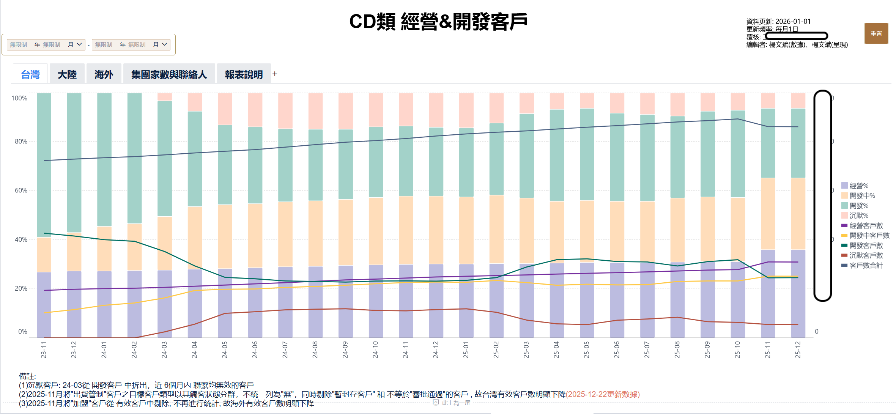
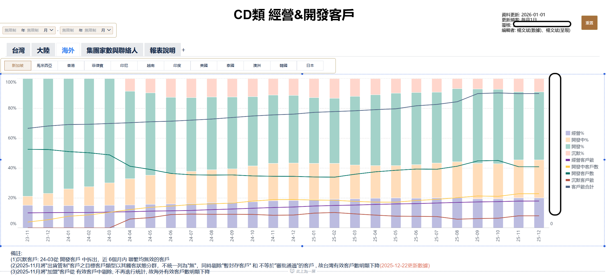

# 集團目標客戶標籤更新與回寫系統 開發紀錄與踩坑筆記

### 業務與資料背景

集團目標客戶更新專案的目的是整合分散在不同系統的業務數據，將全球的 B2B 客戶劃分為經營，開發中，開發，沉默與暫封存五種狀態。由於台灣與海外共用一套 CRM，大陸則獨立使用另一套 CRM，兩邊的資料表結構與 API 接口已經產生分歧。加上早期的 SAP 歷史銷售數據與今年初剛切換的新版清洗管線存在斷層，這些異構數據的對齊成為這個專案最大的工程挑戰。

### 數據流轉與架構設計

### 資料清洗與特徵標籤化實作

在特徵工程與標籤判定的實作上，系統首先透過 API 滾動拉取過去半年到三年的機會，聯絡人與拜訪紀錄。這裡踩到的一個大坑是 CRM 系統回傳的時間戳極度不穩定，有時是十位數的秒級，有時是十三位數的毫秒級，甚至會出現負數或超過西元三千年的異常值。為此我封裝了單獨的日期解析函數，強制將極端值轉換為空值，避免後續 Pandas 處理時引發崩潰。

另一個工程限制是銷售數據的歷史交接。由於二零二五年一月一日系統進行了切換，舊有的資料留在 raw 庫，而新的資料則由 clean 庫的管線產出。為了計算近三年的總銷售額，我直接在 SQL Server 端寫死了一組 CTE，利用 UNION ALL 將兩段歷史強制拼接，再交由 Pandas 進行關聯。這樣做雖然稍顯暴力，但避開了在 Python 記憶體中載入巨量歷史明細的效能問題。

在計算完單一公司的標籤後，業務邏輯要求子公司的狀態必須繼承母公司。我透過拉取關聯公司映射表，將主關聯公司的標籤強制下放到所有關聯的子公司。同時針對無效資料區域，倒閉或是審批撤回未提交的紀錄進行了強規則覆蓋，將這些特例統一刷成暫封存或直接清空標籤。

在標籤計算完成並過濾掉無效加盟商後，我需要將統計結果輸出，這裡引入了 BI 報表來驗證各區域的客戶結構。

![集團各區域目標客戶標籤分佈狀態]BI/account_label_distribution.png

透過這張圖表可以明顯看出不同大區在過濾掉管制名單後，實際落入經營與開發中狀態的真實水位，這也作為後續推播更新至 CRM 前的重要信心指標。

### 異構 CRM 回寫與技術債

在資料回寫 CRM 的階段，兩岸系統的架構差異帶來了嚴重的技術債。台灣與海外的資料可以直接透過封裝好的 API 批次更新物件並寫入歷史軌跡表。但是大陸的 CRM 欄位不僅命名不同，標籤的內部映射代碼也完全不一致。

此外，CRM API 經常會回傳帶有空白或特殊字元的髒 ID。程式碼中必須動用正則表達式強制提取十六位數字，再轉換為支援空值的整數格式，否則在比對差異時會產生大量偽陽性。更麻煩的是，排程伺服器在背景執行時，經常因為 Windows 環境的限制拋出編碼錯誤，我只能在腳本頂端強行覆寫系統輸出，將錯誤輸出替換為標準的 UTF8 以確保流程不會中斷。

針對大陸區的標籤回寫，目前採用了妥協的設計。由於 API 吞吐量限制與欄位對齊問題，程式會以四萬九千筆為一個批次，將比對出有差異的紀錄切割匯出成多份 Excel 檔案，暫時依賴輔助工具完成最終寫入。這是一筆明確的技術債，後續需要等大陸區的 CRM 接口升級後才能整合回全自動管線。另外腳本中也加入了 UNC 路徑強制轉換的防禦機制，解決背景排程無法穩定讀取網路磁碟機的陳年老問題。

### BI 成果展示

**台灣區經營開發趨勢**

圖表展示了台灣區各類標籤客戶數量的月度變化趋势，並在下方備註了關鍵業務邏輯變動（如 25-12）對數據的影響。

**海外區經營開發分布**

海外 BI 報表除整體趨勢外，亦提供新加坡、馬來西亞、香港等多個國家的子標籤篩選功能，便於跨國業務的管理與分析。
