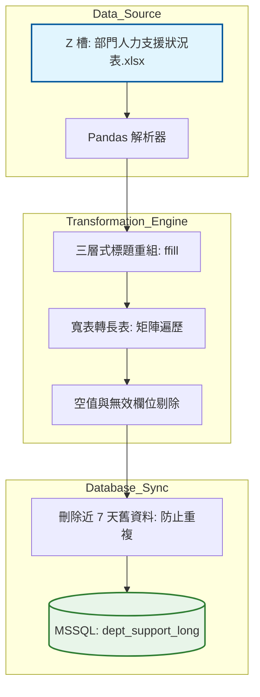

# 部門人力支援數據轉置系統：開發紀錄與踩坑筆記

### 項目背景

要把各部門填寫的人力支援 Excel 表自動化存入資料庫。業務背景是公司內部經常有跨部門的人力借調（原部門、支援部門），主管需要看這些借調的人數跟時數。原本這些資料都死在 Excel 裡，我的任務是把這些橫向擴展的寬表（Wide Format）轉置成資料庫好處理的長表（Long Format），並存入 SQL Server 的 dept_support_long 表。

### 數據流轉邏輯



---

### 卡點在哪

這份 Excel 的格式非常不工程師。標題列整整佔了三行，第一行是原部門，第二行是支援部門，第三行是數據類型（人數或時數）。而且 Excel 裡用了大量合併單元格，這在 Pandas 讀進來會變成一堆 NaN。

我這裡直接用 `ffill()` 硬塞，把合併單元格造成的空值往後補齊，不然我根本沒辦法把標題拼湊出來。

### 為什麼這樣寫

這裡我不用 `pd.melt`，因為標題有三層結構，用 `melt` 會寫得非常痛苦。我直接用雙層迴圈遍歷欄位，雖然這寫法比較土，但在處理這種奇葩 Excel 格式時最直觀。

```python
# 為什麼不直接 read_excel？因為標題是合併的，會炸。
df = pd.read_excel(file_path, header=None)
# 強迫把合併單元格的 NaN 往後填滿
orig_row = df.iloc[0].ffill()
supp_row = df.iloc[1].ffill()
type_row = df.iloc[2]

# 這裡我直接用 index 遍歷，因為我要同時抓三行標題的資訊
for col in range(1, n_cols):
    orig = str(orig_row.iloc[col]).strip()
    supp = str(supp_row.iloc[col]).strip()
    t = str(type_row.iloc[col]).strip()
    
    # 這裡攔截掉空標題，不然會塞一堆廢物進資料庫
    if orig in ["", "原部門"] or supp in ["", "支援部門"]:
        continue

```

---

### 實際跑下來的坑

1. **重複導入問題**：業務有時候會回頭改前幾天的數據。如果我直接 `append`，資料庫會出現一堆重複的日期。
我這裡寫了一個 `delete_last_7_days` 函數。每次跑腳本前，先暴力刪除資料庫裡最近 7 天的紀錄再重噴，這比寫 `update` 邏輯要穩得多。
2. **非法日期格式**：有些同仁會在日期欄位填一些文字備註。我這裡直接用 `data.iloc[i, 0]` 抓日期，沒做 `to_datetime` 的話，進資料庫會直接報錯。

```python
# 這裡最繞的地方：刪除舊數據防止重複
def delete_last_7_days(db_name, table_name):
    # 這裡硬取 7 天前，保險起見。
    cutoff = (datetime.today() - timedelta(days=7)).date()
    with engine.begin() as conn:
        # 為什麼要用 text()？因為 sqlalchemy 2.0 之後不接受純字串 SQL 了。
        sql = text(f"DELETE FROM {table_name} WHERE date >= :cutoff")
        conn.execute(sql, {"cutoff": cutoff})
        print(f"Cleanup done: >= {cutoff}")

```

### 為什麼這麼做

1. **快速重建模組**：我把 `write_to_sql` 獨立出來，並且開啟 `fast_executemany=True`。這在處理這種跨部門大表時，寫入速度會差到三、四倍以上。
2. **硬性過濾**：在解析過程中，只要 `val`（人數或時數）是 NaN，我直接 `continue` 跳過。這能讓原本幾千行的 Excel 數據縮減到只有幾百行的有效紀錄，減少資料庫負擔。

