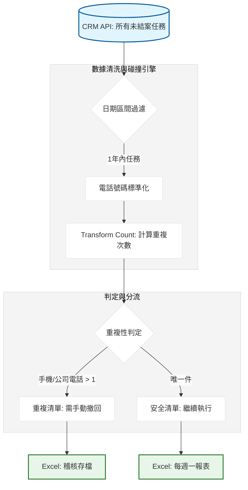

# 每週一未關閉交辦清理：開發紀錄與踩坑筆記

### 項目背景

每週一早上要把 CRM 裡面所有還沒結案（執行狀態 != 結案）的交辦任務抓出來，特別是那堆司機推廣、派樣電訪的名單。需求是找出哪些任務已經掛在那邊超過三個月沒動，或是同一個聯絡人、同一個公司電話被重複下了一堆交辦。要把這些重複的、過期的垃圾清理掉，產出兩份清單：一份是乾淨的待辦，一份是重複需要刪除的稽核件。

### 數據流轉邏輯



---

### 卡點在哪

這專案最炸的地方是電話號碼。業務在 CRM 下交辦的時候，聯絡人手機有的寫 0912-345-678，公司電話有的寫 (02)2299-xxxx。我這裡如果直接拿來做 groupby 算重複數，絕對會漏掉一堆明明是同一個人但格式不同的任務。

我這裡直接寫了一個強力的 regex 函數，先把所有非數字的東西全部幹掉，再把開頭 886 或是 009 這種東西全部校正回 0 開頭。

### 為什麼這樣寫

我這裡不寫 for 迴圈去對撞，因為未關閉的交辦有幾萬筆，跑完都要下班了。我直接用 `transform('count')` 把整張表丟進去算。

```python
# 為什麼不用 count() 而用 transform？
# 因為 transform 會回傳跟原表一樣長度的 Series，我可以直接寫回 df['手機號出現次數']。
# 這樣我最後過濾 df[df['手機號出現次數'] > 1] 速度快到沒感覺。
test_tw["聯絡人手機號_clean"] = test_tw["聯絡人手機"].str.replace(r'\D', '', regex=True)
test_tw["手機號出現次數"] = (
    test_tw.groupby("聯絡人手機號_clean")["聯絡人手機號_clean"]
    .transform("count")
    .fillna(0)
    .astype(int)
)

# print(f"Detected duplicates: {len(test_tw[test_tw['手機號出現次數'] > 1])}")

```

---

### 實際跑下來的坑

1. **非法字元炸彈**：業務在工作主旨或備註裡塞的換行符，會讓匯出的 Excel 格式全亂，稽核員打開會發現資料全部錯位。我這裡最後強迫過一遍 `ILLEGAL_CHARACTERS_RE`，這是血淚教訓。
2. **日期跨年問題**：CRM 的時間戳（timestamp）如果是 13 位毫秒，我這裡沒轉好會變成 1970 年。我直接封裝在 `kd.convert_to_date` 裡跑，但跨年時的 `year_ago_one` 還是要手動算準，不然會把去年的舊任務全部漏掉。

```python
# 這裡最繞的地方：處理重複行的分流
# 為什麼要分 duplicate_rows 跟 unduplicate_rows？
# 因為稽核員要看的是哪些任務在「打架」。
duplicate_rows = test_tw[(test_tw["手機號出現次數"] > 1) | (test_tw["公司電話出現次數"] > 1)].copy()
unduplicate_rows = test_tw[(test_tw["手機號出現次數"] <= 1) & (test_tw["公司電話出現次數"] <= 1)].copy()

# 坑：空值也會被當成重複。如果大家手機都沒填，那不就全重複了？
# 所以在算 count 前，手機號為空的必須先丟掉或填入隨機值。

```

### 為什麼這麼做

1. **硬性標籤攔截**：我只抓 司機推廣、經營專案 這幾類主題。以前沒過濾，結果連財務部的催款交辦都抓進來，差點把財務部的任務給撤回，那邊的人會直接殺過來。
2. **多維度去重**：不只對手機，還要對公司電話。有些設計師在不同的公司掛職，但電話是一樣的，這種重複下單的情況如果不抓出來，業務會重複打電話被客戶噴。
3. **自黑與留坑**：目前的代碼還沒辦法處理「改號碼」的情況。如果聯絡人改了電話，我這套邏輯就抓不到了。這部分目前只能靠業務在 CRM 回報。

