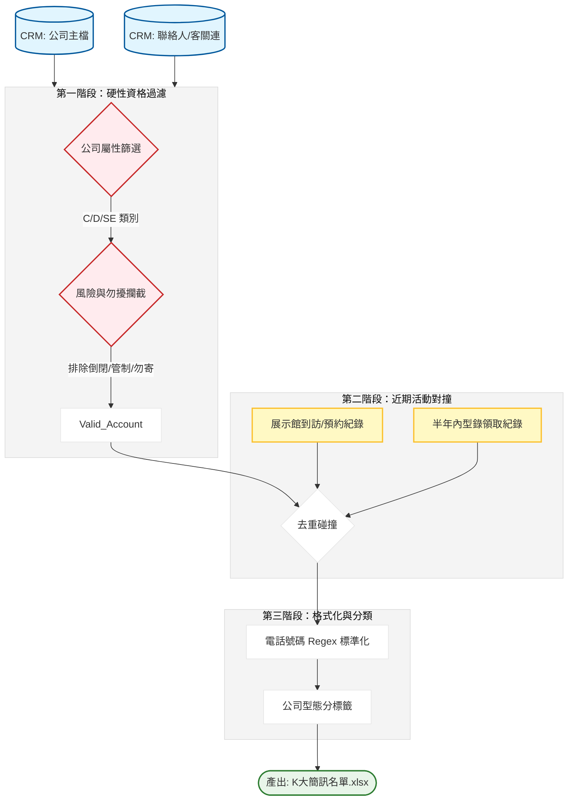

# K大說明會簡訊邀約自動化系統：開發紀錄與踩坑筆記

### 項目背景

要把 CRM 裡面幾萬名客戶篩選出精準的簡訊邀約名單，去參加 K大（產品說明會）。這案子最麻煩的是要跨多個對象判定：要看公司型態（C, D, SE）、要排除倒閉或管制戶、要確認半年內沒領過型錄（避免重複打擾）、還要檢查這人最近有沒有去過展示館。最後要把這些洗乾淨的名單按公司型態分類，導出給規劃組直接發簡訊。

### 數據流轉邏輯



---

### 卡點在哪

簡訊名單最核心的就是手機號碼。CRM 裡的聯絡人電話簡直是垃圾場，有人寫 0912-345-678，有人寫 +886，還有人在號碼後面寫 分機12。我這裡如果直接拿這組號碼去發簡訊，系統會直接拒收或噴報錯。

另一個卡點是 展示館再訪 邏輯。規劃組要求如果這人三個月內去過展館、或是未來有預約的人，這次就不要發簡訊給他，因為他已經跟公司有接觸了。我必須去 `customEntity24__c`（展館預約表）撈資料，用 聯絡人代號 做 `isin` 比對。

### 為什麼這麼繞

這裡我不用單純的 `drop_duplicates`。因為一個聯絡人可能掛在好幾家公司名下，我必須創一個 `唯一識別`（公司代號 + 聯絡人姓名），否則會發生 A 公司沒領過型錄但 B 公司領過，導致名單判定失準。

```python
# 為什麼不用簡單的合併？因為一個聯絡人代碼可能對應到多個公司
# 我這裡強迫用 唯一識別 進行標註，這是為了保證去重不會誤殺。
K_invite['唯一識別'] = K_invite['公司代號'].astype(str) + K_invite['連絡人姓名'].astype(str)
museum_one_filtered['唯一識別'] = museum_one_filtered['公司代號'].astype(str) + museum_one_filtered['連絡人'].astype(str)

# 這裡留個坑：如果業務把聯絡人姓名打錯一個字，這個唯一識別就對不上了
K_invite['是否展館K大'] = K_invite['唯一識別'].isin(museum_one_filtered['唯一識別']).map({True: '是', False: '否'})

```

---

### 實際跑下來的坑

1. **手機號碼清洗失效**：原本以為只清掉橫槓就好，結果發現有人手機開頭寫 `886` 沒加 `+`。我直接用 `re.sub` 把所有非數字清掉，然後校正 `8869` 開頭的全部換成 `09`，否則簡訊商的 API 會判定為格式錯誤。
2. **非法字元炸掉 Excel**：`ILLEGAL_CHARACTERS_RE` 這個正則表達式一定要加在最後的 `applymap` 裡。規劃組那邊的 Excel 只要讀到客戶備註裡的奇怪換行符，檔案直接損毀，我修這個修了好幾次。

```python
# 這是保命用的一段，沒洗過一遍不敢導出。
from openpyxl.cell.cell import ILLEGAL_CHARACTERS_RE
K_invite = K_invite.applymap(lambda x: ILLEGAL_CHARACTERS_RE.sub('', x) if isinstance(x, str) else x)

# 實際跑下來發現，公司地址長度太短的通常是測試資料
# 我這裡直接下死命令，len < 7 且沒寫 號 的直接扔掉
K_invite = K_invite[K_invite['公司地址'].str.len() > 7]

```

### 為什麼這麼做

1. **分流輸出**：我這裡把 C/EC、D、SE 類別分開成三個 DataFrame 輸出。因為規劃組發簡訊的文案完全不同，這樣做讓他們可以一鍵複製，不用再自己手動篩選。
2. **歷史型錄對撞**：我直接抓 `appDate__c` 是一年內的所有禮品發放紀錄（`gift_df`）。只要這人這一年內拿過東西，優先權直接調到最低，確保簡訊資源是花在「新開發」的客戶身上。

