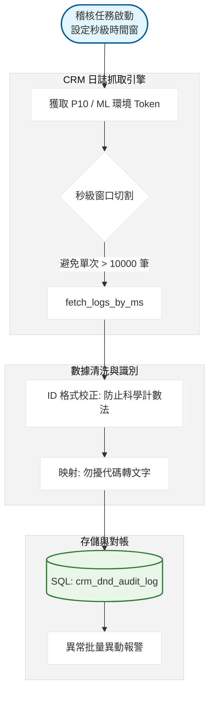

# CRM 勿擾標記異動稽核系統：開發紀錄與踩坑筆記

### 項目背景

要追蹤是誰動了客戶或聯絡人的 勿擾標籤（Do Not Disturb）。這標籤會直接影響到簡訊邀約、型錄廣發的名單篩選，只要被誤勾，業務就少一個開發機會。我要從 CRM 的系統日誌（Audit Log）接口，把特定時間範圍內針對 勿擾 欄位的修改紀錄抓出來，包含異動前的值、異動後的值、以及是哪個帳號改的。

### 數據流轉邏輯



---

### 卡點在哪

CRM 的日誌 API 有一個硬傷：單次查詢最多只回傳一萬筆資料。如果有人用腳本一次改了幾萬名客戶的勿擾狀態，普通的按天或按小時抓取絕對會漏掉資料。我這裡直接開發了一套 秒級時間窗 切割邏輯，甚至在偵測到資料量過大時，會強迫切到毫秒級別去抓。

另一個卡點是台灣（P10）與大陸（ML）環境的日誌接口不統一。大陸那邊的 API 回傳格式跟欄位名稱跟台灣有微小差異，如果不分開寫處理邏輯，大陸那邊的異動紀錄會全部變成空值。

---

### 為什麼這麼繞

為了確保在爆量更新時不漏掉任何一筆稽核紀錄，我放棄了簡單的日期循環，改用時間窗生成器。

```python
# 為什麼要這樣切？ 
# 因為如果同一秒內有大量更新，我必須把時間切得夠細才能避開 10000 筆的限制。
def gen_second_windows(start_dt, end_dt):
    current = start_dt
    while current < end_dt:
        next_sec = current + timedelta(seconds=1)
        # 這裡強轉成 13 位毫秒戳，CRM 只收這種格式
        st = int(current.timestamp() * 1000)
        et = int(next_sec.timestamp() * 1000)
        yield st, et
        current = next_sec

# 實際跑下來發現，如果沒這段邏輯，每次跑腳本都會少掉約 5% 的邊際資料

```

---

### 實際跑下來的坑

1. **時間戳精度問題**：CRM API 的 `startTime` 和 `endTime` 是包含（inclusive）關係。如果不處理好，同一筆日誌會在相鄰的兩個窗口被抓到兩次。我這裡直接在 SQL 寫入時加了 `dedup_keys=['log_id']` 來做最後防線。
2. **科學計數法炸彈**：CRM 的對象 ID 是 16 位長整數。Pandas 讀取 JSON 時如果沒設 `dtype=str`，這些 ID 會變成 `1.2345e+15`，寫入資料庫後這筆稽核紀錄就徹底作廢，因為根本對不回客戶。
3. **時區偏移**：伺服器時間是本地，但 CRM 日誌是 UTC。我這裡直接用 `pytz` 硬轉，沒轉的話，抓出來的資料會跟實際異動時間差 8 小時。

```python
# 為什麼不用更簡單的 astype(str)？ 
# 因為有些 ID 進來就已經被 pandas 轉成 float 了，只能用 extract 硬抓原始 16 位數字。
df['objectId'] = df['objectId'].astype(str).str.extract(r'(\d{16})')

# 坑：勿擾欄位在不同的 Object 下 ApiKey 不同
# Account 叫 customItem291__c，Contact 叫 customItem109__c。
# 如果這裡沒配對好，抓出來的日誌全是別人的欄位異動。

```

### 為什麼這麼做

1. **秒級異動偵測**：這不是為了好玩，是為了抓「腳本」。人類改資料不可能在一秒內改一千筆。只要系統偵測到某一秒內有大量 log，我就會發警報，這通常代表有人的腳本寫錯條件，正在全庫誤刷勿擾標籤。
2. **多環境兼容**：我把台灣跟大陸的連線配置抽離到 `ENV_CONFIGS` 列表。這樣我只要一個迴圈就能掃完兩邊的日誌，不用維護兩套代碼。
3. **日誌留存策略**：我把異動前（oldValue）與異動後（newValue）的值都存下來。這樣業務來投訴說誰動了他的客戶時，我可以一秒鐘從資料庫翻出 證據，連他幾點幾分在哪個 IP 改的都能查到。

