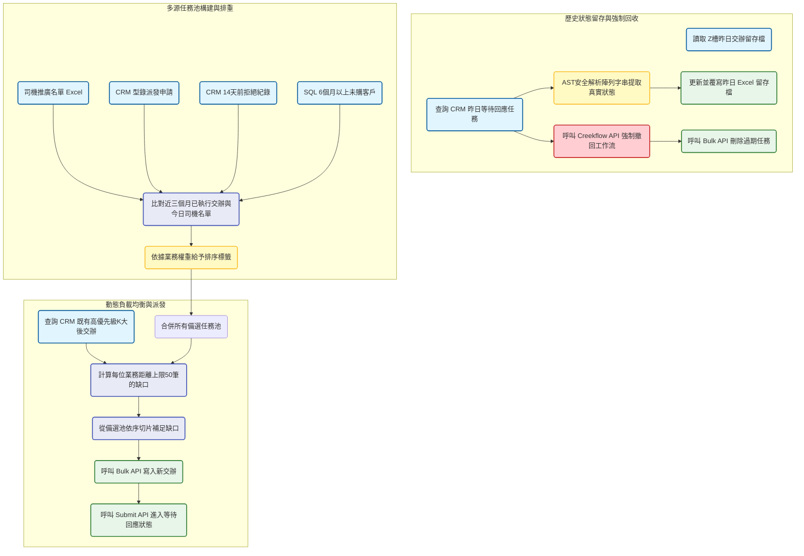

# 經營業務多源交辦自動派發與回收管線 開發紀錄與踩坑筆記

### 業務與資料背景

經營業務團隊每日需要執行大量的客戶關懷與開發電訪。過去依賴人工整理名單並派發，不僅耗時，還經常發生業務員累積了幾百筆過期未打的任務，導致跟進進度失真。為了解決這個問題，系統導入了每日限額派發與強制回收機制。系統每日清晨會先清掃昨日未完成的任務，接著從四個不同的業務場景（司機推廣，型錄派樣，十四天前拒絕，六個月以上未購）中撈取潛在名單，經過嚴格的排重與防打擾過濾後，動態計算每位業務員今日的負載，精準補足至五十筆的每日上限。

### 數據流轉與架構設計

### 任務回收與狀態快照的技術債

CRM 系統的交辦任務一旦進入審批工作流，底層邏輯就會變得異常封閉。我無法直接對這些記錄進行刪除或修改，必須先取得 `procInstId`，透過 API 模擬代理人將任務撤回（Withdraw），待其狀態解除後才能真正刪除。這個過程極度耗時且容易因為網路波動失敗。

另一個大坑是 CRM 報表無法準確追蹤這種會被每日刪除的變動型任務。為此我採用了土炮但極度可靠的快照機制，在執行回收前，先將昨日的狀態匯出至 Z槽的共用 Excel 中。由於 CRM 回傳的執行狀態經常帶有不規則的中括號與引號，我在程式中實作了基於 `ast.literal_eval` 的安全解析函數，將字串強制轉型並提取首個元素。同時也加入了針對 `PermissionError` 的防禦機制，避免因為業務員忘記關閉共用 Excel 而導致整個清晨排程崩潰。

### 動態負載均衡與限額演算法

為了確保業務員不會因為任務過多而產生抗拒心理，系統被要求每日只能派發五十筆名單。但每位業務員手上的既有任務量並不相同，有些人可能已經背了三十筆不可略過的強制任務。

![經營業務每日交辦負載與追蹤]BI/management_task_dispatch_quota.png

透過這張監控圖表可以發現，系統在派單時實作了精密的配額演算法。程式會先掃描每個人名下的高優先級任務數量，如果已經超過五十筆，今日就不再派發任何新名單。如果還有缺口，系統會將司機推廣，派樣跟進，十四天拒絕與沈睡喚醒這四類任務，依照一到四的優先級進行全域排序，接著利用 Pandas 的 `head` 函數精準切出需要的數量補上。這樣既保證了名單的消化率，也確保了最高價值的推廣資源能優先被觸達。