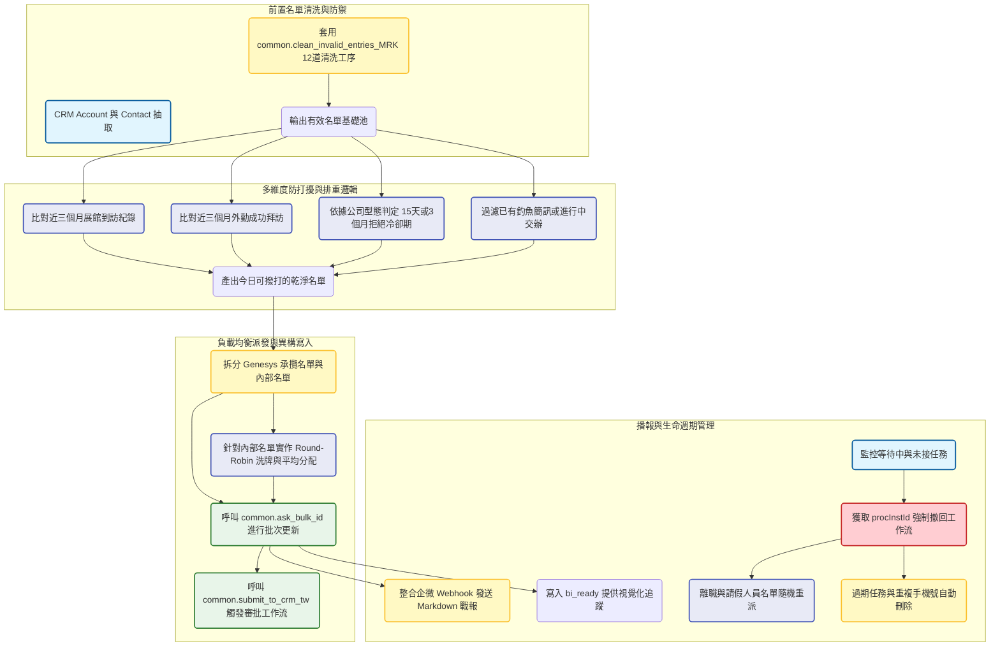

# 台灣每日K大電訪交辦派發系統 開發紀錄與踩坑筆記

### 業務與資料背景

為了支撐台灣區業務的每日電話開發量，系統必須每日清晨自動從 CRM 中撈取潛在客戶名單，過濾掉無效資料後，將「K大視訊邀約」的電訪任務平均派發給內部的電訪專員與外部的 Genesys 承攬團隊。這個管線的複雜度不在於資料量，而在於極度嚴苛的「防打擾」與「排重」邏輯。我必須跨越多個異構資料表，交叉比對客戶近期是否有展館參訪，外勤拜訪，拒絕紀錄或是已經在走其他交辦流程，以避免重複撥打引發客訴。同時，系統還需負責任務的生命週期管理，包含每日執行狀況播報，以及離職或未上線人員的交辦撤回與重派。

### 數據流轉與架構設計

### 複雜的排除邏輯與防禦機制

電訪派單最怕的就是踩到業務的紅線。為了確保派發出去的名單絕對乾淨，我在第一階段直接套用了底層 `common.py` 中封裝好的 `clean_invalid_entries_MRK`。這個模組包含了十二道硬核的過濾規則，從 SAP 呆帳管制，特定區域群組排除，一直到聯絡人姓名是否包含過世或退休等關鍵字，將明顯無效的資料擋在門外。

真正的挑戰在於第二階段的動態排重。客戶與我的互動軌跡散落在 CRM 的各個角落，包含了自定義實體中的展館預約（customEntity43__c），外勤打卡，以及過去的電訪軌跡。我利用 Python 集合的交集與差集運算，將這些條件層層過濾。特別是在處理「拒絕」狀態時，業務邏輯要求針對 C 類設計公司給予十五天的冷卻期，而其他類型的公司則需要三個月的冷卻期，這些細微的差異都必須在 Pandas 中透過遮罩矩陣精確切割。

### 交辦分配演算法與 CRM 寫入坑點

在決定好今日的目標名單後，必須將任務均勻派發給在線的電訪員。我實作了一個簡單的 Round-Robin 分配器，透過隨機洗牌並利用餘數將名單分塊，確保每位專員拿到的名單質量與數量相對平均。而超出內部負載的部分，則會精準切割並派發給外部的 Genesys 承攬團隊處理。

寫入 CRM 時遇到了嚴重的 API 限制。在系統中，交辦任務一旦觸發了審批工作流，就無法直接透過 Bulk API 覆寫或刪除。這是一個巨大的技術債。為此，我在底層封裝了繁瑣的撤回機制。程式必須先透過 Creekflow 的歷史過濾 API 撈取每一筆資料的 `procInstId`，然後構造特殊的 Payload 將任務從工作流中撤回（Withdraw），待狀態解除後，才能進行後續的重派或 `delete_from_CRM` 操作。

### 報表播報與自動化運維

系統的最後一環是自動化運維與報表生成。腳本會每日撈取前一天的執行狀態，將任務區分為 A 類（第一次電訪且拒絕），B 類（第一次電訪非拒絕）等狀態，並透過微信機器人的 Webhook 發送 Markdown 格式的早報。同時，為了滿足主管的操作習慣，程式會動態生成 Excel 報表，並利用 `openpyxl` 寫入 TableStyleMedium9 樣式，確保欄位寬度自適應後，存放到 Z 槽的網路共享資料夾。

針對人員異動，腳本內建了生命週期守護行程。一旦偵測到 CRM 中的使用者被標記為離職（customItem182__c 有值），或者像翊盛承攬這類外部人員未上線，程式會自動撈取他們名下處於「等待」狀態的任務，執行強制撤回，並利用 `np.random.choice` 從現有的在職電訪員名單中隨機抽取人選進行重派。這確保了即使有人員流動，交辦任務也不會卡在死胡同裡無人處理。