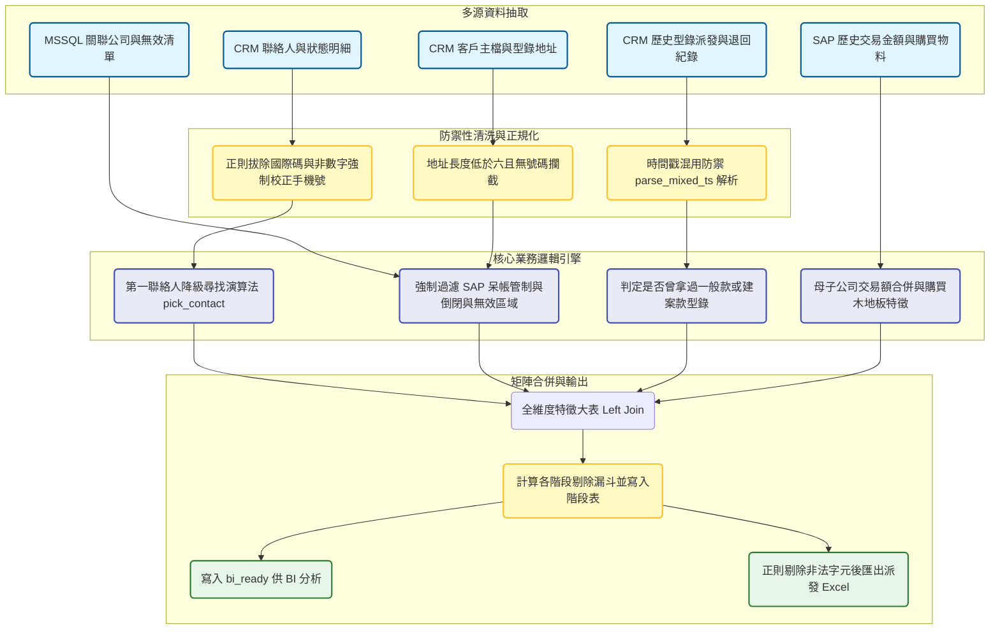

# 廣發型錄名單篩選與清洗管線 開發紀錄與踩坑筆記

### 業務與資料背景

集團每年會定期化向全台設計公司與建商寄送實體型錄。由於高規格型錄的印製與物流成本極高，業務端需要一份極度精準的派發名單。專案的核心挑戰在於 CRM 系統中累積了大量歷史殘亂數據，一家公司可能掛了數十個聯絡人，其中包含離職，空號或職位不符的無效資料；同時必須排除 SAP 系統中的呆帳管制戶，已倒閉公司，以及近期已經索取過同款型錄的客戶。這個管線負責整合 CRM 客戶主檔，聯絡人明細，型錄派發歷史，以及 SAP 近一與近三年的交易額，最終輸出一份去蕪存菁的黃金派發名單。

### 數據流轉與架構設計

### 第一聯絡人降級尋找演算法

在實作中遇到的最大痛點是，CRM 上的「主要聯絡人」往往因為久未維護而變成空號或已離職。為了確保型錄能寄到關鍵決策者手上，我在 Pandas 中針對 `groupby` 實作了客製化的 `pick_contact` 演算法。

當系統發現原本的主客關連無效（包含離職，空號，停機，勿電訪或手機格式錯誤）時，會強制觸發降級尋找機制。程式會從該公司的其餘聯絡人中，優先篩選出擁有合法 09 開頭手機號碼的名單，接著套用硬編碼的職務權重字典（老闆優先於設計總監，再優先於設計師與助理）。如果職務相同，則進一步比對關係狀態，確保優先選擇「主要公司」大於「配合」大於「在職」的聯絡人。這種層層兜底的設計，大幅拯救了原本會被判定為死單的潛在客戶。

### 歷史時間戳混用防禦與型錄去重

在比對歷史型錄派發紀錄（`customEntity28__c`）時，踩到了一個 CRM 底層 API 的陳年大坑。由於系統升級的歷史遺留問題，建檔日期欄位回傳的值極度混亂，同時混雜了毫秒級整數，秒級整數，甚至字串格式。直接使用 Pandas 的 `to_datetime` 會導致大批資料解析成 1970 年的極端值。

為了解決這個問題，我封裝了 `parse_mixed_ts` 函數。利用科學記號的量級判定（例如界於 10的12次方到 14次方之間判定為毫秒，10的9次方到 11次方判定為秒），動態給予正確的 `unit` 參數進行轉換，最後統一轉回台北時區。時間軸對齊後，系統才能精準將客戶過去索取過的型錄名稱與退回備註，依照時間倒序拼接成字串，並利用關鍵字匹配客戶是否已經拿過最新的「超耐磨一般款」或「建案款」，避免重複寄送浪費成本。

![型錄派發名單篩選漏斗與無效原因分佈]
![型錄派發名單篩選漏斗與無效原因分佈]
![型錄派發名單篩選漏斗與無效原因分佈]

其实这里有一个漏斗图，但是我在交接的时候忘记截图了，现在无法展示这个漏斗图的结构，但是漏斗图都差不多，所以我们可以模拟一下这里有一个图片，可以清晰看到各階段名單的折損率。透過明確的漏斗圖，管理層能直觀理解有多少比例的公司是因為地址無效，聯絡人全數離職，或是踩到 SAP 管制紅線而被系統自動剔除，有效消除了業務單位對系統「吃名單」的疑慮。

### 關聯公司聚合與非法字元清洗

為了評估客戶的真實含金量，系統不僅抓取了單一公司的 SAP 近一年與近三年交易額，還透過 `crm_related_company` 關聯表，將子公司的業績全部向上聚合到主關聯母公司。同時加入了是否購買過「環保木」或「手刮」等物料特徵的布林值標籤，讓行銷端可以依據購買偏好決定派發的型錄版本。

最後在產出實體 Excel 供物流單位使用時，經常會因為聯絡人姓名或備註欄位夾雜了不可見的控制字元（如垂直定位符或退格字元）導致 openpyxl 存檔崩潰。因此在匯出前的最後一哩路，系統會使用 `ILLEGAL_CHARACTERS_RE.sub` 強制掃描整個 DataFrame 並抹除所有非法字元，這是一個看似不起眼但能徹底解決日常排程中斷的防禦性工程設計。
