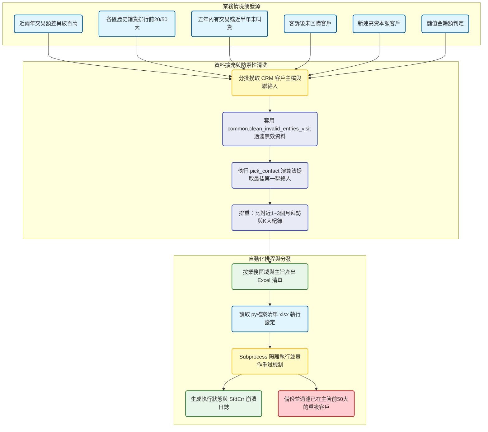

# 業務外勤拜訪清單自動化生成系統 開發紀錄與踩坑筆記

### 業務與資料背景

為了協助外勤業務與小區主管精準鎖定高價值或需挽回的客戶，系統需要每日自動產出各種類型的拜訪名單。這些名單的觸發條件涵蓋了：歷史銷貨排行，近兩年交易差異破百萬，客訴後未再交易，五年內有交易但久未聯繫，以及高資本額的新建客戶等。專案的挑戰在於，所有的撈取邏輯都必須掛載嚴格的「防打擾」機制（例如近三個月內已拜訪或已透過K大視訊聯繫過的客戶必須強制排除），同時確保最終產出的清單只保留「第一聯絡人」供業務撥打，並根據負責區域精準分派。最後，為了解決數十支獨立 Python 腳本的排程管理問題，專案導入了一個基於 Excel 驅動的中央排程器。

### 數據流轉與架構設計

### 多情境名單撈取與排重邏輯

在實作各類拜訪名單時，我大量依賴了底層的 `common` 模組。以「客訴後未交易」這支腳本為例，業務邏輯非常刁鑽：必須先從 CRM 軌跡表（`customEntity15__c`）中抓出工作類別為客訴（代碼 12）或 C3 系列的紀錄，取得每家公司最近一次的投訴日期；接著拿這批公司去跟 SAP 銷貨明細進行 Inner Join，最後透過 `~isin` 反向篩選出「在最近一次投訴後，就再也沒有出貨紀錄」的流失客戶。

另一個效能雷區是 CRM 的 XOQL 查詢限制。由於單次查詢回傳的資料量有限且 URL 可能超長，在透過公司代號反查 CRM 客戶主檔時，我實作了批次查詢（Batch Query）機制。程式會將幾千筆公司代號以 100 筆為一個 Batch，拼接成 `IN ('A', 'B', ...)` 的字串分批戳 API，並透過 `try-except` 確保單一 Batch 失敗不會導致整支腳本崩潰。

在防打擾機制上，所有產出的名單在最後一關都必須強制套用 `kd.last_connected` 函數。這個函數會去撈取 `clean_data.dbo.crm_track_1year`（外勤拜訪打卡）以及 `crm_K_3M`（K大視訊上線超過 8 分鐘），將近期已經接觸過的客戶剔除，避免業務重複撥打引發反感。

### 聯絡人降級尋找與專案歸屬

在「五年內有交易」這類久未聯繫的名單中，原本的主要聯絡人往往已經離職或空號。我在這裡套用了 `best_contact` 演算法。當首選聯絡人無效時，程式會從該公司的所有關聯聯絡人中，依序檢查職務（老闆優先於總監優先於設計師）與關係狀態（在職主要優先於在職配合），最終兜底出一個最有可能接電話的有效 09 手機號碼。此外，為了確保開發資源不衝突，程式會利用 `_prefer` 旗標，優先保留「公司代號等於關聯母公司代號」的主帳號，將子公司的重複聯絡人強制隱藏。

### 基於 Excel 的中央排程器實作

這個專案包含了將近四十支獨立的 `.py` 腳本，每天清晨依序執行。如果依賴 Windows 工作排程器去綁定每一支腳本，維護成本將會極度失控。為了降低運維難度，我開發了 `99.清單執行.py` 這個中央控制器。

它的設計非常直觀：讀取一份名為 `py檔案清單.xlsx` 的設定檔，業務單位可以直接在 Excel 中將 `是否執行` 的欄位改成 True 或 False 來動態開關某支腳本。在底層實作上，控制器使用了 `subprocess.run` 來呼叫獨立的 Python 行程，這保證了單一腳本的 Memory Leak 或是 Pandas 處理崩潰（例如資料夾被鎖住導致的 PermissionError）絕對不會波及到主流程。同時，程式內建了 `MAX_RETRY = 3` 的重試機制，並會將成功與失敗的 `stderr` 詳細軌跡寫入 `run_log_YYYYMMDD.log` 中，徹底解決了過去「腳本死在半夜卻沒人知道原因」的痛點。最後，控制器還負責善後工作，自動將當日產出的所有清單進行備份，並強制將其他名單中「已經出現在小區主管前50大」的客戶剔除，確保基層業務不會跟主管打到同一通電話。