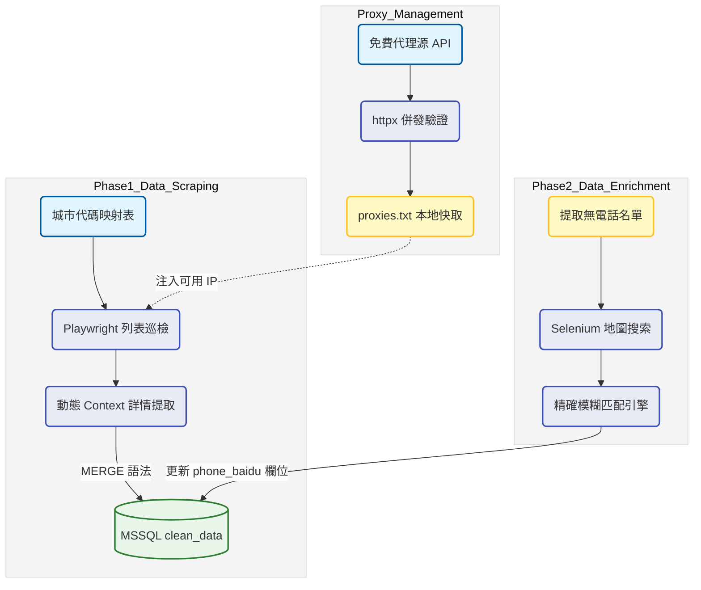

# 裝修業潛在客戶自動化爬蟲與清洗管線：開發紀錄與踩坑筆記

### 項目背景

業務端需要大量各城市的室內設計公司名單作為開發線索，原本靠人工搜索收集的效率太低。專案目標是自動巡迴各城市抓取公司名稱與實體地址，並透過地圖服務二次搜索補齊聯絡電話。架構上分為三個獨立階段，代理節點池更新，目標平台名單抓取，地圖電話補齊。這樣的解耦設計是為了應對不同網站的封鎖策略，避免單一環節卡死導致全盤停擺。

### 數據流轉邏輯

### 實作挑戰與卡點

1. **動態環境與反爬蟲博弈**：目標網站的反爬機制極度嚴格，最初嘗試單一瀏覽器跑到底，沒幾頁就會被封鎖或是瘋狂跳出驗證碼。後來改用 Playwright 的動態環境機制，每抓取十二筆公司詳情就強制銷毀上下文並更換代理與瀏覽器指紋。雖然大幅度犧牲了爬取效能，但這是目前能穩定獲取完整地址資料的唯一保命解法。
2. **免費代理池的高死亡率**：使用腳本自動抓取免費代理，但這些 IP 存活時間極短。爬蟲主程式必須實作大量的 try-except 與重試邏輯，在請求超時或被服務器拒絕時，必須強行攔截錯誤並自動切換下一個代理。
3. **名稱匹配的髒資料地獄**：從地圖搜出來的結果經常帶有總店或分公司等後綴，甚至混雜裝飾工程等行業泛詞。如果只用字串完全相等來比對，電話命中率極低，導致後續業務端拿到一堆空號或錯誤資訊。

### 技術細節與取捨

* **精確模糊匹配引擎設計**：為了解決地圖搜索結果與原始公司名稱不一致的問題，在腳本中開發了自訂的清洗引擎。先拔除括號內容與城市詞，再搭配雙連字與 Jaccard 相似度綜合評分。這部分耗費了最多時間在微調參數，目前設定 SequenceMatcher 閥值在零點九勉強達到業務要求的準確率。

圖表展示了經過模糊匹配引擎優化後，各主力城市的有效電話補齊率變化，可以看出加入 Jaccard 相似度判斷與泛詞過濾後，地圖搜尋的精準命中率有顯著拉升，大幅減少了業務端無效撥打的時間成本。

* **雙重爬蟲技術棧的妥協**：專案中抓取主名單使用 Playwright，但第二階段查地圖卻混用了 Selenium。這是典型的實務技術債，因為電話補齊的腳本繼承自早期的舊專案，當時已經把地圖網站的網頁結構和遇到防護時的重試退避邏輯寫死在 Selenium 裡。為了快速交付業務端，決定保留原樣不做重構，反正兩階段透過資料庫非同步對接，完全互不干涉。
* **資料庫 UPSERT 邏輯**：全城市巡檢動輒十幾個小時，遇到網路中斷是常態。寫入資料庫一律採用 MSSQL 的 MERGE 語法處理，完全依賴公司網址與實體地址作為唯一識別。這樣能避免重複爬取造成的鍵值衝突與效能浪費，也能無縫接軌斷點續傳。

