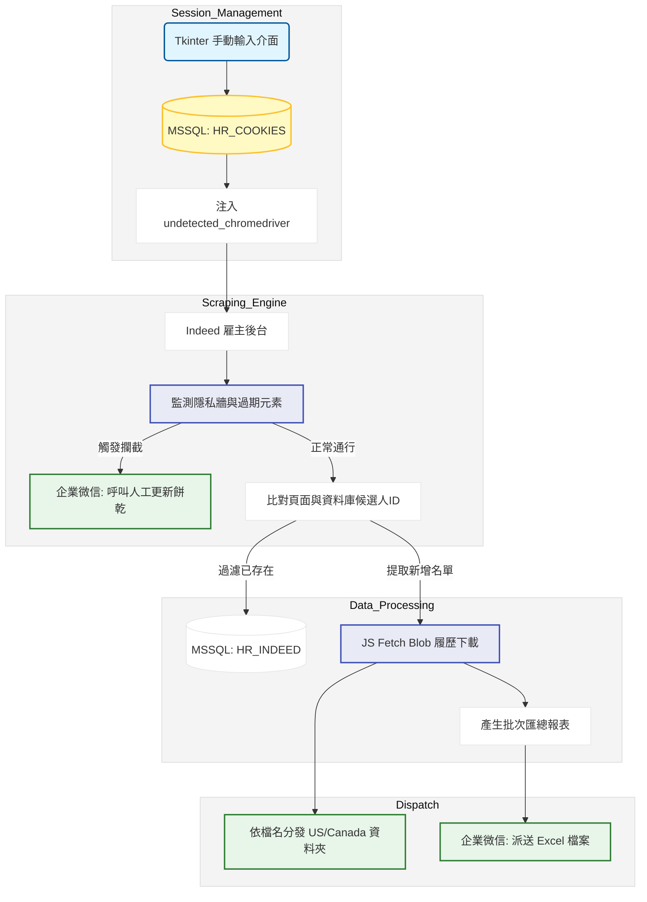

# Indeed 海外履歷自動化抓取與歸檔系統：開發紀錄與踩坑筆記

### 項目背景

人資部為了應對海外加盟專案的擴張需求，需要大量從 Indeed 平台獲取美國與加拿大的候選人履歷。早期完全依賴人資手動逐頁點擊下載並分類，耗費大量作業時間。本專案目標是建立一套半自動化的爬蟲管線，透過資料庫比對去重，自動抓取新增的候選人資訊，解決履歷檔案的下載與本機端資料夾分類，並透過企業微信機器人串接每日的進件報告與異常警報。

### 數據流轉邏輯

### 實作挑戰與卡點

1. **嚴苛的登入狀態失效機制**：Indeed 對於自動化工具的防護非常嚴格，即使用了 undetected_chromedriver 仍無法穩定維持長期登入狀態。為了解決反覆登入被鎖帳號的問題，最終選擇妥協為半自動架構。透過額外開發的 Tkinter 介面讓使用者手動貼上 Cookie 存入資料庫，主程式讀取後再進行抓取。
2. **Blob 履歷下載限制**：當進入候選人詳情頁要下載履歷時，發現下載按鈕的連結通常受限於前端防護，直接用 Python requests 去請求該 URL 會被擋下或是拿不到真實檔案。最後的解法是直接在瀏覽器環境內執行 JavaScript，透過 fetch 拿到 blob 網址後，轉成 Base64 傳回 Python 再解碼存成 PDF 實體檔案，這是整個抓取流程中最核心的繞過技巧。
3. **無效點擊與網頁加載時序**：Indeed 前端是用重度框架渲染，元素出現的時機點非常不固定。如果在列表中直接使用點擊下一頁的邏輯，經常會因為防護彈窗或是加載延遲導致腳本崩潰。

### 技術細節與取捨

* **人機協作的監控機制**：既然無法百分之百避開 Cookie 過期或隱私審查彈窗，就在程式中實作了 `monitor_element` 函數。一旦連續五次偵測到特定的防護牆元素，就直接打 API 給企業微信機器人，發送求救訊息提醒業務端人工去更新 Cookie。這種把例外狀況拋給人工作業的做法，大幅降低了程式的維護成本。
* **記憶體內集合去重**：為了避免重複下載履歷，每次翻頁獲取到的候選人 ID 會先透過 Python 的 set 資料結構，與從資料庫撈出的 `existing_userids` 取差集（`new_ids = current_ids - existing_userids`）。確認是全新的 ID 才加入待抓取序列，有效減少對 Indeed 伺服器的無效請求。
* **資料夾硬碟映射**：因為這支程式預期會在內網的排程伺服器上跑，所以直接把履歷輸出的路徑寫死綁定在 Z 槽的網路磁碟機。抓下來的檔案會依照檔名帶有的關鍵字自動搬移到美國或加拿大的專屬目錄，方便人資部第一時間檢視。

圖表展示了系統上線後每週成功解析並下載的履歷數量趨勢，可以看出在解決了 Blob 下載問題後，系統能穩定處理大量的候選人進件，並且大幅縮短了人資獲取報表的時間差。
