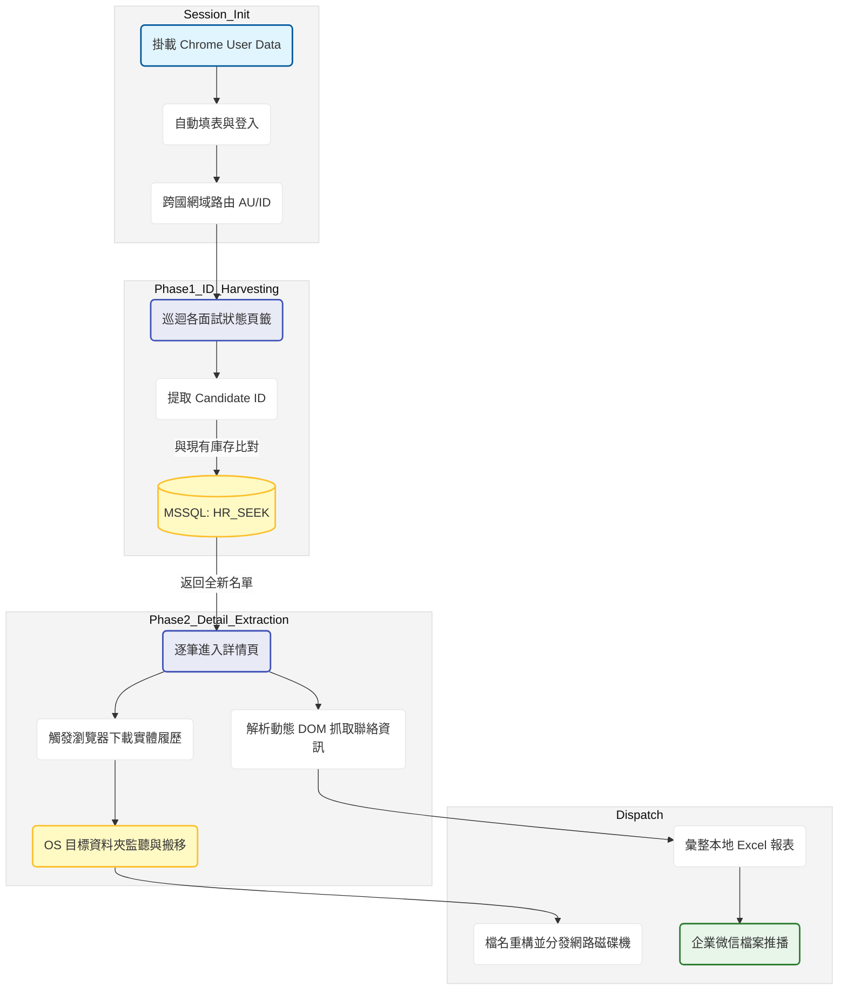

# SEEK 跨國履歷自動化抓取與歸檔系統 開發紀錄與踩坑筆記

### 項目背景

人資部擴展海外版圖（包含澳洲與印尼），需要大量從 SEEK 平台撈取候選人履歷與聯絡資訊。原本依賴人資手動切換不同國家的雇主後台逐一下載，不僅極度耗時且容易遺漏。專案目標是建立一套跨國自動化爬蟲管線，透過統一的架構處理不同網域的登入驗證，先掃描所有狀態頁籤取得候選人編號，與 MSSQL 資料庫比對去重後，再逐筆進入詳情頁下載實體履歷檔案，最後自動產出匯總報表並推播至企業微信群組。

### 數據流轉邏輯

### 實作挑戰與卡點

1. 前端框架的動態類別名稱地獄。SEEK 的前端使用了重度的 CSS in JS 框架，DOM 結構極度深層且類別名稱全是一堆無意義的動態亂碼。這導致常規的網頁元素定位幾乎無法使用，只能硬著頭皮把超長的組合選擇器寫死在程式碼裡，維護成本極高。
2. 實體檔案下載的非同步攔截。SEEK 的履歷下載按鈕點擊後，是透過前端腳本直接觸發瀏覽器底層下載，無法像 Indeed 那樣透過 fetch 拿到 blob 網址來優雅處理。實作上只能妥協，讓腳本寫死一個本機下載路徑，利用無限迴圈去監聽該資料夾，並透過檔案的最後修改時間來盲抓剛載好的履歷，這種做法在系統 I/O 繁忙時有極高的機率抓錯檔案。
3. 跨國網域的行為差異。澳洲與印尼的 SEEK 雖然底層架構相似，但在登入跳轉邏輯與頁面載入速度上有微妙差異，導致原本想寫成單一通用模組的計畫失敗，最後只能拆分成兩支獨立的腳本分別維護。

### 技術細節與取捨

* 雙階段分離爬取策略。如果一邊掃描列表一邊進去抓履歷，只要中間網路斷線就會全盤皆輸。系統改採兩段式設計，第一階段只管翻頁並把所有候選人 ID 收集起來，直接拿這包 ID 去跟資料庫的 unique_id 做差集比對，確認是全新名單後才進入第二階段的深層抓取，大幅降低了不必要的頁面跳轉與防護觸發率。
* 本地進度斷點快取。考量到單次抓取可能包含數百份履歷，在深層抓取迴圈中加入了 progress.txt 的本地落檔機制。每成功下載並解析一筆，就把該筆的 unique_id 寫入檔案，若程式意外崩潰，下次重啟時會自動跳過已處理的進度，這是在不頻繁對資料庫做 Update 的情況下最穩妥的保命做法。

圖表展示了澳洲與印尼兩個國家在不同面試狀態（如 Shortlist 或 Prescreen）下的履歷進件數量分佈，並對比了兩段式爬取架構導入前後的執行時間差異，可以看出分離去重邏輯後整體系統的穩定度與處理吞吐量都有顯著提升。
