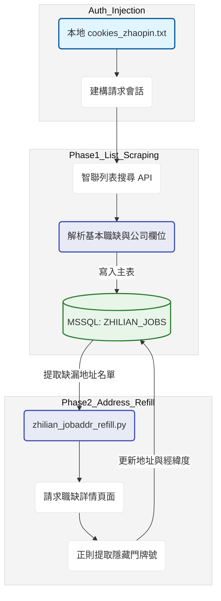

# 智聯招聘崗位數據自動化採集與地址補齊管線：開發紀錄與踩坑筆記

### 項目背景

業務端需要監控大陸地區競品公司的招聘動態，並藉由企業擴編釋出的職缺作為 B2B 業務開發的潛在線索。早期依賴人工定期巡檢智聯招聘網站，效率低且無法規模化。本專案目標是建構自動化爬蟲管線，定期抓取特定城市與行業的職缺列表。由於智聯的列表頁缺乏精確的實體辦公地址，專案架構拆分為兩階段，主程式負責高頻率掃描列表入庫，回補腳本則針對高價值線索進行深層的地址抓取，確保第一線業務能獲得完整的聯絡資訊。

### 數據流轉邏輯

### 實作挑戰與卡點

1. **極端嚴苛的滑塊驗證與風控**：智聯招聘對異常流量的封控極為敏感，若直接使用無頭瀏覽器模擬點擊，極易觸發複雜的防機器人滑塊驗證，且通過率極低。為了保證爬蟲生存率，放棄了程式自動登入的幻想，改採手動獲取網頁版憑證並存入文本供程式讀取。
2. **精確地址欄位的深層隔離**：在 V2 版本的開發過程中發現，列表頁的 API 回傳值僅包含商圈或行政區的模糊字串，真正的門牌號碼與經緯度資訊被隔離在職缺詳情頁中，甚至部分是透過另外的非同步請求加載。若在掃描列表時同步請求詳情頁，會瞬間拉高請求頻率導致 IP 被封。
3. **動態介面變更與頻繁失效**：智聯的前端結構與 API 簽章演算法更迭頻繁。這也是專案命名為 V2 的原因，前一版本的解析邏輯已經完全失效，必須重新攔截網路封包分析新的參數結構。

### 技術細節與取捨

* **非同步雙軌抓取架構**：針對地址隔離的問題，系統設計成主副兩支程式。主程式負責廣泛撒網，快速將基本資訊掃入資料庫，副程式再以極慢的速率、模擬真人瀏覽的間隔，逐筆進入詳情頁把精確地址補齊。犧牲了資料獲取的即時性，換取了系統的長期穩定運作。
* **狀態降級與休眠策略**：直接從本地讀取授權憑證。當程式偵測到 HTTP 回應碼異常或 JSON 解析失敗時，會判定為憑證失效或觸發風控，此時腳本會主動休眠並印出警告，而不是無腦重試消耗有限的網路資源。
* **資料庫寫入防衝突機制**：為了配合雙軌架構，資料庫寫入採用了狀態機的設計概念。主程式寫入時將狀態標記為待補齊，回補腳本只針對這些特定狀態的資料進行處理，處理完畢再更新標籤，避免兩支程式同時操作同一筆記錄產生鎖死。

圖表展示了系統自動化運轉後，重點關注城市（如北上廣深）的特定行業職缺釋出熱度，結合補齊後的實體地址座標，能精準繪製出競品公司的擴編熱力圖，輔助業務團隊制定地推策略。
