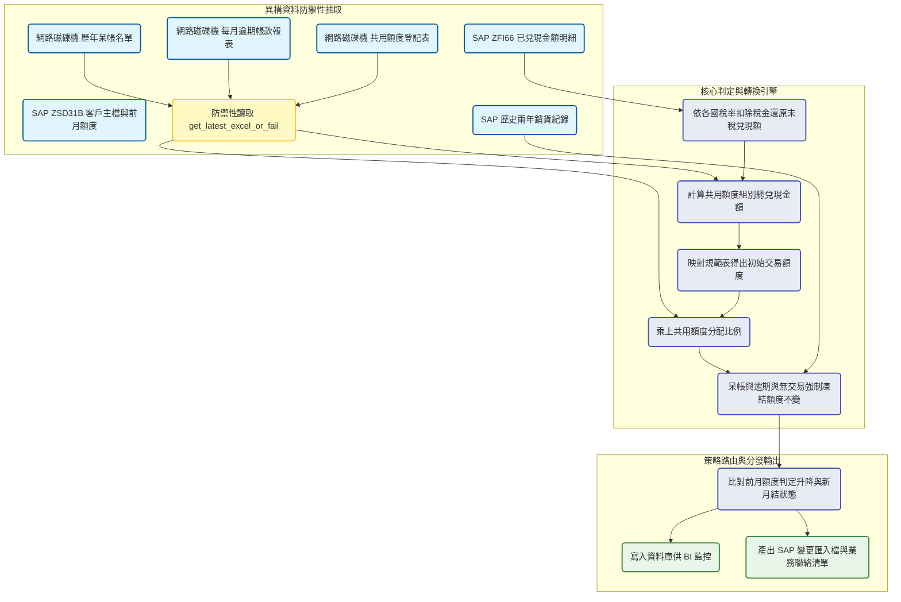

# 自動化月結與全球交易額度判定系統 開發紀錄與踩坑筆記

### 業務與資料背景

集團在全球各區的 B2B 交易中存在複雜的月結與信用額度規範。過去業務助理需要每月手動比對 SAP 的客資狀態，會計提供的呆帳名單，海外業務部的逾期帳款，以及各區業務自行登記的共用額度表。為了消除人工結算的延遲與誤判，專案的目標是將台灣，新加坡，馬來西亞以及海外六國（香港，日本，菲律賓，印尼，越南，泰國）的月結額度判定邏輯全面自動化。系統必須融合 SAP 系統內的歷史銷貨與兌現明細，並與散落在 Z 槽網路磁碟機的各類 Excel 報表進行關聯，最終輸出一份精準的額度變更建議與 SAP 大批匯入檔。

### 數據流轉與架構設計

### 稅率陷阱與共用額度計算實作

在處理跨國交易額度時，我踩到了一個隱蔽的稅率陷阱。SAP ZFI66 報表撈出的已兌現金額預設是含稅的，但各國的稅率完全不同（台灣百分之五，新加坡馬來西亞百分之九，日本百分之十，菲律賓百分之十二等）。如果不將金額還原成未稅價，會導致客戶的累計兌現金額虛高，進而配發錯誤的信用額度。我在程式中強制介入除以對應的稅率常數，並加上微小的浮點數防禦來精準進位。

另一個極度複雜的業務邏輯是共用額度。許多集團客戶會使用多個子公司帳號進行交易，但總部要求這些帳號必須共用同一個信用池。我在 Pandas 實作了向上聚合的邏輯，先將同一個共用額度組別（共用額度組別分類）的未稅兌現金額加總，用這個巨大的總額去階梯表映射出頂層的交易額度，最後再乘上各子公司專屬的額度分配比例。這個設計確保了集團客戶的信用曝險不會因為開設分公司而無限膨脹。

### 策略模式重構與跨國架構演進

在最初的開發階段（如腳本一與腳本二），台灣與新加坡的邏輯是完全寫死在主流程中的。但當專案需要擴展到另外六個海外國家時，這種程序導向的寫法引發了巨大的技術債。各國的 SAP 銷售組織代碼，買方前綴，稅率，甚至共用額度的分頁名稱都完全不同。

為了解決這個工程瓶頸，我在第三個腳本中導入了物件導向的策略模式。我定義了 CountryConfig 資料類別來集中管理每個國家的常數與檔案路徑，並實作了 BaseStrategy 類別來封裝標準的計算流程。未來如果某個國家（例如日本）的判斷邏輯發生變異，只需要繼承 BaseStrategy 並覆寫單一方法，再將其註冊到 STRATEGY_REGISTRY 字典中即可。這種設計讓主程式 run_country 變得極度乾淨，只負責依序呼叫介面，大幅降低了後續維護的認知負擔。

### 實務限制與檔案依賴痛點

整套系統最大的脆弱點在於對共用網路磁碟機的深度依賴。業務端與會計端高度習慣使用 Excel 來維護不轉月結名單與呆帳紀錄。這些檔案經常被隨意更改名稱，或是因為人員忘記關閉檔案而引發 PermissionError 權限鎖死。

為了讓排程能夠穩定活下去，我封裝了 get_latest_excel 函式。系統不再依賴寫死的絕對檔名，而是利用關鍵字與時間戳掃描目錄抓取最新版本。如果遇到缺失的檔案（例如某個國家這個月剛好沒有逾期帳款），程式會捕捉例外並回傳預設的空 DataFrame 讓流程繼續空轉，而不是直接報錯崩潰。這是在與傳統辦公室作業流程妥協下，保證資料管線韌性的必要手段。